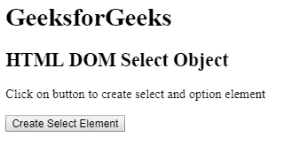
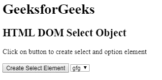
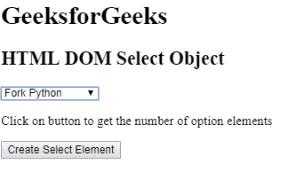
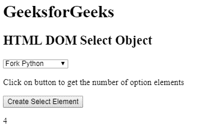

# HTML | DOM 选择对象

> 原文:[https://www.geeksforgeeks.org/html-dom-select-object/](https://www.geeksforgeeks.org/html-dom-select-object/)

HTML DOM 中的**选择对象**用来表示一个 HTML <选择>元素。可以使用 document.createElement()方法创建<选择>元素，并且可以使用 getElementById()访问该元素。

**语法:**

*   用于创建<select>元素。document.createElement("SELECT")</select>
*   用于访问<select>元素。document.getElementById("mySelect")</select>

**选择对象属性:**

*   **自动对焦:**用于设置或返回下拉列表，页面加载时自动对焦。
*   **禁用:**用于设置或返回下拉列表是否禁用。
*   **表单:**返回对包含下拉列表的表单的引用。
*   **长度:**返回下拉列表中<选项>元素的个数。
*   **倍数:**用于设置或返回下拉列表中是否可以选择多个选项。
*   **名称:**用于设置或返回下拉列表的名称属性的值。
*   **selectedIndex:** 用于在下拉列表中设置或返回选中选项的索引。
*   **大小:**用于设置或返回下拉列表的大小值。
*   **类型:**从下拉列表中返回表单元素的类型。
*   **值:**用于在下拉列表中设置或返回选中选项的值。

**选择对象方法:**

*   **add():** 用于在下拉列表中添加一个选项。
*   **检查有效性():**用于检查下拉列表的有效性。
*   **remove():** 用于从下拉列表中删除一个选项。

**选择对象集合:**

*   **选项:**返回下拉列表中所有选项的集合。

下面的程序说明了在超文本标记语言中选择对象:

**示例 1:** 本示例使用 document.createElement()方法创建<选择>元素。

```html
<!DOCTYPE html>
<html>

<head> 
    <title>
        HTML DOM Select Object
    </title> 
</head>

<body>
    <h1>GeeksforGeeks</h1> 

    <h2>HTML DOM Select Object</h2> 

    <p>
        Click on button to create select
        and option element
    </p>

    <button onclick = "myGeeks()">
        Create Select Element
    </button>

    <!-- script to create select element -->
    <script>
        function myGeeks() {
            var sel = document.createElement("Select");
            sel.setAttribute("id", "MySelect");
            document.body.appendChild(sel);

            var opt = document.createElement("option");
            opt.setAttribute("value", "gfg");
            var nod = document.createTextNode("gfg");
            opt.appendChild(nod);
            document.getElementById("MySelect").appendChild(opt);
        }

    </script>
</body>

</html>                                                           
```

**输出:**
**之前点击按钮:**

**之后点击按钮:**


**示例 2:** 本示例使用 getElementById()方法访问<选择>元素。

```html
<!DOCTYPE html>
<html>

<head> 
    <title>
        HTML DOM Select Object
    </title> 
</head>

<body>

    <h1>GeeksforGeeks</h1> 

    <h2>HTML DOM Select Object</h2> 

    <select id="GFG">
        <option>Fork Python</option>
        <option>Fork Java</option>
        <option>Fork CPP</option>
        <option>Sudo Placement</option>
    </select>

    <p>
        Click on button to get the number
        of option elements
    </p>

    <button onclick = "myGeeks()">
        Create Select Element
    </button>

    <p id="test"></p>

    <!-- script to count select element -->
    <script>
        function myGeeks() {
            var len = document.getElementById("GFG").length;
            document.getElementById("test").innerHTML = len;
        }
    </script>
</body>

</html>                                                            
```

**输出:**
**之前点击按钮:**

**之后点击按钮:**


**支持的浏览器:***DOM 选择对象*支持的浏览器如下:

*   歌剧
*   微软公司出品的 web 浏览器
*   谷歌 Chrome
*   火狐浏览器
*   苹果 Safari