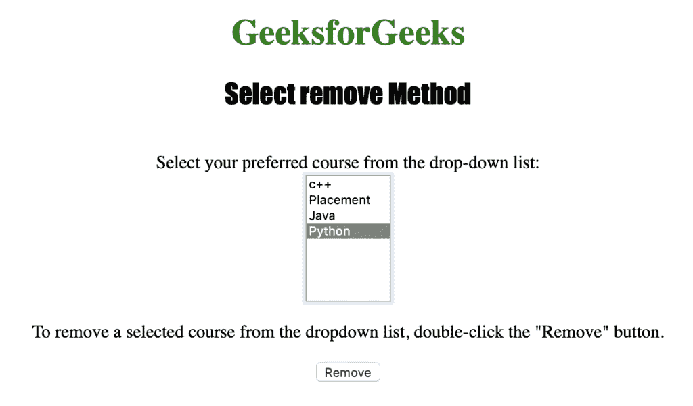
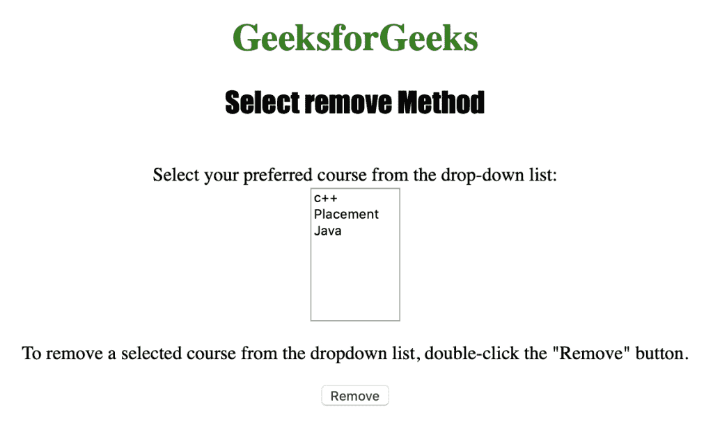

# HTML | DOM 选择移除()方法

> 原文:[https://www . geesforgeks . org/html-DOM-select-remove-method/](https://www.geeksforgeeks.org/html-dom-select-remove-method/)

HTML DOM 中的**选择移除()方法**用于从下拉列表中移除一个选项。此方法接受索引号作为从所需位置移除选项的参数。

**语法:**

```html
selectObject.remove(index)
```

**参数:**包含单参数**索引**，为必选项，用于指定待移除元素的索引位置。

下面的程序说明了在 HTML DOM 中选择移除()方法:

**示例:**本示例使用 select remove()方法从下拉列表中移除所选选项。

```html
<!DOCTYPE html>
<html>

<head> 
    <title>
        HTML DOM Select remove Method
    </title> 
</head>

<body style="text-align:center;">

    <h1 style="color:green;">
        GeeksforGeeks
    </h1> 

    <h2 style="font-family: Impact;">
        Select remove Method
    </h2><br>

    Select your preferred course from
    the drop-down list:<br>

    <select id="myCourses" size="8">
        <option value="C++">c++</option>
        <option value="Placement">Placement</option>
        <option value="Java">Java</option>
        <option value="Python">Python</option>
    </select>

    <p>
        To remove a selected course from the dropdown 
        list, double-click the "Remove" button.
    </p>

    <button ondblclick="myGeeks()">
        Remove
    </button>

    <!-- Script to use DOM Select remove Method -->
    <script>
        function myGeeks() {
            var d = document.getElementById("myCourses");
            d.remove(d.selectedIndex);
        }
    </script>
</body>

</html>                                                  
```

**输出:**

*   **点击按钮前:**
    
*   **点击按钮后:**
    

**支持的浏览器:**以下是*选择移除()方法*支持的浏览器:

*   苹果 Safari
*   微软公司出品的 web 浏览器
*   火狐浏览器
*   谷歌 Chrome
*   歌剧