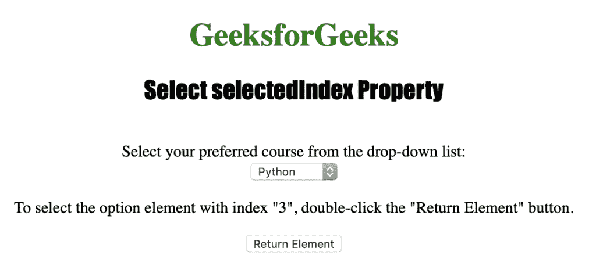

# HTML | DOM 选择选择索引属性

> 原文:[https://www . geesforgeks . org/html-DOM-select-selectedindex-property/](https://www.geeksforgeeks.org/html-dom-select-selectedindex-property/)

HTML DOM 中的 **Select selectedIndex 属性**用于在下拉列表中设置或返回所选选项的索引。下拉列表的索引通常从 0 开始，如果没有选择任何选项，则返回-1。如果下拉列表允许多选，此属性返回第一个选项的索引。

**语法:**

*   它返回选择选择索引属性。

    ```html
    selectObject.selectedIndex
    ```

*   它用于设置选择选择索引属性。

    ```html
     selectObject.selectedIndex = number 
    ```

**属性值:**包含单值**号**，用于在下拉列表中指定所选选项的索引。

下面的程序说明了在超文本标记语言中选择选择索引属性:

**示例:**本示例使用 Select selectedIndex 属性选择索引为“3”的<选项>元素。

```html
<!DOCTYPE html>
<html>

<head> 
    <title>
        HTML DOM Select selectedIndex Property
    </title> 
</head>

<body style="text-align:center;">

    <h1 style="color:green;">
        GeeksforGeeks
    </h1> 

    <h2 style="font-family: Impact;">
        Select selectedIndex Property
    </h2><br>

    Select your preferred course from the drop-down list:<br>

    <select name="Courses Titles" id="myCourses">
        <option value="C++">c++</option>
        <option value="Placement">Placement</option>
        <option value="Java">Java</option>
        <option value="Python">Python</option>
    </select>

    <p>
        To select the option element with index "3",
        double-click the "Return Element" button.
    </p>

    <button ondblclick="myGeeks()">
        Return Element
    </button>

    <!-- This example uses Select selectedIndex Property -->
    <script>
        function myGeeks() {
            document.getElementById("myCourses").selectedIndex
                    = "3";
        }
    </script>
</body>

</html>                                                     
```

**输出:**
**点击按钮前:**

**点击按钮后:**


**支持的浏览器:**T2 DOM Select selectedIndex 属性支持的浏览器如下:

*   苹果 Safari
*   微软公司出品的 web 浏览器
*   火狐浏览器
*   谷歌 Chrome
*   歌剧