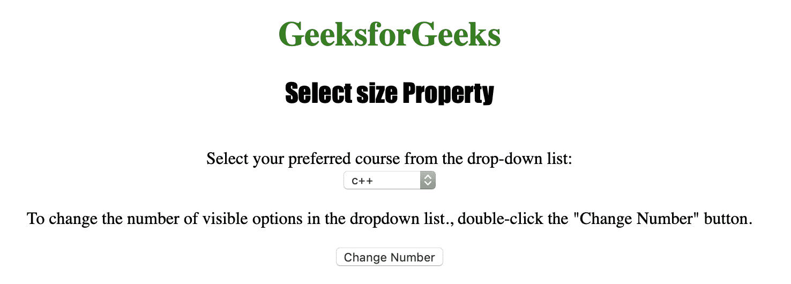
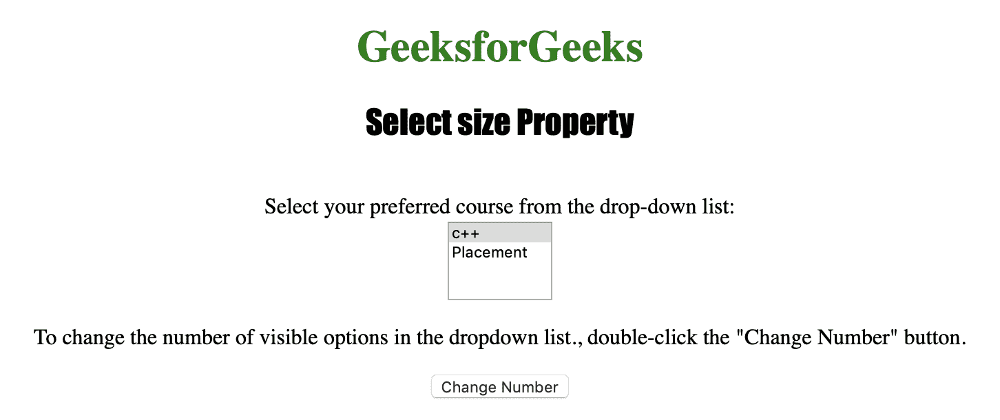

# HTML | DOM 选择大小属性

> 原文:[https://www . geesforgeks . org/html-DOM-select-size-property/](https://www.geeksforgeeks.org/html-dom-select-size-property/)

**选择尺寸属性**用于**设置**或**返回** *下拉列表*的尺寸属性值。“选择大小”属性通常用于指定下拉列表中可见选项的数量。
**语法:**

*   **返回大小属性:**

```html
selectObject.size
```

*   **设置尺寸属性:**

```html
selectObject.size = number
```

**房产价值**

*   **编号:**用于指定下拉列表中可见选项的数量。

**返回值:**返回一个数值，代表下拉列表中可见选项的数量。

下面的程序说明了选择大小属性:
**示例:**更改下拉列表中可见选项的数量。

## 超文本标记语言

```html
<!DOCTYPE html>
<html>

<head>
    <title>
      Select size Property in HTML
  </title>
    <style>
        h1 {
            color: green;
        }

        h2 {
            font-family: Impact;
        }

        body {
            text-align: center;
        }
    </style>
</head>

<body>

    <h1>
      GeeksforGeeks
  </h1>
    <h2>
      Select size Property
  </h2>
    <br>
  Select your preferred course from the drop-down list:
    <br>

    <select name="Courses Titles"
            id="myCourses">
        <option value="C++">c++</option>
        <option value="Placement">Placement</option>
        <option value="Java">Java</option>
        <option value="Python">Python</option>
    </select>

<p>To change the number of visible options in
      the dropdown list., double-click the "Change
      Number" button.</p>

    <button ondblclick="My_list()">
      Change Number
  </button>

    <script>
        function My_list() {
            document.getElementById("myCourses").size = "2";
        }
    </script>

</body>

</html>
```

**输出:**
**点击按钮前:**



**点击按钮后:**



**支持的浏览器:**

*   苹果 Safari
*   微软公司出品的 web 浏览器
*   火狐浏览器
*   谷歌 Chrome
*   歌剧