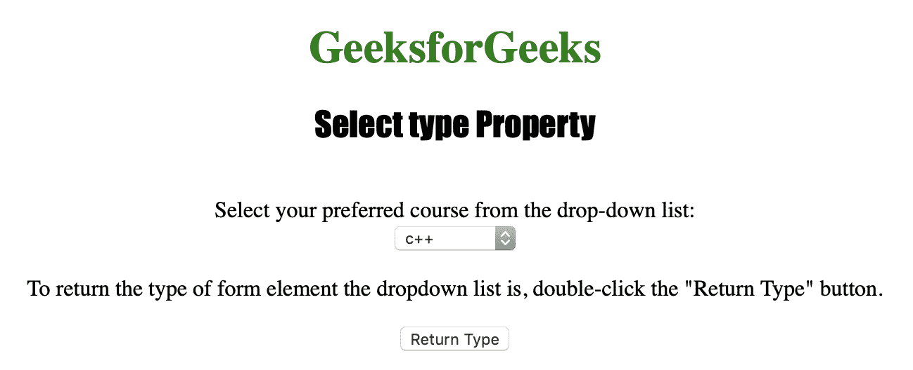
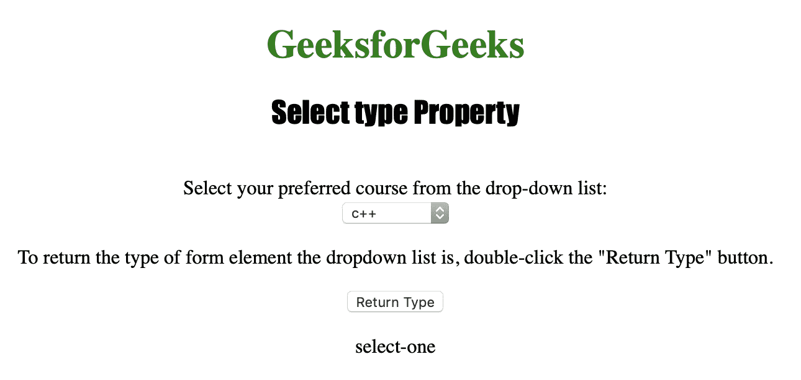

# HTML | DOM 选择类型属性

> 原文:[https://www . geesforgeks . org/html-DOM-select-type-property/](https://www.geeksforgeeks.org/html-dom-select-type-property/)

**选择类型属性**用于**返回** *表单元素类型下拉列表为*。下拉列表可以有两种类型，分别是**“选择-一个”**或**“选择-多个”**。
**语法:**

```html
selectObject.type
```

**返回值:**一个字符串，表示下拉列表(<选择>元素)的表单元素类型

下面的程序说明了选择类型属性:
**示例:**返回一个下拉列表的表单元素的类型。

## 超文本标记语言

```html
<!DOCTYPE html>
<html>

<head>
    <title>
      Select type Property in HTML
  </title>
    <style>
        h1 {
            color: green;
        }

        h2 {
            font-family: Impact;
        }

        body {
            text-align: center;
        }
    </style>
</head>

<body>

    <h1>
      GeeksforGeeks
  </h1>
    <h2>
      Select type Property
  </h2>
    <br>
  Select your preferred course from the drop-down list:
    <br>

    <select name="Courses Titles" id="myCourses">
        <option value="C++">c++</option>
        <option value="Placement">Placement</option>
        <option value="Java">Java</option>
        <option value="Python">Python</option>
    </select>

<p>To return the type of form element the
      dropdown list is,
      double-click the "Return Type" button.
  </p>

    <button ondblclick="My_list()">
      Return Type
  </button>

    <p id="test"></p>

    <script>
        function My_list() {
            var d = document.getElementById("myCourses").type;
            document.getElementById("test").innerHTML = d;
        }
    </script>

</body>

</html>
```

**输出:**
**点击按钮前:**



**点击按钮后:**



**支持的浏览器:**

*   苹果 Safari
*   微软公司出品的 web 浏览器
*   火狐浏览器
*   谷歌 Chrome
*   歌剧