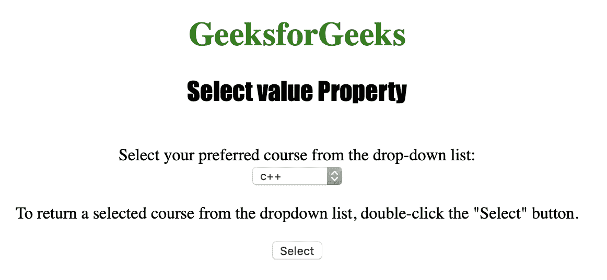
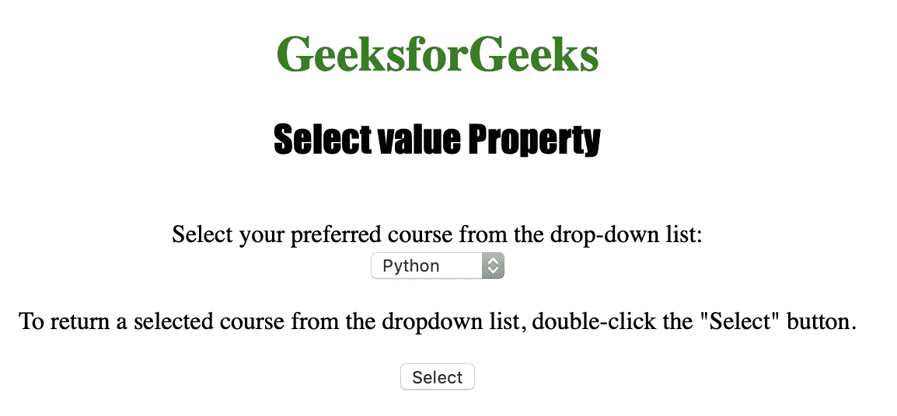

# HTML | DOM 选择值属性

> 原文:[https://www . geesforgeks . org/html-DOM-select-value-property/](https://www.geeksforgeeks.org/html-dom-select-value-property/)

**选择值属性**用于**设置**或**在下拉列表中返回** *所选选项的值。
如果下拉列表允许多选，则 Select value 属性返回第一个选择的选项，否则，如果没有选择的选项，则不返回任何内容。
**语法:**
**用于返回值属性:*** 

```html
selectObject.value
```

**用于设置值属性:**

```html
selectObject.value = value
```

**房产价值**

*   **值:**用于指定下拉列表中应被选中的 **<选项>** 元素的值。

**返回值:**一个字符串，表示下拉列表中<选项>元素的值属性的值。如果下拉列表允许多个选择，则返回第一个选择的选项。如果没有选定的选项，则不返回任何内容。

下面的程序说明了选择值属性:
**示例:**将所选课程更改为“python”。

## 超文本标记语言

```html
<!DOCTYPE html>
<html>

<head>
    <title>
      Select value Property in HTML
  </title>
    <style>
        h1 {
            color: green;
        }

        h2 {
            font-family: Impact;
        }

        body {
            text-align: center;
        }
    </style>
</head>

<body>

    <h1>
      GeeksforGeeks
  </h1>
    <h2>
      Select value Property
  </h2>
    <br>
  Select your preferred course from the drop-down list:
    <br>

    <select name="Courses Titles" id="myCourses">
        <option value="C++">c++</option>
        <option value="Placement">Placement</option>
        <option value="Java">Java</option>
        <option value="Python">Python</option>
    </select>

<p>
      To return a selected course from the dropdown list,
      double-click the "Select" button.
  </p>

    <button ondblclick="My_list()">
      Select
  </button>

    <script>
        function My_list() {
            document.getElementById(
              "myCourses").value = "Python";
        }
    </script>

</body>

</html>
```

**输出:**
**点击按钮前:**



**点击按钮后:**



**支持的浏览器:**

*   苹果 Safari
*   微软公司出品的 web 浏览器
*   火狐浏览器
*   谷歌 Chrome
*   歌剧