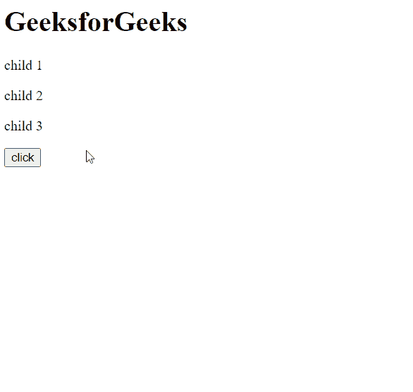

# HTML | DOM selectAllChildren()方法

> 原文:[https://www . geesforgeks . org/html-DOM-selectall children-method/](https://www.geeksforgeeks.org/html-dom-selectallchildren-method/)

**selectAllChildren()** 方法将指定节点的所有子节点添加到当前选择中。

**语法:**

```html
selection.selectAllChildren( parentNode )
```

**参数:**

*   **父节点:**要选择其子节点的节点。

**示例:**在本例中，使用此方法，在按钮点击时，父 div 的所有**子元素**都将被选中。

## 超文本标记语言

```html
<!DOCTYPE html>
<html>

<head>
    <title>GeeksforGeeks</title>
</head>

<body>
    <main>
        <h1>GeeksforGeeks</h1>
    </main>

    <div>
        <p>child 1</p>
        <p>child 2</p>
        <p>child 3</p>
    </div>

    <button onclick="select()">
        click
    </button>

    <script>
        const pNode = document
            .querySelector('div');

        function select() {
            window.getSelection()
                .selectAllChildren(pNode);
        };
    </script>
</body>

</html>
```

**输出:**

**点击按钮选择父 div 的子节点:**


**支持的浏览器:**selectall children()方法支持的浏览器如下:

*   谷歌 Chrome
*   边缘
*   火狐浏览器
*   歌剧
*   旅行队
*   互联网浏览器。