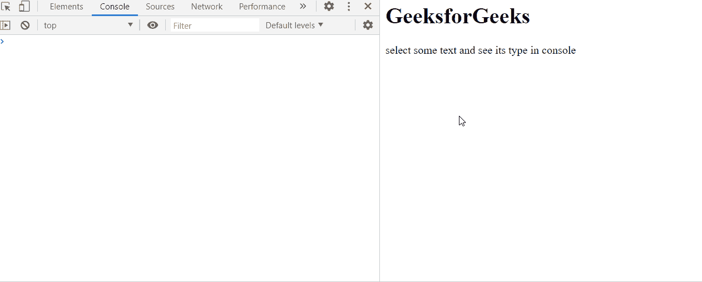

# HTML DOM 选择.类型属性

> 原文:[https://www . geesforgeks . org/html-DOM-selection-type-property/](https://www.geeksforgeeks.org/html-dom-selection-type-property/)

**类型**属性返回一个**字符串**，该字符串描述了当前选择的**类型。**这是一个只读属性。

**语法:**

```html
selection.type
```

**返回值:**描述选择类型的字符串。可能的返回值有:

*   **无:**目前没有选择。
*   **插入符号:**仅单击但未选择。所选内容被折叠，插入符号被放在一些文本上，但没有选择任何区域。
*   **范围:**选择文本的某个范围。

**示例:**

在本例中， **getSelection()** 方法用于获取所选文本， **type 属性**用于获取选择的类型。

## 超文本标记语言

```html
<html>
<head>
<title>HTML DOM selection type property</title>    
</head>
<body>
    <h1>GeeksforGeeks</h1>
    <p>select some text and see its type in console</p>
</body>
<script>
    var selection;
    document.onselectionchange = function() {
      selection = document.getSelection();
      console.log(selection)
      console.log(selection.type);
    };
</script>
</html>
```

**输出:**

在控制台中，选择的类型可以在选择的每次变化中看到。



**支持的浏览器:**

*   谷歌 Chrome
*   边缘
*   火狐浏览器
*   歌剧
*   旅行队
*   微软公司出品的 web 浏览器