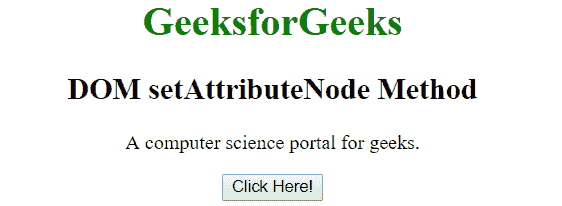
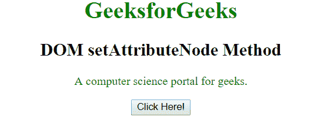

# HTML | DOM setAttributeNode()方法

> 原文:[https://www . geesforgeks . org/html-DOM-set attributenode-method/](https://www.geeksforgeeks.org/html-dom-setattributenode-method/)

HTML DOM 中的 **setAttributeNode()** 方法用于将指定的属性节点添加到元素中。如果指定的属性已经存在，则此方法替换它。

**语法:**

```html
element.setAttributeNode(name)
```

**参数:**只接受一个参数**名称**。其中**名称**是需要添加的属性节点。这是必填字段。

**返回值:**该方法返回一个表示被替换属性节点的属性对象，否则返回空值。

**示例:**

```html
<!DOCTYPE html>
<html>

<head>
    <title>
      HTML DOM setAttributeNode Method
    </title>
    <style>
        .gfg {
            color: green;
        }
    </style>
</head>

<body style="text-align: center;">
    <h1 style="color:green;">
       GeeksforGeeks
    </h1>

    <h2>
       DOM setAttributeNode Method
    </h2>

    <p id="p">
        A computer science portal for geeks.
    </p>

    <button onclick="Geeks()">
        Click Here!
    </button>

    <script>
        function Geeks() {
            //Get the paragraph to add attribute. 
            var doc = document.getElementById("p");

            //Creating a class attribute.
            var attr = document.createAttribute("class");

            //Setting the value of class attribute.
            attr.value = "gfg";

            //Adding class attribute to paragraph. 
            doc.setAttributeNode(attr);
        }
    </script>
</body>

</html>
```

**输出:**

**之前点击按钮:**


**点击按钮后:**


**支持的浏览器:**下面列出了 *setAttributeNode()* 方法支持的浏览器:

*   谷歌 Chrome
*   微软公司出品的 web 浏览器
*   火狐浏览器
*   歌剧
*   旅行队