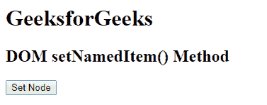
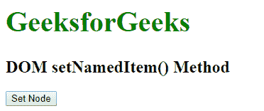
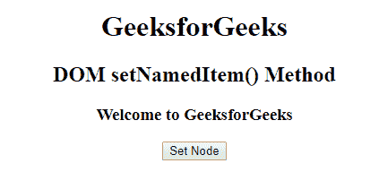
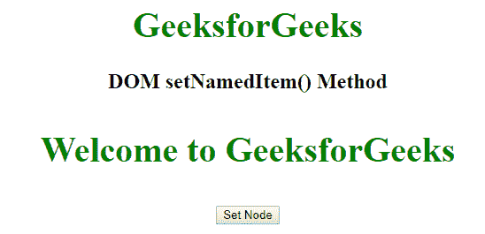

# HTML | DOM setNamedItem()方法

> 原文:[https://www.geeksforgeeks.org/html-dom-setnameditem-method/](https://www.geeksforgeeks.org/html-dom-setnameditem-method/)

**setNamedItem()** 方法用于使用属性节点的名称将特定节点添加到属性节点。这些属性节点统称为 namedNodeMap。可以通过名称访问它。如果文档中已经存在某个节点，它将替换该节点并返回更新后的值。 **setNamedItem()** 方法需要一个节点作为参数。
**语法:**

```html
namedNodeMap.setNamedItem( node )
```

**参数值:**该方法包含单参数*节点*，为必选项。此参数是需要在 namedNodeMap 集合中添加或替换的节点值。

**返回值:**返回一个 Node 对象，表示被替换的节点(如果有)，否则为空

**例 1:**

## 超文本标记语言

```html
<!DOCTYPE html>
<html>
    <head>
        <title>
            DOM setNamedItem() Method
        </title>

        <style>
            .gfg {
                color:green;
                font-size: 40px;
            }
        </style>
    </head>

    <body>
        <h1 class="geeks1">GeeksforGeeks</h1>
        <h2 class="geeks2">DOM setNamedItem() Method</h2>

        <button onclick = "setNameItem()">
            Set Node
        </button>

        <script>
            function setNameItem() {

                // It is used to fetch the text
                // present in class geeks1
                var one =
                    document.getElementsByClassName("geeks1")[0];

                // New class (geek) is created
                var geek = document.createAttribute("class");

                // Passing value of gfg class into geek class
                geek.value = "gfg";                                

                // Updating the CSS property of geeks1
                // class to gfg class
                one.attributes.setNamedItem(geek);                    
            }
        </script>
    </body>
</html>                                   
```

**输出:**
之前点击按钮:



点击按钮后:



**例 2:**

## 超文本标记语言

```html
<!DOCTYPE html>
<html>
    <head>
        <title>
            DOM setNamedItem() Method
        </title>

        <!-- Set CSS property to the element -->
        <style>
            .gfg {
                color:green;
                font-size: 40px;
            }
            .gfg1 {
                color:green;
                font-size: 40px;
            }
        </style>
    </head>

    <body style = "text-align:center">

        <h1>GeeksforGeeks</h1>
        <h2>DOM setNamedItem() Method</h2>
        <h3>Welcome to GeeksforGeeks</h3>

        <button onclick = "setNameItem()">
            Set Node
        </button>

        <script>
            function setNameItem() {

                var one =
                    document.getElementsByTagName("H1")[0];
                var geek =
                    document.createAttribute("class");
                geek.value = "gfg";                            
                one.attributes.setNamedItem(geek);            

                var two =
                    document.getElementsByTagName("H3")[0];
                var geek1 =
                    document.createAttribute("class");
                geek1.value = "gfg1";
                two.attributes.setNamedItem(geek1);
            }
        </script>
    </body>
</html>                                      
```

**输出:**
之前点击按钮:



点击按钮后:



**支持的浏览器:**T2 DOM setNamedItem()方法支持的浏览器如下:

*   谷歌 Chrome
*   微软公司出品的 web 浏览器
*   火狐浏览器
*   歌剧
*   旅行队