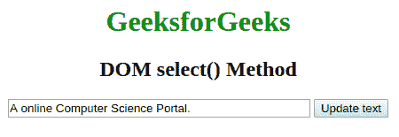
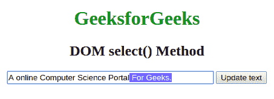

# HTML | DOM setRangeText()方法

> 原文:[https://www.geeksforgeeks.org/html-dom-setrangetext-method/](https://www.geeksforgeeks.org/html-dom-setrangetext-method/)

**setRangeText()** 方法用另一个字符串替换输入或文本区域中的文本范围。

**语法:**

```html
element.setRangeText(replacement);
```

运筹学

```html
element.setRangeText(replacement, start, end[, Mode]);
```

**参数:**

*   **替换:**此参数表示将替换为退出字符串的字符串。*   **Start:** 指定第一个字符的索引，可选。*   **end:** 指定最后一个开始字符后的字符索引，也是可选的。*   **Mode:** This attribute defines how the selection should be set all the possible values are described below.
    *   *选择:*这将选择新插入的文本。
    *   *开始:*它会将选中的文本移动到新插入的文本之前。
    *   *结束:*类似于开始只是将选中的文本移动到插入的文本之后。
    *   *保留:*保留选择及其默认值。

    **示例:**

    ```html
    <!DOCTYPE html>
    <html>

    <head>
        <title>
            DOM focus() Method
        </title>
        <style>
            a:focus {
                background-color: magenta;
            }
        </style>
    </head>

    <body>
        <center>
            <h1 style="color:green;"> 
                 GeeksforGeeks 
            </h1>
            <h2>DOM select() Method</h2>

            <input type="text" id="text-box" size="40"
                value="A online Computer Science Portal.">
            <button onclick="selectText()">
             Update text
            </button>

            <script>
                //Main function 
                function selectText() {
                    const select = 
                        document.getElementById('text-box');
                    select.focus();
                    select.setRangeText
                        (' For Geeks.', 32, 40, 'select');
                }
            </script>
        </center>
    </body>            
    </html>        
    ```

    **输出:**
    点击更新按钮前:
    

    点击更新按钮后。
    

    **支持的浏览器:**以下列出了 *HTML | DOM setRangeText()方法*支持的浏览器:

    *   谷歌 Chrome
    *   微软公司出品的 web 浏览器
    *   火狐浏览器
    *   歌剧
    *   旅行队