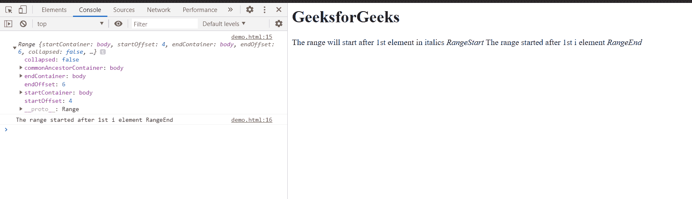

# HTML DOM setStartAfter()方法

> 原文:[https://www . geesforgeks . org/html-DOM-setstartafter-method/](https://www.geeksforgeeks.org/html-dom-setstartafter-method/)

HTML DOM Range**setStartAfter()**方法设置一个范围的起始位置。用于设置起点范围的元素是**参考节点**元素。在该方法中，使用的参考元素是不包括在范围内的**。**

****语法:****

```html
range.setStartAfter(refNode); 
```

****参数:****

*   ****引用节点元素:**用于设置范围起点的节点。**

****返回值:**这个方法没有返回值。**

****示例:**本示例将展示如何使用**设置开始时间()**设置范围的开始时间。同样在这个例子中，我也使用了 **setEndAfter()** 方法来设置范围的结束。**开始引用节点**这里是文档的第一个****<I>元素**。****

****作为参考，我还在文本中记录了范围，以使其清晰。****

```html
**<html>
<head>
<title>HTML DOM range setStartAfter() property</title>    
</head>
<body>
    <h1>GeeksforGeeks</h1>
    The range will start after 
1st element in italics<i> RangeStart
</i> The range started after 1st i 
element <i>RangeEnd</i>
</body>
<script>
    var range = document.createRange();
    var refNode1 = document.getElementsByTagName("i").item(0);
    var refNode2 = document.getElementsByTagName("i").item(1);
    range.setStartAfter(refNode1);
    range.setEndAfter(refNode2);
    console.log(range);
    console.log(range.toString())
</script>
</html>**
```

******输出:**在控制台中，可以看到用 startOffset 和 endOffset 制作的范围。****

********

******支持的浏览器:******

*   ****谷歌 Chrome****
*   ****边缘****
*   ****火狐浏览器****
*   ****旅行队****
*   ****歌剧****