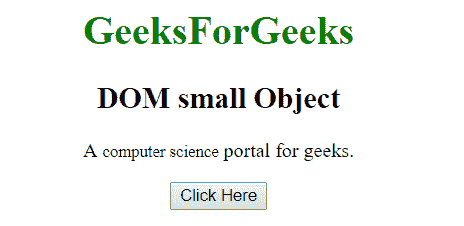
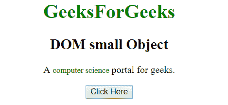
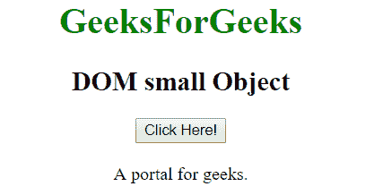
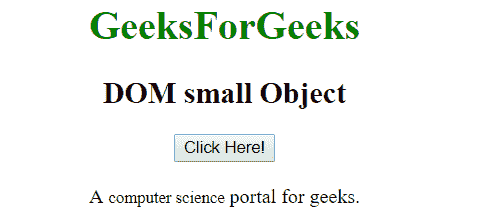

# HTML | DOM 小对象

> 原文:[https://www.geeksforgeeks.org/html-dom-small-object/](https://www.geeksforgeeks.org/html-dom-small-object/)

HTML DOM 中的小对象用来表示 HTML small 元素。可以使用 getElementById()方法访问这个小元素。

**语法:**

```html
document.getElementById("id"); 
```

其中 id 被分配给<small>标签。</small>

**例 1:**

## 超文本标记语言

```html
<!DOCTYPE html>
<html>
    <head>
        <title>
            HTML DOM Small Object
        </title>
    </head>

    <body style = "text-align:center;">

        <h1 style = "color:green;" >
            GeeksForGeeks
        </h1>

        <h2>DOM small Object</h2>

<p>A <small id="small_obj">computer science</small>
        portal for geeks.</p>

        <button onclick = "Geeks()">
            Click Here
        </button>

        <script>
            function Geeks() {
                var txt = document.getElementById("small_obj");
                txt.style.color = "green";
            }
        </script>
</body>
</html>                               
```

**输出:**
**之前点击按钮:**



**点击按钮后:**



**例 2:** 小对象可以使用 document.createElement 方法创建。

## 超文本标记语言

```html
<!DOCTYPE html>
<html>
    <head>
        <title>
            HTML DOM Small Object
        </title>
    </head>

    <body style = "text-align:center">

        <h1 style = "color:green;" >
            GeeksForGeeks
        </h1>

        <h2>DOM small Object</h2>

        <button onclick = "Geeks()">
            Click Here!
        </button>

        <br><br>

        <div>
            A <span id = "p"></span> portal for geeks.
        </div>

        <script>
            function Geeks() {
                var txt = document.createElement("SMALL");
                var t = document.createTextNode("computer science");
                txt.appendChild(t);
                document.getElementById("p").appendChild(txt);
            }
        </script>
    </body>
</html>                   
```

**输出:**
**之前点击按钮:**



**点击按钮后:**



**支持的浏览器:**

*   谷歌 Chrome
*   Mozilla Firefox
*   边缘
*   旅行队
*   歌剧