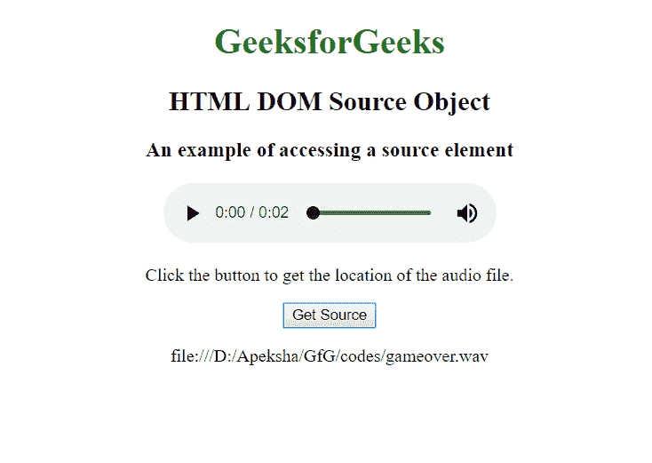
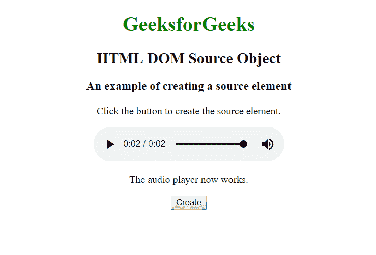

# HTML | DOM 源对象

> 原文:[https://www.geeksforgeeks.org/html-dom-source-object/](https://www.geeksforgeeks.org/html-dom-source-object/)

HTML 中的**源对象**代表一个 HTML 元素。使用 **getElementById()** 可以访问一个元素，使用 **document.createElement()** 方法可以创建一个元素。

**源对象的属性:**

*   **媒体:**返回元素中媒体属性的值。
*   **src:** 返回元素中 src 属性的值。
*   **类型:**返回元素中类型属性的值。

**示例-1:** 访问源对象

```html
<!DOCTYPE html>
<html>

<head>
    <style>
        body {
            text-align: center;
        }

        h1 {
            color: green;
        }
    </style>

  </head>

        <body>
            <h1>GeeksforGeeks</h1>
            <h2>HTML DOM Source Object</h2>
            <h3>An example of accessing a source element</h3>

            <audio controls>
                <source id="mySource" 
                        src="gameover.wav"
                        type="audio/mpeg">

                <source src="gameover.ogg" 
                        type="audio/ogg"> 
              Your browser does not support the audio element.
            </audio>

            <p>Click the button to get the 
              location of the audio file.</p>

            <button onclick="myFunction()">
              Get Source
           </button>

            <p id="demo"></p>

            <script>
                function myFunction() {

                    var x = document.getElementById(
                      "mySource").src;
                    document.getElementById(
                      "demo").innerHTML = x;
                }
            </script>

        </body>

</html>
```

**输出:**


**示例-2:** 创建源对象。

```html
<!DOCTYPE html>
<html>

<head>
    <style>
        body {
            text-align: center;
        }

        h1 {
            color: green;
        }
    </style>

    <head>

        <body>
            <h1>GeeksforGeeks</h1>
            <h2>HTML DOM Source Object</h2>

            <h3>An example of creating a source element
          </h3>

            <p>Click the button to create the source element.
          </p>

            <audio controls id="myAudio" autoplay>
              Your browser does not support 
              the audio element.
            </audio>
            <br>

            <p id="demo"></p>

            <button onclick="myFunction()">
              Create
          </button>

            <script>
                function myFunction() {

                    var x = document.createElement("SOURCE");
                    x.setAttribute("src", "gameover.wav");
                    x.setAttribute("type", "audio/mpeg");
                    document.getElementById(
                      "myAudio").appendChild(x);

                    var y = document.createElement("SOURCE");
                    y.setAttribute("src", "gameover.ogg");
                    y.setAttribute("type", "audio/ogg");
                    document.getElementById("myAudio").appendChild(y);
                    document.getElementById("demo").innerHTML = 
                      "The audio player now works.";
                }
            </script>

        </body>

</html>
```

**输出:**


**支持的浏览器:**

*   谷歌 Chrome
*   Mozilla Firefox
*   边缘
*   旅行队
*   歌剧