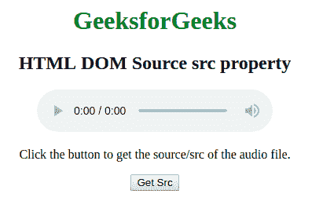
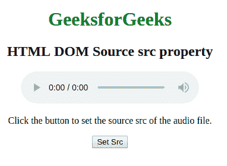
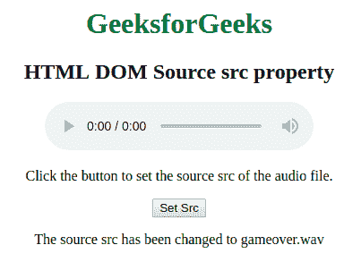

# HTML | DOM 源码 src 属性

> 原文:[https://www.geeksforgeeks.org/html-dom-source-src-property/](https://www.geeksforgeeks.org/html-dom-source-src-property/)

HTML DOM 中的 Source src 属性用于设置或返回<source>元素中 src 属性的值。type 属性用于指定媒体资源的 URl。

**语法:**

*   它返回源 src 属性。

    ```html
     sourceObject.src
    ```

*   它用于设置源 src 属性。

    ```html
    sourceObject.src = URL 
    ```

**属性值:**包含单个值**网址**，指定媒体资源的网址。它可以是绝对或相对网址。

**返回值:**返回一个字符串值，代表媒体资源的网址。

**示例 1:** 本示例返回源 src 属性。

```html
<!DOCTYPE html>
<html>

<head>
    <style>
        body {
            text-align: center;
        }

        h1 {
            color: green;
        }
    </style>

</head>

<body>
    <h1>GeeksforGeeks</h1>
    <h2>HTML DOM Source src property</h2>

    <audio controls>
        <source id="mySource" src="gameover.wav" type="audio/mpeg">

        <source src="gameover.ogg" type="audio/ogg"> 
    </audio>

    <p>Click the button to get the source/src of the audio file.</p>

    <button onclick="myFunction()">
        Get Src
    </button>

    <p id="demo"></p>

    <script>
        function myFunction() {

            var x = document.getElementById("mySource").src;
            document.getElementById("demo").innerHTML = x;
        }
    </script>

</body>

</html>

```

**输出:**
点击按钮前:


点击按钮后:


 **示例 2:** 本示例设置 Source src 属性。

```html
<!DOCTYPE html>
<html>

<head>
    <style>
        body {
            text-align: center;
        }

        h1 {
            color: green;
        }
    </style>

</head>

<body>
    <h1>GeeksforGeeks</h1>
    <h2>HTML DOM Source src property</h2>

    <audio controls>
        <source id="mySource" src="gameover1.wav" type="audio/mpeg">

        <source src="gameover.ogg" type="audio/ogg"> 
    </audio>

    <p>Click the button to set the source 
         src of the audio file.</p>

    <button onclick="myFunction()">
        Set Src
    </button>

    <p id="demo"></p>

    <script>
        function myFunction() {

            var x = document.getElementById("mySource").type = "gameover.wav";
            document.getElementById("demo").innerHTML = 
             "The source src has been changed to " +x;
        }
    </script>

</body>

</html>                    
```

**输出:**
点击按钮前:


点击按钮后:


**支持的浏览器:**

*   谷歌 Chrome
*   火狐浏览器
*   微软公司出品的 web 浏览器
*   歌剧
*   旅行队