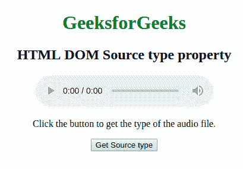
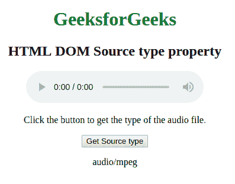
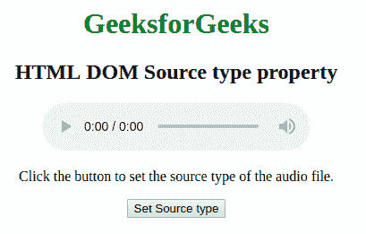
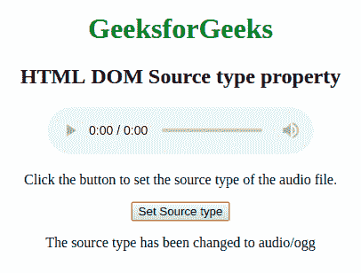

# HTML | DOM 源码类型属性

> 原文:[https://www . geesforgeks . org/html-DOM-source-type-property/](https://www.geeksforgeeks.org/html-dom-source-type-property/)

HTML DOM 中的源类型属性用于设置或返回<source>元素中类型属性的值。类型属性用于指定媒体资源的 MIME 类型。

**语法:**

*   它返回源类型属性。

    ```html
     sourceObject.type
    ```

*   它用于设置源类型属性。

    ```html
    sourceObject.type = MIME_type 
    ```

**属性值:**它包含单个值 **MIME_type** ，指定媒体资源的 MIME_type。很少有 MIME 类型是视频/ogg、视频 mp4、音频/ogg 等。

**返回值:**返回一个字符串值，代表媒体资源的 MIME 类型。

**示例 1:** 本示例返回源类型属性。

```html
<!DOCTYPE html>
<html>

<head>
    <style>
        body {
            text-align: center;
        }

        h1 {
            color: green;
        }
    </style>

</head>

<body>
    <h1>GeeksforGeeks</h1>
    <h2>HTML DOM Source type property</h2>

    <audio controls>
        <source id="mySource" src="gameover.wav" type="audio/mpeg">

        <source src="gameover.ogg" type="audio/ogg"> 
    </audio>

    <p>Click the button to get the type of the audio file.</p>

    <button onclick="myFunction()">
        Get Source type
    </button>

    <p id="demo"></p>

    <script>
        function myFunction() {

            var x = document.getElementById("mySource").type;
            document.getElementById("demo").innerHTML = x;
        }
    </script>

</body>

</html>

```

**输出:**
点击按钮前:


点击按钮后:


 **示例 2:** 本示例设置 Source 类型属性。

```html
<!DOCTYPE html>
<html>

<head>
    <style>
        body {
            text-align: center;
        }

        h1 {
            color: green;
        }
    </style>

</head>

<body>
    <h1>GeeksforGeeks</h1>
    <h2>HTML DOM Source type property</h2>

    <audio controls>
        <source id="mySource" src="gameover.wav" type="audio/mpeg">

        <source src="gameover.ogg" type="audio/ogg"> 
    </audio>

    <p>Click the button to set the source 
         type of the audio file.</p>

    <button onclick="myFunction()">
        Set Source type
    </button>

    <p id="demo"></p>

    <script>
        function myFunction() {

            var x = document.getElementById("mySource").type = "audio/ogg";
            document.getElementById("demo").innerHTML = 
             "The source type has been changed to " +x;
        }
    </script>

</body>

</html>                    
```

**输出:**
点击按钮前:


点击按钮后:


**支持的浏览器:**

*   谷歌 Chrome
*   火狐浏览器
*   微软公司出品的 web 浏览器
*   歌剧
*   旅行队