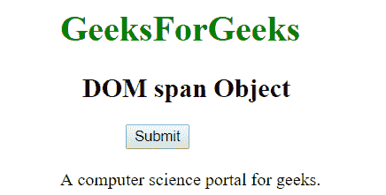

# HTML | DOM 跨度对象

> 原文:[https://www.geeksforgeeks.org/html-dom-span-object/](https://www.geeksforgeeks.org/html-dom-span-object/)

**DOM 跨度对象**用于表示 HTML <跨度>元素。使用 **getElementById()** 方法可以访问 span 元素。

**语法:**

```html
document.getElementById("id"); 
```

其中“标识”是分配给**跨度**标签的标识。
**示例-1:** 在下面的程序中，span 元素中的内容被访问并附加到段落元素中。

## 超文本标记语言

```html
<!DOCTYPE html>
<html>

<body style = "text-align:center">
        <h1 style = "color:green; font-size:38px;" >
          GeeksForGeeks
        </h1>

        <h2>DOM span Object</h2>

<p>A computer science portal for <span id="span"
        style="color:green;">geeks</span>.</p>

        <button onclick="Geeks()">Click Here!</button>

        <p id="p"></p>

        <script>
        function Geeks() {
          var x = document.getElementById("span").textContent;
          document.getElementById("p").innerHTML = x;
        }
        </script>
</body>

</html>
```

**输出:**
**点击按钮前:**


**点击按钮后:**


**示例-2:** 可以使用**文档.创建元素**方法创建跨度对象。在下面的程序中，点击按钮会创建一个 span 对象，并在其上附加一个文本节点。

## 超文本标记语言

```html
<!DOCTYPE html>
<html>

<body>
        <center>
        <h1 style = "color:green;" >
          GeeksForGeeks
        </h1>
        <h2>DOM span Object</h2>

        <button onclick="myGeeks()" >Submit</button>
        <br><br>
        <script>
            <!--Creating span element-->
            function myGeeks() {
                var g = document.createElement("SPAN");
                var f = 
                document.createTextNode("A computer science
                portal for geeks.");

                g.appendChild(f);

                document.body.appendChild(g);
            }
        </script>
</body>

</html>
```

**输出:**
**点击按钮前:**


**点击按钮后:**



**支持的浏览器:**

*   谷歌 Chrome
*   Mozilla Firefox
*   边缘
*   旅行队
*   歌剧