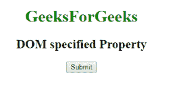
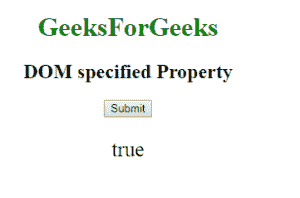

# HTML | DOM 指定属性

> 原文:[https://www.geeksforgeeks.org/html-dom-specified-property/](https://www.geeksforgeeks.org/html-dom-specified-property/)

**DOM 指定属性**用于返回布尔值。如果元素具有指定的属性，则返回 true 否则，如果元素没有特定的属性，则返回 false 值。

**语法:**

```html
attribute.specified
```

**返回值:**返回一个布尔值，该值代表特定属性是否附加到元素上。

**示例:**

```html
<!DOCTYPE html>
<html>
    <head>
        <title>
            HTML DOM specified Property
        </title>
    </head>

    <body>
        <center>
            <h1 style = "color:green">
                GeeksForGeeks
            </h1>

            <h2>DOM specified Property </h2>

            <button onclick="Geeks()">
                Submit
            </button>

            <p id="sudo"></p>

            <script>
                function Geeks() {
                    var x = 
                        document.getElementsByTagName("P")[0];
                    var w = 
                        x.getAttributeNode("ID").specified;
                    document.getElementById("sudo").innerHTML =
                        w;
                }
            </script>
        </center>
    </body>
</html>                    
```

**输出:**
点击按钮前:

点击按钮后:

**支持的浏览器:**支持的浏览器由 *DOM 指定属性*列出如下:

*   谷歌 Chrome
*   微软公司出品的 web 浏览器
*   火狐浏览器
*   歌剧
*   旅行队