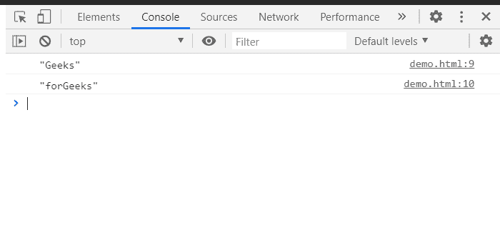

# HTML DOM splitText()方法

> 原文:[https://www.geeksforgeeks.org/html-dom-splittext-method/](https://www.geeksforgeeks.org/html-dom-splittext-method/)

**splitText()** 方法在指定的**偏移索引**处将**文本节点**分成两个节点，将树中的两个节点保持为兄弟节点。

拆分文本后，主节点包含指定偏移索引点之前的所有内容，新创建的相同类型的节点包含剩余的文本。

**语法:**

```html
newTextNode=textNode.splitText(offsetIndex)

```

**参数:**

*   **偏移索引:**紧接在它之前断开文本节点的索引。

**返回值:**

*   返回**新创建的文本节点**，该节点包含偏移索引后的文本。

**示例:**

```html
<html>
   <head>
      <title>HTML | DOM textSplit() method</title>
      <p id="h">GeeksforGeeks</p>
      <script>
        // get the p element
          const a = document.getElementById('h');
        // get the textcontent in textnode 
          const firstNode = a.firstChild;
        // splitting the firstnode at 5th offset index
          const newNode = firstNode.splitText(5);
          console.log(firstNode);
          console.log(newNode);
      </script>
   </head>
</html>
```

**输出:**

在控制台中，可以看到两个分开的文本节点。



**支持的浏览器:**

*   谷歌 Chrome
*   边缘
*   火狐浏览器
*   歌剧