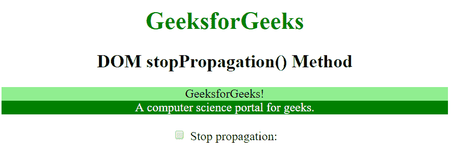
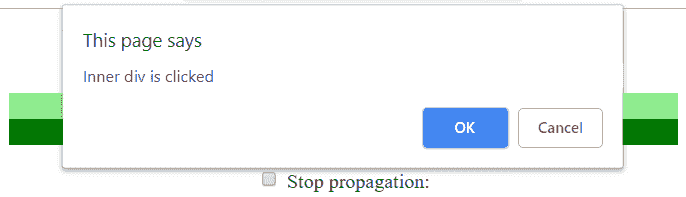
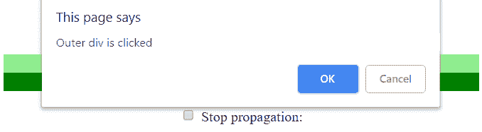

# HTML | DOM stopperpagement()事件方法

> 原文:[https://www . geesforgeks . org/html-DOM-stopper propagation-event-method/](https://www.geeksforgeeks.org/html-dom-stoppropagation-event-method/)

**stopperpagation()**方法用于停止事件调用的传播。也就是说，当一个父事件被调用时，我们可以通过使用 stopProagration()方法来停止调用其子事件的传播，反之亦然。

**语法:**

```html
event.stopPropagation()
```

**返回值:**不返回值。

**示例:**在此示例中，当未选中复选框并单击内部 div 时，确认框会显示两次(一次用于内部 div，另一次用于外部 div)。但是，当复选框被选中并且再次单击内部 div 时，由于 stopPropagation()事件方法，确认框只显示一次。

```html
<!DOCTYPE html>
<html>
<head>
    <title>DOM stopPropagation() Method</title>

    <style>
        #div1 {
            background: lightgreen;
        }

        #div2 {
            background: green;
            color: white;
        }
    </style>
</head>

<body style="text-align:center">

    <h1 style="color: green;">
        GeeksforGeeks
    </h1>

    <h2>DOM stopPropagation() Method</h2>

    <div id="div1" onclick="Geek2()">
       GeeksforGeeks!
       <div id="div2" onclick="Geek1(event)">
            A computer science portal for geeks.
       </div>
    </div>

    <br>
    <input type="checkbox" id="c">
    Stop propagation: 

    <script>
        function Geek1(event) {
            confirm("Inner div is clicked");
            if (document.getElementById("c").checked) {
                event.stopPropagation();
            }
        }

        function Geek2() {
            confirm("Outer div is clicked");
        }
    </script>

</body>
</html>                    
```

**输出:**

**未勾选复选框点击内部分区:**确认框显示两次。




**勾选复选框后:**确认框只显示一次。
T3】

**支持的浏览器:**stopperpagation()事件方法支持的浏览器如下:

*   苹果 Safari
*   谷歌 Chrome
*   火狐浏览器
*   歌剧
*   Internet Explorer 9.0