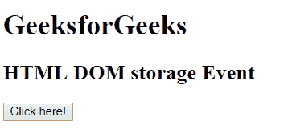
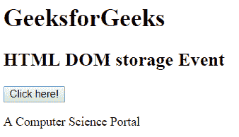

# HTML | DOM 存储事件

> 原文:[https://www.geeksforgeeks.org/html-dom-storage-event/](https://www.geeksforgeeks.org/html-dom-storage-event/)

HTML DOM 中的存储事件用于在另一个文档的上下文中对存储区域进行更改。当窗口的存储区域有修改时，会向该窗口发送一个存储事件。

**语法:**

```html
window.addEventListener("storage", script)
```

**示例:**

```html
<!DOCTYPE html>
<html>

<head>
    <title>
        HTML DOM storage Event
    </title>
</head>

<body>

    <h1>GeeksforGeeks</h1>

    <h2>HTML DOM storage Event</h2>

    <button onclick = "myGeeks()">
        Click here!
    </button>

    <p id = "cont"></p>

    <!-- script of DOM storage event -->
    <script>
        window.addEventListener("storage", myGeeks1);

        function myGeeks1(event) {
            document.getElementById("cont").innerHTML
                    = "A Computer Science Portal";
        }

        function myGeeks() {
            var x = window.open("", "win", 
                    "width = 100, height = 100");

            x.localStorage.setItem("mytime", Date.now());
            x.close();
        }
    </script>
</body>

</html>                                
```

**输出:**
**点击按钮前:**

**点击按钮后:**


**支持的浏览器:**T2 DOM 存储事件属性支持的浏览器如下:

*   谷歌 Chrome
*   Mozilla Firefox
*   边缘
*   旅行队
*   歌剧