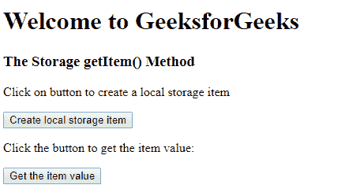
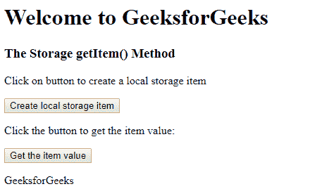

# HTML | DOM 存储 getItem()方法

> 原文:[https://www . geesforgeks . org/html-DOM-storage-getitem-method/](https://www.geeksforgeeks.org/html-dom-storage-getitem-method/)

**getItem()** 方法用于检索用户指定的存储对象。该存储对象可以是**本地存储对象**或**会话存储对象**。

**语法:**

```html
localStorage.getItem(keyname)
```

对于会话存储:

```html
sessionStorage.getItem(keyname)
```

**参数:**需要 *Keyname* ，指定用于获取值的键的名称。

**返回值:**一个字符串，代表指定键的值。

**示例:**从本地存储获取项目。

```html
<!DOCTYPE html>
<html>

<head>
    <!--script for creating new local 
      storage item and retrieve it -->
    <script>
        function createItem() {
            localStorage.name = "GeeksforGeeks";
        }

        function myFunction() {

            // get name of item from local storage.
            var x = localStorage.getItem("name");
            document.getElementById("demo").innerHTML =
                x;
        }
    </script>
</head>

<body>
    <h1>Welcome to GeeksforGeeks</h1>
    <h3>The Storage getItem() Method</h3>
    <p>
      Click on button to create a 
      local storage item 
    </p>

    <button onclick="createItem()">
      Create local storage item
    </button>

    <p>
      Click the button to get the item value:
    </p>

    <button onclick="myFunction()">
      Get the item value
    </button>

    <p id="demo"></p>

</body>

</html>
```

**输出:**
**前:**


**之后:**


**支持的浏览器:**T2 DOM getItem()方法支持的浏览器如下:

*   谷歌 Chrome
*   微软公司出品的 web 浏览器
*   火狐浏览器
*   歌剧
*   旅行队