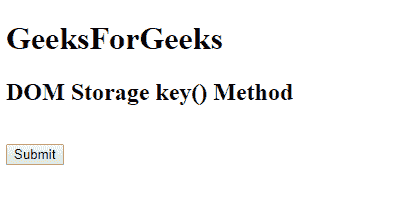
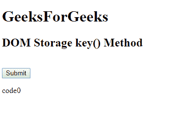

# HTML | DOM 存储键()方法

> 原文:[https://www.geeksforgeeks.org/html-dom-storage-key-method/](https://www.geeksforgeeks.org/html-dom-storage-key-method/)

DOM **存储键()**方法与*存储对象*相关，用于返回具有指定索引的键的名称。存储对象可以是**本地存储**或**会话存储**对象。

**语法:**

*   **本地存储:**

    ```html
    localStorage.key(index)
    ```

*   **Session storage:**

    ```html
    sessionStorage.key(index)
    ```

    **参数:**它接受一个参数，即**索引**，以获得具有该特定给定索引的键的名称。

    **返回值**:以字符串的形式返回键名。

    下面是 HTML 代码展示 HTML DOM **存储键()**对象:
    T3】示例:

    ```html
    <!DOCTYPE html>
    <html>

    <head>
        <title>
            HTML DOM Storage key() Method
        </title>
        <!-- Script to get the name of the key -->
        <script>
            function myGeeks() {
                var key = localStorage.key(0);
                document.getElementById(
                  "geeks").innerHTML = key;
            }
        </script>
    </head>

    <body>
        <h1>GeeksForGeeks</h1>
        <h2>DOM Storage key() Method</h2>
        <br>
        <button onclick="myGeeks()">
            Submit
        </button>

        <p id="geeks"></p>
    </body>

    </html>
    ```

    **输出:**

    *   **点击前:**
        
    *   **点击后:**
        

    **支持的浏览器:**DOM 存储键()方法支持的浏览器如下:

    *   谷歌 Chrome 4
    *   Internet Explorer 8
    *   Firefox 3.5
    *   歌剧 10.5
    *   Safari 4