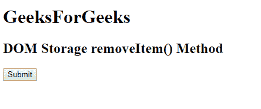
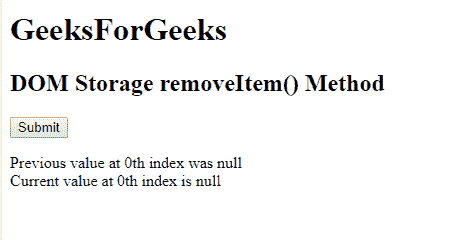
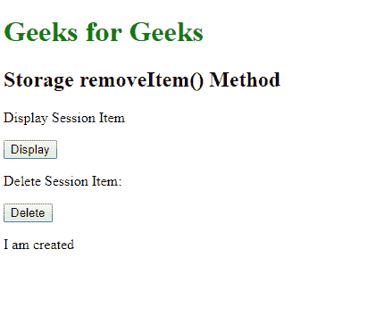
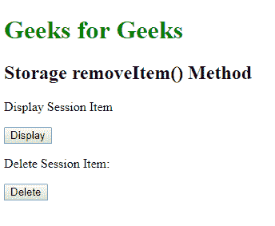

# HTML | DOM 存储 removeItem()方法

> 原文:[https://www . geesforgeks . org/html-DOM-storage-remove item-method/](https://www.geeksforgeeks.org/html-dom-storage-removeitem-method/)

DOM **Storage removeItem()** 方法与 Storage 对象相关，用于删除指定的 Storage 对象项。**存储对象**可以是**本地存储**或**会话存储**对象。
**语法:**

*   **本地存储删除项目:**

```html
localStorage.key(keyname)
```

*   **会话存储删除项目:**

```html
sessionStorage.key(keyname)
```

**参数:**它接受一个必需的参数 **keyname** ，即要删除的项目的名称。
**返回值**:不返回值。
下面是 HTML 代码展示 HTML DOM**Storage remove item()**对象:
**示例-1:**

## 超文本标记语言

```html
<!DOCTYPE html>
<html>

<head>
    <title>
        HTML DOM Storage removeItem() Method
    </title>
        <!-- Script to get the name of the key -->
    <script>
        function myGeeks() {

        // Storing key present at 0th index
        var key = localStorage.key(0);

        // Removing key at 0th index
        localStorage.removeItem(key);

        // Printing key at 0th index
        var key2 = localStorage.key(0);

        document.getElementById("geeks").innerHTML =
        "Previous value at 0th index was " + key + "<br>"
        + "Current value at 0th index is " + key2;
        }
    </script>
</head>

<body>
    <h1>GeeksForGeeks</h1></b>
    <h2 >DOM Storage removeItem() Method</h2>

    <button onclick="myGeeks()">
        Submit
    </button>

    <p id="geeks"></p>

</body>

</html>                   
```

**输出:**

*   **点击前:**



*   **点击后:**



下面是展示 HTML DOM**Storage remove item()**对象:
**示例-2:** Session 项工作原理的 HTML 代码。

a

## 超文本标记语言

```html
<!DOCTYPE html>
<html>

<body>

    <h1 style="color: green;">
      Geeks for Geeks</h1>

    <h2>Storage removeItem() Method</h2>

<p>Display Session Item</p>

    <button onclick="displayItem()">Display</button>

<p>Delete Session Item:</p>

    <button onclick="deleteItem()">Delete</button>

    <p id="try"></p>

    <script>
        // set item.
        sessionStorage.setItem(
          "gfg", "I am created");

        function deleteItem() {
            // Remove item.
            sessionStorage.removeItem("gfg");
        }

        function displayItem() {
            //  Display item.
            var remove_item =
                sessionStorage.getItem("gfg");

            document.getElementById(
              "try").innerHTML = remove_item;
        }
    </script>
</body>

</html>
```

**输出:**

*   **点击前:**



*   **点击后:**



**支持的浏览器:**以下是 **DOM Storage removeItem()** 支持的浏览器:

*   谷歌 Chrome 4
*   Internet Explorer 8
*   Firefox 3.5
*   歌剧 10.5
*   Safari 4