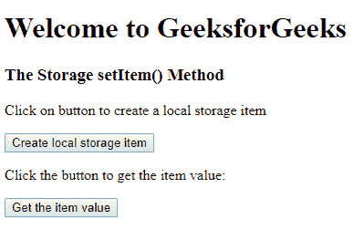
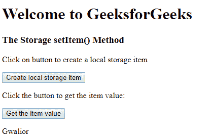

# HTML | DOM 存储设置项()方法

> 原文:[https://www . geesforgeks . org/html-DOM-storage-set item-method/](https://www.geeksforgeeks.org/html-dom-storage-setitem-method/)

**设置项()**方法用于**设置**用户指定的存储对象项。此存储对象可以是本地存储对象或会话存储对象。

**语法:**
对于本地存储:

```html
localStorage.setItem(keyname, value)
```

对于会话存储:

```html
sessionStorage.setItem(keyname, value)

```

**参数:**需要两个参数:-

*   **Keyname:** 它指定用于获取值的键的名称。
*   **值:**指定替换旧值的值。

**返回值:**代表插入值的字符串。

**示例:**

```html
<!DOCTYPE html>
<html>

<head>
    <!--script for creating new local 
      storage item and retrieve it -->
    <script>

        // Set item in local storage.
        function createItem() {
            localStorage.setItem("city", "Gwalior");
        }

        function myFunction() {
            var x = localStorage.getItem("city");
            document.getElementById("demo").innerHTML = x;
        }
    </script>
</head>

<body>
    <h1>Welcome to GeeksforGeeks</h1>
    <h3>The Storage setItem() Method</h3>
    <p>Click on button to create a 
      local storage item </p>

    <button onclick="createItem()">
      Create local storage item
  </button>

    <p>Click the button to get the item value:</p>

    <button onclick="myFunction()">
      Get the item value
  </button>

    <p id="demo"></p>

</body>

</html>
```

**输出:**

**之前:**


**之后:**


**支持的浏览器:**T2 DOM setItem()方法支持的浏览器如下:

*   谷歌 Chrome
*   微软公司出品的 web 浏览器
*   火狐浏览器
*   歌剧
*   旅行队