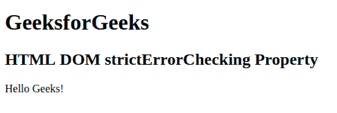

# HTML | DOM 严格错误检查属性

> 原文:[https://www . geeksforgeeks . org/html-DOM-strict error checking-property/](https://www.geeksforgeeks.org/html-dom-stricterrorchecking-property/)

**DOM 严格错误检查**属性*设置*或*返回*是否可以对文档执行严格错误检查。用于返回布尔值*真*或*假*。如果*为真*表示可以对文件进行严格检查，如果*为假*则不能进行检查。该属性默认为*真*。

**返回值:**返回一个布尔值，真或假。

**语法**

*   **返回:**

    ```html
    documentObject.strictErrorChecking
    ```

*   **设置:**

    ```html
    documentObject.strictErrorChecking=true|false
    ```

**示例:**

```html

<!DOCTYPE html>
<html>

<head>
    <title>
        HTML DOM strictErrorChecking Property
    </title>
</head>

<body>
    <h1>GeeksforGeeks</h1>
    <h2>HTML DOM strictErrorChecking Property</h2>

    <p id="geeks" onclick="MyGeeks()">
        Hello Geeks!
    </p>

    <script>
        function MyGeeks() {
            document.getElementById("geeks").strictErrorChecking;
        }
    </script>
</body>

</html>
```

**输出:**

**支持的浏览器:**主要浏览器不支持*DOM strict error checking Property*。