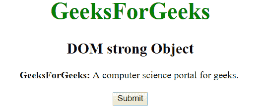
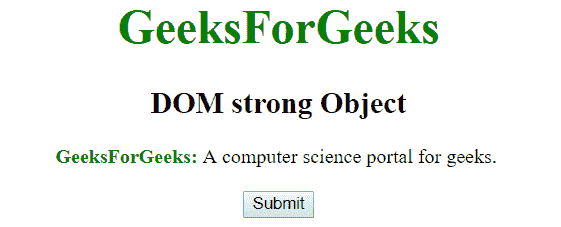
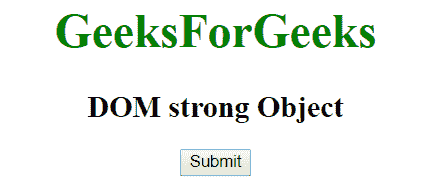
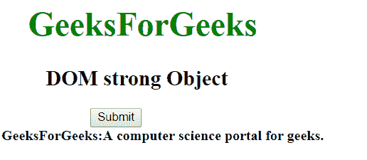

# HTML | DOM 强对象

> 原文:[https://www.geeksforgeeks.org/html-dom-strong-object/](https://www.geeksforgeeks.org/html-dom-strong-object/)

HTML DOM 中的强对象用来表示 HTML strong 元素。该标签用于显示文本的重要性。可以使用 getElementById()方法访问强元素。

**语法:**

```html
document.getElementById("id")
```

其中 id 被分配给**标签。**

**例 1:**

## 超文本标记语言

```html
<!DOCTYPE html>
<html>
    <head>
        <title>
            HTML DOM Strong Object
        </title>
    </head>

    <body style = "text-align:center;">

        <h1 style = "color:green;">
            GeeksForGeeks
        </h1>

        <h2>DOM strong Object</h2>

        <!-- Assign id to STRONG tag-->

<p>
            <strong id = "GFG">
                GeeksForGeeks:
            </strong>
            A computer science portal for geeks.
        </p>

        <button onclick = "myGeeks()">
            Submit
        </button>

        <!-- set style to the strong object -->
        <script>
            function myGeeks() {
                var para = document.getElementById("GFG");

                /* Change the color of strong element */
                para.style.color = "green";
            }
        </script>
    </body>
</html>                   
```

**输出:**
**之前点击按钮:**



**点击按钮后:**



**示例 2:** 可以使用 document.createElement 方法创建强对象。

## 超文本标记语言

```html
<!DOCTYPE html>
<html>
    <head>
        <title>
            HTML DOM Strong Object
        </title>
    </head>

    <body style = "text-align:center;">

        <h1 style = "color:green;" >
            GeeksForGeeks
        </h1>

        <h2>DOM strong Object</h2>

        <button onclick = "myGeeks()">
            Submit
        </button><br>

        <!-- script to display strong element -->
        <script>
            function myGeeks() {
                var elem = document.createElement("STRONG");
                var txt =
                document.createTextNode("GeeksForGeeks:"
                +"A computer science portal for geeks.");

                elem.appendChild(txt);

                document.body.appendChild(elem);
            }
        </script>
    </body>
</html>                   
```

**输出:**
**之前点击按钮:**



**点击按钮后:**



**支持的浏览器:**

*   歌剧
*   微软公司出品的 web 浏览器
*   谷歌 Chrome
*   火狐浏览器
*   苹果 Safari