# HTML | DOM 样式对齐内容属性

> 原文:[https://www . geesforgeks . org/html-DOM-style-aligncontent-property/](https://www.geeksforgeeks.org/html-dom-style-aligncontent-property/)

DOM Style **alignContent** 属性用于在灵活容器的项目没有使用横轴上所有可用空间时对齐它们。

**语法:**

*   获取对齐内容属性

    ```html
    object.style.alignContent
    ```

*   设置对齐内容属性

    ```html
    object.style.alignContent = "stretch | center | flex-start |
    flex-end | space-between | space-around | initial | inherit"
    ```

**属性值:**

*   **拉伸:**用于拉伸物品以适应容器。
*   **居中:**用于将容器中的物品居中。
*   **flex-start:** 这用于将项目定位在容器的开头。
*   **弯曲端:**用于将物品放置在容器的末端。
*   **间距:**用于定位行间间距均匀的物品。第一项在第一行，最后一项在最后一行。其他项目之间有间隔。
*   **环绕空间:**用于放置周围空间相等的物品。
*   **初始值:**用于将该属性设置为默认值。
*   **继承:**这将从其父级继承属性。

**返回值:**返回一个字符串值，代表元素的 align-content 属性。

**示例-1:** 使用拉伸值。

```html
<!DOCTYPE html>
<html>
<title>DOM Style alignContent property</title>

<head>
    <style>
        .main {
            width: 250px;
            height: 300px;
            border: 1px solid;
            display: flex;
            flex-flow: row wrap;
            /* setting to space-around to 
             observe the effect of 'stretch'*/
            align-content: space-around;
        }

        .main div {
            width: 250px;
            height: 70px;
            font-size: 2rem;
            text-align: center;
        }
    </style>
</head>

<body>
    <h1 style="color: green">
      GeeksforGeeks
    </h1>
    <b>DOM Style alignContent</b>

    <p>Click the button to change the
      value of the alignContent to "stretch"</p>

    <div class="main">
        <div style="background-color:green;">
          Geeks
      </div>
        <div style="background-color:lightgreen;">
          For
      </div>
        <div style="background-color:green;">
          Geeks
      </div>
    </div>

    <button onclick="changeAlign()">
      Change alignContent
  </button>

    <script>
        function changeAlign() {
            document.querySelector('.main').style.alignContent =
              "stretch";
        }
    </script>

</body>

</html>
```

**输出:**

*   **Before clicking the button:**

    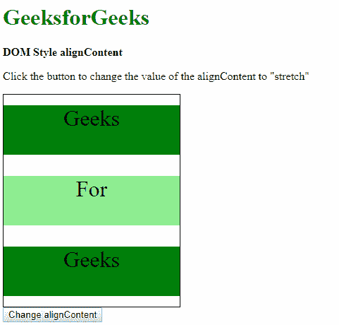

*   **After clicking the button:**

    

**示例-2:** 使用中心值。

```html
<!DOCTYPE html>
<html>
<title>
  DOM Style alignContent property
  </title>

<head>
    <style>
        .main {
            width: 250px;
            height: 300px;
            border: 1px solid;
            display: flex;
            flex-flow: row wrap;
        }

        .main div {
            width: 250px;
            height: 70px;
            font-size: 2rem;
            text-align: center;
        }
    </style>
</head>

<body>
    <h1 style="color: green">
      GeeksforGeeks
  </h1>
    <b>DOM Style alignContent</b>

    <p>Click the button to change the 
      value of the alignContent to "center"</p>

    <div class="main">
        <div style="background-color:green;">
          Geeks
      </div>
        <div style="background-color:lightgreen;">
          For
      </div>
        <div style="background-color:green;">
          Geeks
      </div>
    </div>

    <button onclick="changeAlign()">
      Change alignContent
  </button>

    <script>
        function changeAlign() {
            document.querySelector('.main').style.alignContent =
              "center";
        }
    </script>

</body>

</html>
```

**输出:**

*   **Before clicking the button:**

    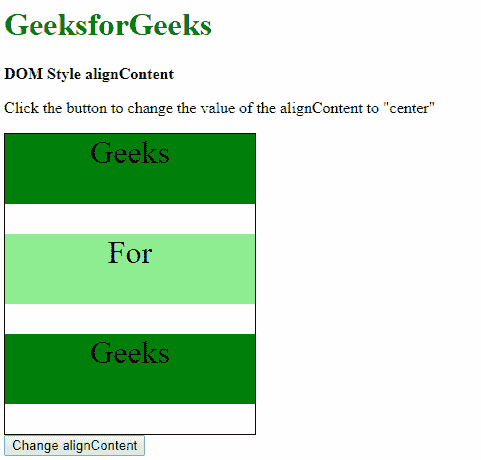

*   **After clicking the button:**

    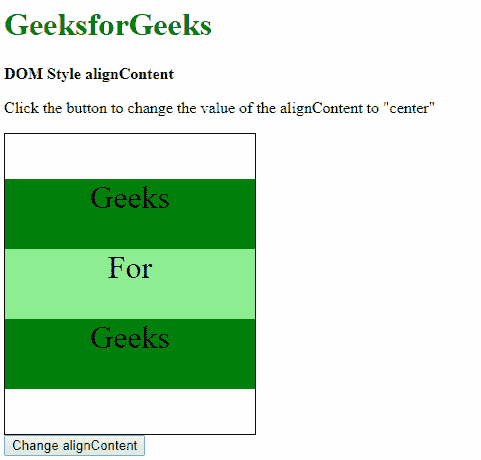

**示例-3:** 使用弹性启动值。

```html
<!DOCTYPE html>
<html>
<title>
  DOM Style alignContent property
  </title>

<head>
    <style>
        .main {
            width: 250px;
            height: 300px;
            border: 1px solid;
            display: flex;
            flex-flow: row wrap;
        }

        .main div {
            width: 250px;
            height: 70px;
            font-size: 2rem;
            text-align: center;
        }
    </style>
</head>

<body>
    <h1 style="color: green">
      GeeksforGeeks
  </h1>
    <b>DOM Style alignContent</b>

    <p>Click the button to change the 
      value of the alignContent to "flex-start"</p>

    <div class="main">
        <div style="background-color:green;">
          Geeks
      </div>
        <div style="background-color:lightgreen;">
          For
      </div>
        <div style="background-color:green;">
          Geeks
      </div>
    </div>

    <button onclick="changeAlign()">
      Change alignContent
  </button>

    <script>
        function changeAlign() {
         document.querySelector('.main').style.alignContent =
            "flex-start";
        }
    </script>

</body>

</html>
```

**输出:**

*   **Before clicking the button:**

    

*   **After clicking the button:**

    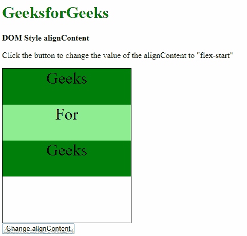

**示例-4:** 使用弯曲端值。

```html
<!DOCTYPE html>
<html>
<title>
  DOM Style alignContent property
 </title>

<head>
    <style>
        .main {
            width: 250px;
            height: 300px;
            border: 1px solid;
            display: flex;
            flex-flow: row wrap;
        }

        .main div {
            width: 250px;
            height: 70px;
            font-size: 2rem;
            text-align: center;
        }
    </style>
</head>

<body>
    <h1 style="color: green">
      GeeksforGeeks
  </h1>
    <b>
   DOM Style alignContent</b>

    <p>Click the button to change the
      value of the alignContent to "flex-end"
  </p>

    <div class="main">
        <div style="background-color:green;">
          Geeks
      </div>
        <div style="background-color:lightgreen;">
          For
      </div>
        <div style="background-color:green;">
          Geeks
      </div>
    </div>

    <button onclick="changeAlign()">
      Change alignContent
  </button>

    <script>
        function changeAlign() {
         document.querySelector('.main').style.alignContent =
              "flex-end";
        }
    </script>

</body>

</html>
```

**输出:**

*   **Before clicking the button:**

    

*   **After clicking the button:**

    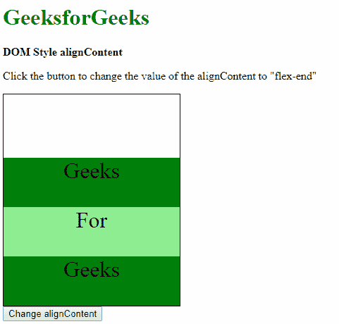

**示例-5:** 使用间距值。

```html
<!DOCTYPE html>
<html>
<title>
  DOM Style alignContent property
 </title>

<head>
    <style>
        .main {
            width: 250px;
            height: 300px;
            border: 1px solid;
            display: flex;
            flex-flow: row wrap;
        }

        .main div {
            width: 250px;
            height: 70px;
            font-size: 2rem;
            text-align: center;
        }
    </style>
</head>

<body>
    <h1 style="color: green">
      GeeksforGeeks
  </h1>
    <b>DOM Style alignContent</b>

    <p>Click the button to change the
      value of the alignContent to "space-between"
  </p>

    <div class="main">
        <div style="background-color:green;">
          Geeks
      </div>
        <div style="background-color:lightgreen;">
          For
      </div>
        <div style="background-color:green;">
          Geeks
      </div>
    </div>

    <button onclick="changeAlign()">
      Change alignContent
  </button>

    <script>
        function changeAlign() {
         document.querySelector('.main').style.alignContent = 
          "space-between";
        }
    </script>

</body>

</html>
```

**输出:**

*   **Before clicking the button:**

    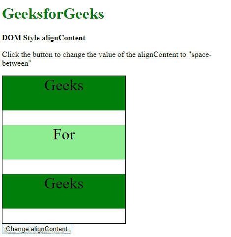

*   **After clicking the button:**

    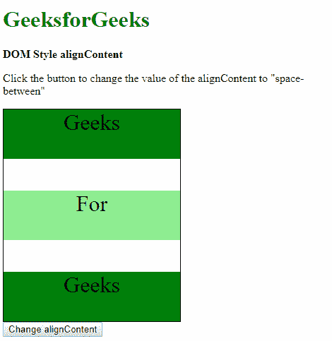

**示例-6:** 使用空格值。

```html
<!DOCTYPE html>
<html>
<title>
  DOM Style alignContent property
  </title>

<head>
    <style>
        .main {
            width: 250px;
            height: 300px;
            border: 1px solid;
            display: flex;
            flex-flow: row wrap;
        }

        .main div {
            width: 250px;
            height: 70px;
            font-size: 2rem;
            text-align: center;
        }
    </style>
</head>

<body>
    <h1 style="color: green">
      GeeksforGeeks
  </h1>
    <b>DOM Style alignContent</b>

    <p>Click the button to change the
      value of the alignContent to "space-around"
  </p>

    <div class="main">
        <div style="background-color:green;">
          Geeks
      </div>
        <div style="background-color:lightgreen;">
          For
      </div>
        <div style="background-color:green;">
          Geeks
      </div>
    </div>

    <button onclick="changeAlign()">
      Change alignContent
  </button>

    <script>
        function changeAlign() {
         document.querySelector('.main').style.alignContent =
           "space-around";
        }
    </script>

</body>

</html>
```

**输出:**

*   **Before clicking the button:**

    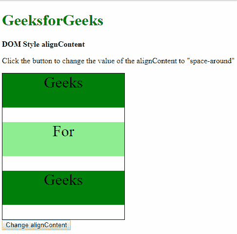

*   **After clicking the button:**

    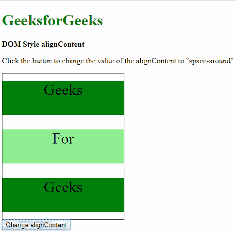

**示例-7:** 使用初始值。

```html
<!DOCTYPE html>
<html>
<title>
  DOM Style alignContent property
  </title>

<head>
    <style>
        .main {
            width: 250px;
            height: 300px;
            border: 1px solid;
            display: flex;
            flex-flow: row wrap;
            /* setting to space-around
          to observe the effect of 'initial' */
            align-content: space-around;
        }

        .main div {
            width: 250px;
            height: 70px;
            font-size: 2rem;
            text-align: center;
        }
    </style>
</head>

<body>
    <h1 style="color: green">
      GeeksforGeeks
  </h1>
    <b>DOM Style alignContent</b>

    <p>Click the button to change the
      value of the alignContent to "initial"
  </p>

    <div class="main">
        <div style="background-color:green;">
          Geeks
      </div>
        <div style="background-color:lightgreen;">
          For
      </div>
        <div style="background-color:green;">
          Geeks
      </div>
    </div>

    <button onclick="changeAlign()">
      Change alignContent
  </button>

    <script>
        function changeAlign() {
         document.querySelector('.main').style.alignContent =
              "initial";
        }
    </script>

</body>

</html>
```

**输出:**

*   **Before clicking the button:**

    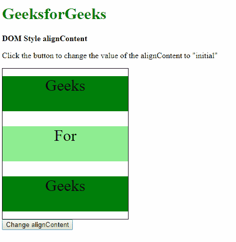

*   **After clicking the button:**

    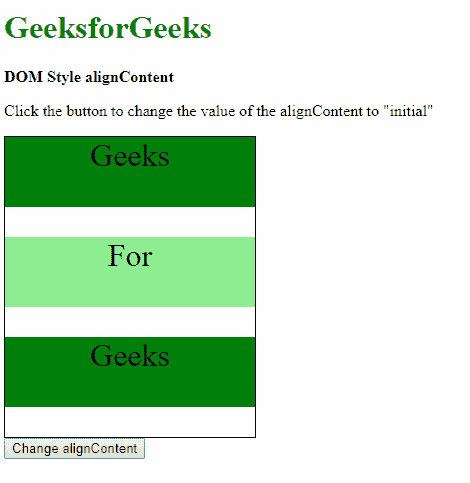

**示例-8:** 使用继承值。

```html
<!DOCTYPE html>
<html>
<title>
  DOM Style alignContent property
  </title>

<head>
    <style>
        #parent {
            /* Set the align-content of 
          parent to observe effect of 'inherit' */
            align-content: flex-end;
        }

        .main {
            width: 250px;
            height: 300px;
            border: 1px solid;
            display: flex;
            flex-flow: row wrap;
        }

        .main div {
            width: 250px;
            height: 70px;
            font-size: 2rem;
            text-align: center;
        }
    </style>
</head>

<body>
    <h1 style="color: green">
      GeeksforGeeks
  </h1>
    <b>DOM Style alignContent</b>

    <p>Click the button to change the 
      value of the alignContent to "inherit"
  </p>
    <div id="parent">
        <div class="main">
            <div style="background-color:green;">
              Geeks
          </div>
            <div style="background-color:lightgreen;">
              For
          </div>
            <div style="background-color:green;">
              Geeks
          </div>
        </div>
    </div>

    <button onclick="changeAlign()">
      Change alignContent
  </button>

    <script>
        function changeAlign() {
            document.querySelector('.main').style.alignContent =
              "inherit";
        }
    </script>

</body>

</html>
```

**输出:**

*   **Before clicking the button:**

    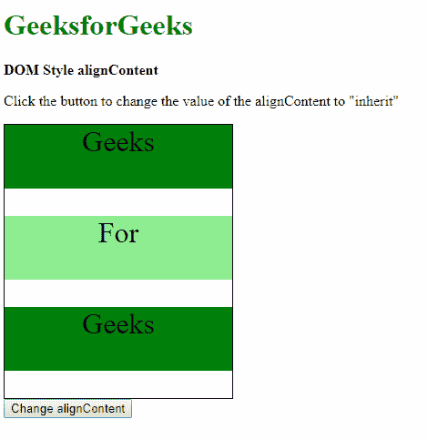

*   **After clicking the button:**

    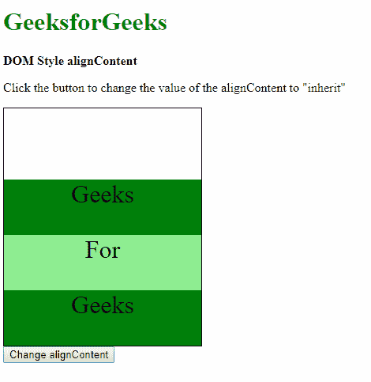

**支持的浏览器:***alignContent*属性支持的浏览器如下:

*   谷歌 Chrome 21.0
*   Internet Explorer 11.0
*   Firefox 28.0
*   歌剧 12.1
*   Safari 7.0