# HTML | DOM 样式对齐属性

> 原文:[https://www . geesforgeks . org/html-DOM-style-alignitems-property/](https://www.geeksforgeeks.org/html-dom-style-alignitems-property/)

DOM Style **alignItems** 属性用于设置或返回灵活容器中项目的默认对齐方式。

**语法:**

*   获得 alignItems 属性

    ```html
    object.style.alignItems
    ```

*   设置对齐属性

    ```html
    object.style.alignItems = "stretch|center|flex-start|flex-end|
    baseline|initial|inherit"

    ```

**属性值:**

*   **拉伸:**用于拉伸物品以适应容器。这是默认值。
*   **居中:**用于将容器中的物品居中。
*   **flex-start:** 这用于将项目定位在容器的开头。
*   **弯曲端:**用于将物品放置在容器的末端。
*   **基线:**用于将物品定位在集装箱的基线上。
*   **初始值:**用于将该属性设置为默认值。
*   **继承:**这将从其父级继承属性。

**返回值:**返回一个字符串值，代表元素的 align-items 属性。

使用以下示例解释这些值:

**示例-1:** 使用拉伸值。

```html
<!DOCTYPE html>
<html lang="en">

<head>
    <title>DOM Style alignItems Property</title>
    <style>
        .main {
            width: 200px;
            height: 150px;
            border: solid;
            display: flex;

            /* setting align-items to center to observe the
            effect of the stretch value */
            align-items: center;
        }
    </style>
</head>

<body>
    <h1 style="color: green">GeeksforGeeks</h1>
    <b>DOM Style alignItems Property</b>
    <p>Click on the button to change the 
       alignItems property to 'stretch'</p>

    <div class="main">
        <div style="background-color:lightblue;"> 
          Item 1 </div>
        <div style="background-color:lightgreen;"> 
          Item 2 </div>
        <div style="background-color:lightsalmon;"> 
          Item 3 </div>
        <div style="background-color:lightyellow;"> 
          Item 4 </div>
    </div>

    <button onclick="changePos()">
      Change alignItems property
    </button>

    <script>
        function changePos() {
            elem = document.querySelector('.main');

            // Setting alignItems to stretch
            elem.style.alignItems = 'stretch';
        }
    </script>
</body>

</html>
```

**输出:**

*   **按下按钮前:**
    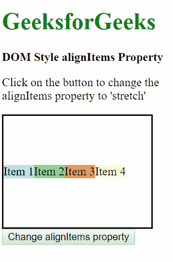
*   **按下按钮后:**
    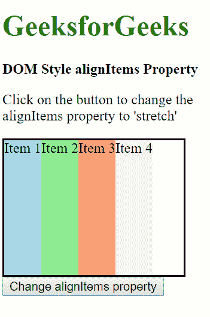

**示例-2:** 使用中心值。

```html
<!DOCTYPE html>
<html lang="en">

<head>
    <title>DOM Style alignItems Property</title>
    <style>
        .main {
            width: 200px;
            height: 150px;
            border: solid;
            display: flex;
        }
    </style>
</head>

<body>
    <h1 style="color: green">GeeksforGeeks</h1>
    <b>DOM Style alignItems Property</b>
    <p>Click on the button to change the 
        alignItems property to 'center'</p>

    <div class="main">
        <div style="background-color:lightblue;"> 
          Item 1 </div>
        <div style="background-color:lightgreen;"> 
          Item 2 </div>
        <div style="background-color:lightsalmon;"> 
          Item 3 </div>
        <div style="background-color:lightyellow;"> 
          Item 4 </div>
    </div>

    <button onclick="changePos()">
      Change alignItems property
    </button>

    <script>
        function changePos() {
            elem = document.querySelector('.main');

            // Setting alignItems to center
            elem.style.alignItems = 'center';
        }
    </script>
</body>

</html>
```

**输出:**

*   **按下按钮前:**
    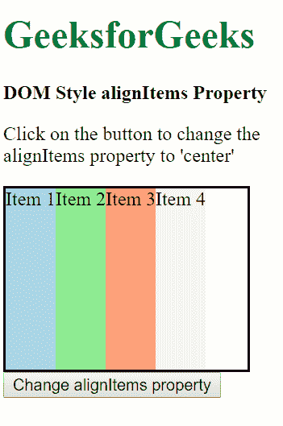
*   **按下按钮后:**
    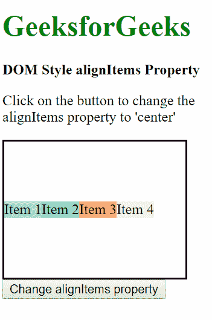

**示例-3:** 使用弹性启动值。

```html
<!DOCTYPE html>
<html lang="en">

<head>
    <title>DOM Style alignItems Property</title>
    <style>
        .main {
            width: 200px;
            height: 150px;
            border: solid;
            display: flex;
        }
    </style>
</head>

<body>
    <h1 style="color: green">GeeksforGeeks</h1>
    <b>DOM Style alignItems Property</b>
    <p>Click on the button to change the 
       alignItems property to 'flex-start'</p>

    <div class="main">
        <div style="background-color:lightblue;"> 
          Item 1 </div>
        <div style="background-color:lightgreen;"> 
          Item 2 </div>
        <div style="background-color:lightsalmon;"> 
          Item 3 </div>
        <div style="background-color:lightyellow;"> 
          Item 4 </div>
    </div>

    <button onclick="changePos()">
      Change alignItems property
    </button>

    <script>
        function changePos() {
            elem = document.querySelector('.main');

            // Setting alignItems to flex-start
            elem.style.alignItems = 'flex-start';
        }
    </script>
</body>

</html>
```

**输出:**

*   **按下按钮前:**
    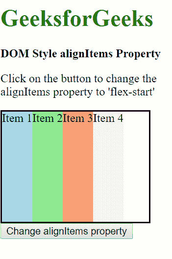
*   **按下按钮后:**
    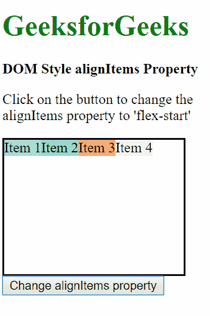

**示例-4:** 使用弯曲端值。

```html
<!DOCTYPE html>
<html lang="en">

<head>
    <title>DOM Style alignItems Property</title>
    <style>
        .main {
            width: 200px;
            height: 150px;
            border: solid;
            display: flex;
        }
    </style>
</head>

<body>
    <h1 style="color: green">GeeksforGeeks</h1>
    <b>DOM Style alignItems Property</b>
    <p>Click on the button to change the 
       alignItems property to 'flex-end'</p>

    <div class="main">
        <div style="background-color:lightblue;"> 
          Item 1 </div>
        <div style="background-color:lightgreen;"> 
          Item 2 </div>
        <div style="background-color:lightsalmon;"> 
          Item 3 </div>
        <div style="background-color:lightyellow;"> 
          Item 4 </div>
    </div>

    <button onclick="changePos()">
      Change alignItems property
    </button>

    <script>
        function changePos() {
            elem = document.querySelector('.main');

            // Setting alignItems to flex-end
            elem.style.alignItems = 'flex-end';
        }
    </script>
</body>

</html>
```

**输出:**

*   **按下按钮前:**
    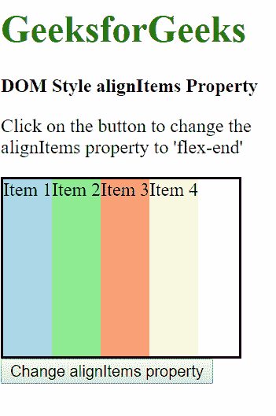
*   **按下按钮后:**
    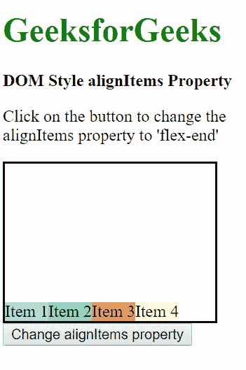

**示例-5:** 使用基线值。

```html
<!DOCTYPE html>
<html lang="en">

<head>
    <title>DOM Style alignItems Property</title>
    <style>
        .main {
            width: 200px;
            height: 150px;
            border: solid;
            display: flex;
        }
    </style>
</head>

<body>
    <h1 style="color: green">GeeksforGeeks</h1>
    <b>DOM Style alignItems Property</b>
    <p>Click on the button to change the 
      alignItems property to 'baseline'</p>

    <div class="main">
        <div style="background-color:lightblue;">
          Item 1 </div>
        <div style="background-color:lightgreen;">
          Item 2 </div>
        <div style="background-color:lightsalmon;">
          Item 3 </div>
        <div style="background-color:lightyellow;">
          Item 4 </div>
    </div>

    <button onclick="changePos()">
      Change alignItems property
    </button>

    <script>
        function changePos() {
            elem = document.querySelector('.main');

            // Setting alignItems to baseline
            elem.style.alignItems = 'baseline';
        }
    </script>
</body>

</html>
```

**输出:**

*   **按下按钮前:**
    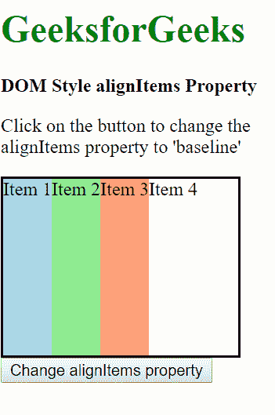
*   **按下按钮后:**
    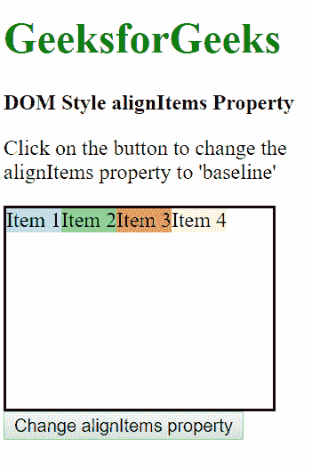

**示例-6:** 使用初始值。这会将属性设置为默认值。

```html
<!DOCTYPE html>
<html lang="en">

<head>
    <title>DOM Style alignItems Property</title>
    <style>
        .main {
            width: 200px;
            height: 150px;
            border: solid;
            display: flex;
            /* setting align-items to center 
             to observe the effect of the 
             initial value */
            align-items: center;
        }
    </style>
</head>

<body>
    <h1 style="color: green">GeeksforGeeks</h1>
    <b>DOM Style alignItems Property</b>
    <p>Click on the button to change the 
      alignItems property to 'initial'</p>

    <div class="main">
        <div style="background-color:lightblue;"> 
          Item 1 </div>
        <div style="background-color:lightgreen;"> 
          Item 2 </div>
        <div style="background-color:lightsalmon;"> 
          Item 3 </div>
        <div style="background-color:lightyellow;"> 
          Item 4 </div>
    </div>

    <button onclick="changePos()">
      Change alignItems property
    </button>

    <script>
        function changePos() {
            elem = document.querySelector('.main');

            // Setting alignItems to initial
            elem.style.alignItems = 'initial';
        }
    </script>
</body>

</html>
```

**输出:**

*   **按下按钮前:**
    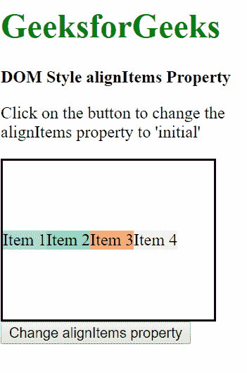
*   **按下按钮后:**
    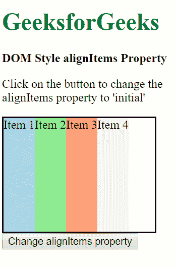

**示例-7:** 使用继承值。这将从其父元素继承位置。

```html
<!DOCTYPE html>
<html lang="en">

<head>
    <title>DOM Style alignItems Property</title>
    <style>
        .main {
            width: 200px;
            height: 150px;
            border: solid;
            display: flex;
        }

        #parent {
            /* Setting the parent div's 
              align-items to flex-end */
            align-items: flex-end;
        }
    </style>
</head>

<body>
    <h1 style="color: green">GeeksforGeeks</h1>
    <b>DOM Style alignItems Property</b>
    <p>Click on the button to change the 
       alignItems property to 'inherit'</p>

    <div id="parent">
        <div class="main">
            <div style="background-color:lightblue;"> 
              Item 1 </div>
            <div style="background-color:lightgreen;"> 
              Item 2 </div>
            <div style="background-color:lightsalmon;"> 
              Item 3 </div>
            <div style="background-color:lightyellow;"> 
              Item 4 </div>
        </div>
    </div>

    <button onclick="changePos()">
      Change alignItems property
    </button>

    <script>
        function changePos() {
            elem = document.querySelector('.main');

            // Setting alignItems to inherit from parent div
            elem.style.alignItems = 'inherit';
        }
    </script>
</body>

</html>
```

**输出:**

*   **按下按钮前:**
    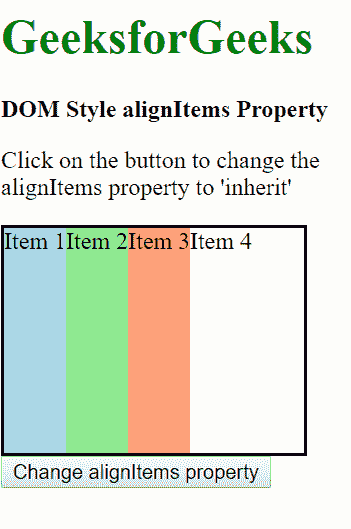
*   **按下按钮后:**
    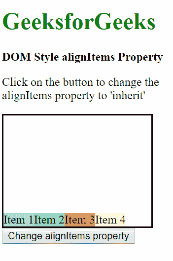

**支持的浏览器:***alignItems Property*支持的浏览器如下:

*   铬 21.0
*   Internet Explorer 11.0
*   Firefox 20.0
*   歌剧 12.1
*   Safari 7.0