# HTML | DOM 样式对齐自身属性

> 原文:[https://www . geesforgeks . org/html-DOM-style-align self-property/](https://www.geeksforgeeks.org/html-dom-style-alignself-property/)

DOM Style**alignment self**属性用于**设置**或**返回**柔性容器内选定项目的对齐方式。

**语法:**

*   获取对齐自身属性

    ```html
    object.style.alignSelf
    ```

*   设置对齐自身属性

    ```html
    object.style.alignSelf = "auto | stretch | center | flex-start |
    flex-end | baseline | initial | inherit"
    ```

**属性值:**

*   **auto:** 元素继承父容器的“align-items”属性，如果没有父容器，则将其设置为“stretch”。这是默认样式。
*   **拉伸:**用于拉伸物品以适合容器。
*   **居中:**用于将容器中的物品居中。
*   **伸缩启动:**用于将物品定位在容器的开始位置
*   **弯曲端:**用于将物品定位在容器的末端。
*   **基线:**用于将物品定位在容器的基线。
*   **初始值:**用于将该属性设置为默认值。
*   **继承:**这将从其父级继承属性。

**返回值:**返回一个代表元素自身对齐属性的字符串值。

**示例-1:** 使用自动值。

```html
<!DOCTYPE html>
<html lang="en">

<head>
    <title>DOM Style alignSelf Property
    </title>
    <style>
        .main {
            width: 200px;
            height: 150px;
            border: solid;
            display: flex;
            align-items: center;
        }

        #item {
            /* setting align-self to 
             flex-end to observe the
            effect of the auto value */
            align-self: flex-end;
        }
    </style>
</head>

<body>
    <h1 style="color: green">GeeksforGeeks
  </h1>

    <b>DOM Style alignSelf Property</b>
    <p>Click on the button to change the alignSelf 
    property to 'auto'</p>

    <div class="main">
        <div style="background-color:green;">
            GFG1 </div>
        <div style="background-color:white;">
            GFG2 </div>
        <div id="item" style="background-color:green;">
            GFG3 </div>
        <div style="background-color:white;">
            GFG4 </div>
    </div>

    <button onclick="changePos()">
        Change alignSelf property</button>

    <script>
        function changePos() {

            elem = document.querySelector('#item');

            // Setting alignSelf to auto
            elem.style.alignSelf = 'auto';
        }
    </script>
</body>

</html>
```

**输出:**

*   **点击按钮前:**
    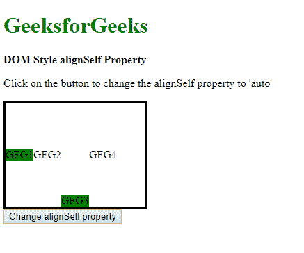
*   **点击按钮后:**
    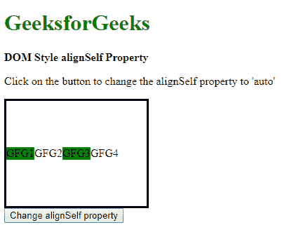

**示例-2:** 使用拉伸值。

```html
<!DOCTYPE html>
<html lang="en">

<head>
    <title>DOM Style alignSelf Property
  </title>
    <style>
        .main {
            width: 200px;
            height: 150px;
            border: solid;
            display: flex;
            /* setting align-items to 
              center to observe the
            effect of the strench value */
            align-items: center;
        }
    </style>
</head>

<body>
    <h1 style="color: green">GeeksforGeeks</h1>
    <b>DOM Style alignSelf Property</b>
    <p>Click on the button to change the 
      alignSelf property to 'stretch'</p>

    <div class="main">
        <div style="background-color:green;">
          GFG1 </div>
        <div style="background-color:white;">
          GFG2 </div>
        <div id="item" 
             style="background-color:green;">
          GFG3 </div>
        <div style="background-color:white;">
          GFG4 </div>
    </div>
    <button onclick="changePos()">Change alignSelf property
  </button>

    <script>
        function changePos() {
            elem = document.querySelector('#item');

            // Setting alignSelf to stretch
            elem.style.alignSelf = 'stretch';
        }
    </script>
</body>

</html>
```

**输出:**

*   **点击按钮前:**
    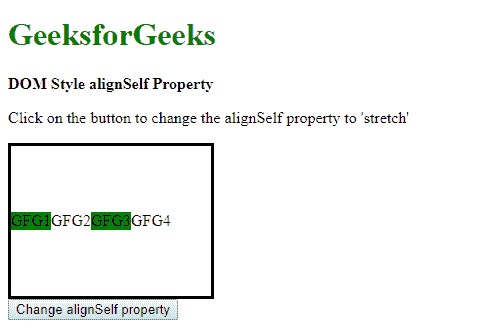
*   **点击按钮后:**
    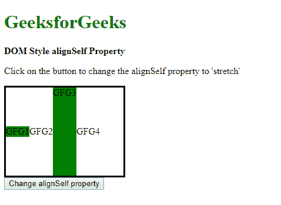

**示例-3:** 使用中心值。

```html
<!DOCTYPE html>
<html lang="en">

<head>
    <title>DOM Style alignSelf Property
  </title>
    <style>
        .main {
            width: 200px;
            height: 150px;
            border: solid;
            display: flex;
            /* setting align-items to 
            center to observe the
            effect of the center value */
            align-items: stretch;
        }
    </style>
</head>

<body>
    <h1 style="color: green">GeeksforGeeks
  </h1>
    <b>DOM Style alignSelf Property</b>
    <p>Click on the button to change the
      alignSelf property to 'center'</p>

    <div class="main">
        <div style="background-color:green;">
          GFG1 </div>
        <div style="background-color:white;">
          GFG2 </div>
        <div id="item" 
             style="background-color:green;">
          GFG3 </div>
        <div style="background-color:white;">
          GFG4 </div>
    </div>

    <button onclick="changePos()">
      Change alignSelf property</button>

    <script>
        function changePos() {
            elem = document.querySelector('#item');

            // Setting alignSelf to center
            elem.style.alignSelf = 'center';
        }
    </script>
</body>

</html>
```

**输出:**

*   **点击按钮前:**
    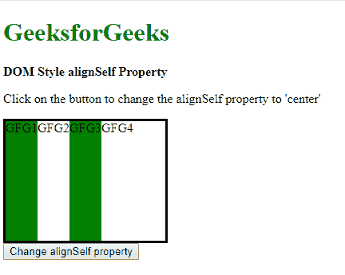
*   **点击按钮后:**
    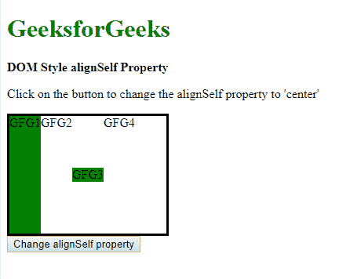

**示例-4:** 使用弹性启动值。

```html
<!DOCTYPE html>
<html lang="en">

<head>
    <title>DOM Style alignSelf Property
  </title>
    <style>
        .main {
            width: 200px;
            height: 150px;
            border: solid;
            display: flex;
        }
    </style>
</head>

<body>
    <h1 style="color: green">GeeksforGeeks
  </h1>
    <b>DOM Style alignSelf Property</b>
    <p>Click on the button to change the 
      alignSelf property to 'flex-start'</p>

    <div class="main">
        <div style="background-color:green;">
          GFG1 </div>
        <div style="background-color:white;">
          GFG2 </div>
        <div id="item" 
             style="background-color:green;">
          GFG3 </div>
        <div style="background-color:white;">
          GFG4 </div>
    </div>

    <button onclick="changePos()">
      Change alignSelf property</button>

    <script>
        function changePos() {
            elem = document.querySelector('#item');

            // Setting alignSelf to flex-start
            elem.style.alignSelf = 'flex-start';
        }
    </script>
</body>

</html>
```

**输出:**

*   **点击按钮前:**
    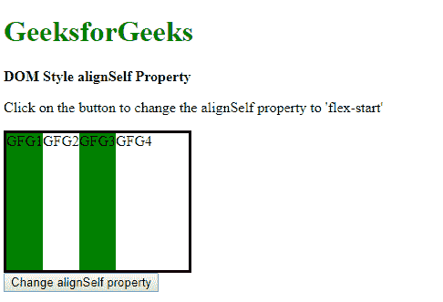
*   **点击按钮后:**
    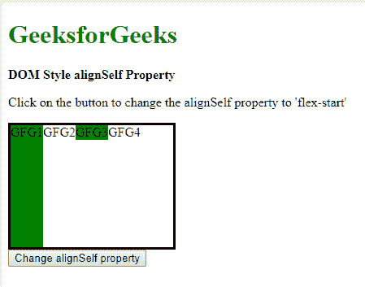

**示例-5:** 使用弯曲端值。

```html
<!DOCTYPE html>
<html lang="en">

<head>
    <title>DOM Style alignSelf Property
  </title>
    <style>
        .main {
            width: 200px;
            height: 150px;
            border: solid;
            display: flex;
        }
    </style>
</head>

<body>
    <h1 style="color: green">GeeksforGeeks
  </h1>
    <b>DOM Style alignSelf Property</b>
    <p>Click on the button to change the 
      alignSelf property to 'flex-end'</p>

    <div class="main">
        <div style="background-color:green;">
          GFG1 </div>
        <div style="background-color:white;">
          GFG2 </div>
        <div id="item" 
             style="background-color:green;">
          GFG3 </div>
        <div style="background-color:white;">
          GFG4 </div>
    </div>

    <button onclick="changePos()">
      Change alignSelf property</button>

    <script>
        function changePos() {
            elem = document.querySelector('#item');

            // Setting alignSelf to flex-end
            elem.style.alignSelf = 'flex-end';
        }
    </script>
</body>

</html>
```

**输出:**

*   **点击按钮前:**
    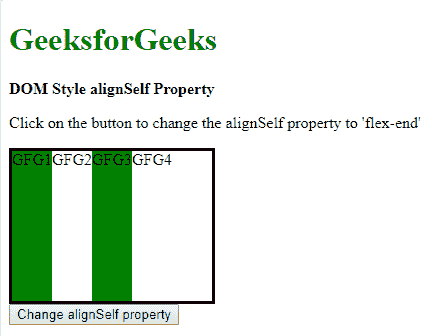
*   **点击按钮后:**
    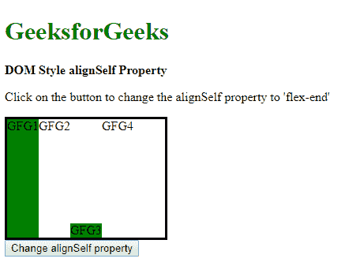

**示例-6:** 使用基线值。

```html
<!DOCTYPE html>
<html lang="en">

<head>
    <title>DOM Style alignSelf Property</title>
    <style>
        .main {
            width: 200px;
            height: 150px;
            border: solid;
            display: flex;
        }
    </style>
</head>

<body>
    <h1 style="color: green">GeeksforGeeks
  </h1>
    <b>DOM Style alignSelf Property</b>
    <p>Click on the button to change the 
      alignSelf property to 'baseline'</p>

    <div class="main">
        <div style="background-color:green;"> 
          GFG1 </div>
        <div style="background-color:white;">
          GFG2 </div>
        <div id="item"
             style="background-color:green;">
          GFG3 </div>
        <div style="background-color:white;">
          GFG4 </div>
    </div>

    <button onclick="changePos()">
      Change alignSelf property</button>

    <script>
        function changePos() {
            elem = document.querySelector('#item');

            // Setting alignSelf to baseline
            elem.style.alignSelf = 'baseline';
        }
    </script>
</body>

</html>
```

**输出:**

*   **点击按钮前:**
    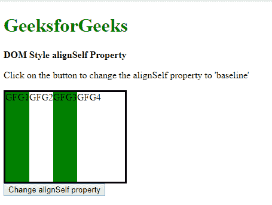
*   **点击按钮后:**
    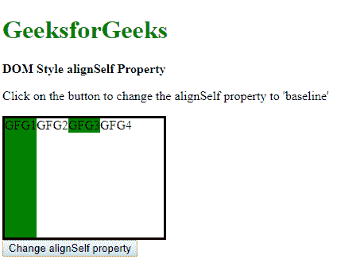

**示例-7:** 使用初始值。

```html
<!DOCTYPE html>
<html lang="en">

<head>
    <title>DOM Style alignSelf Property
  </title>
    <style>
        .main {
            width: 200px;
            height: 150px;
            border: solid;
            display: flex;
            align-items: center;
        }

        #item {
            /* setting align-self to 
             flex-end to observe the
            effect of the initial value */
            align-self: flex-end;
        }
    </style>
</head>

<body>
    <h1 style="color: green">GeeksforGeeks
  </h1>
    <b>DOM Style alignSelf Property</b>
    <p>Click on the button to change the 
      alignSelf property to 'initial'</p>

    <div class="main">
        <div style="background-color:green;"> 
          GFG1 </div>
        <div style="background-color:white;">
          GFG2 </div>
        <div id="item" 
             style="background-color:green;">
          GFG3 </div>
        <div style="background-color:white;">
          GFG4 </div>
    </div>
    <button onclick="changePos()">
      Change alignSelf property</button>

    <script>
        function changePos() {
            elem = document.querySelector('#item');

            // Setting alignSelf to initial
            elem.style.alignSelf = 'initial';
        }
    </script>
</body>

</html>
```

**输出:**

*   **点击按钮前:**
    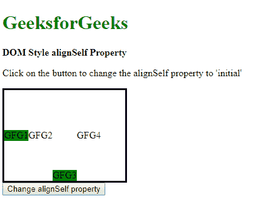
*   **点击按钮后:**
    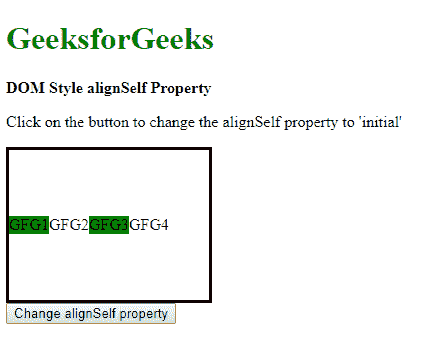

**示例-8:** 使用继承值。

```html
<!DOCTYPE html>
<html lang="en">

<head>
    <title>DOM Style alignSelf Property
  </title>
    <style>
        .main {
            width: 200px;
            height: 150px;
            border: solid;
            display: flex;
            /* this itself is the
          parent of the item */
            align-items: center;
        }

        #item {
            /* setting align-self to 
          flex-end to observe the
            effect of the inherit value */
            align-self: flex-end;
        }
    </style>
</head>

<body>
    <h1 style="color: green">GeeksforGeeks
  </h1>
    <b>DOM Style alignSelf Property</b>
    <p>Click on the button to change the
      alignSelf property to 'inherit'</p>

    <div id="parent">
        <div class="main">
            <div style="background-color:green;">
              GFG1 </div>
            <div style="background-color:white;"> 
              GFG2 </div>
            <div id="item" 
                 style="background-color:green;">
              GFG3 </div>
            <div style="background-color:white;">
              GFG4 </div>
        </div>
    </div>

    <button onclick="changePos()">
      Change alignSelf property</button>

    <script>
        function changePos() {
            elem = document.querySelector('#item');

            // Setting alignSelf to inherit
            elem.style.alignSelf = 'inherit';
        }
    </script>
</body>

</html>
```

**输出:**

*   **点击按钮前:**
    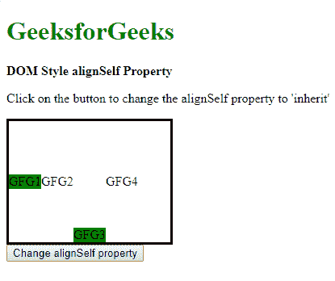
*   **点击按钮后:**
    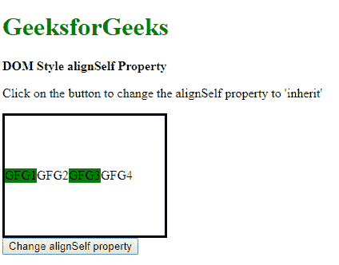

**支持的浏览器:**由 *alignSelf* 属性支持的浏览器如下:

*   谷歌 Chrome 21.0
*   Internet Explorer 11.0
*   Firefox 20.0
*   歌剧 12.1
*   Safari 7.0