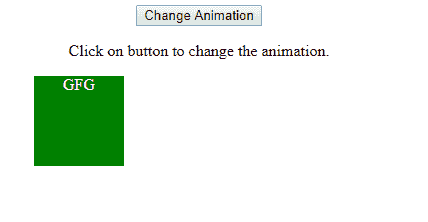
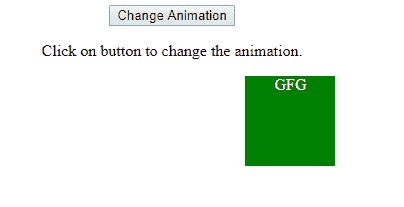
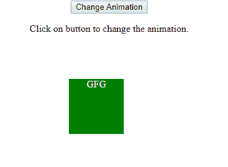
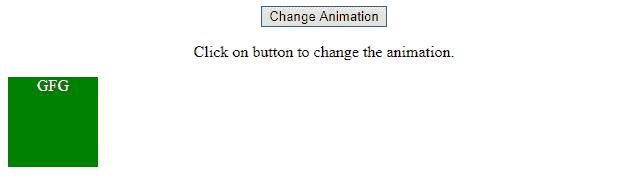
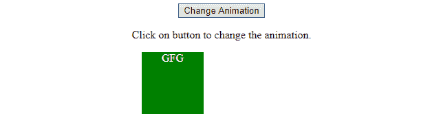
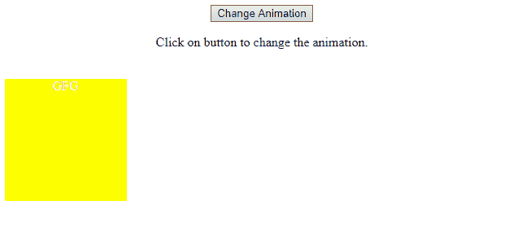

# HTML | DOM 风格动画属性

> 原文:[https://www . geesforgeks . org/html-DOM-style-animation-property/](https://www.geeksforgeeks.org/html-dom-style-animation-property/)

样式**动画**属性使从一种 CSS 样式到另一种 CSS 样式的动画转换成为可能。它配置动画序列应该如何进行的定时、延迟、持续时间和其他细节。该动画包含两个组件，一个是描述组件的 CSS，另一个是指示样式开始和结束状态的一组关键帧。
**语法:**

*   用于返回动画属性

```html
object.style.animation
```

*   用于设置动画属性

```html
object.style.animation="name duration timingFunction delay
iterationCount direction fillMode playState"
```

**房产价值**

*   **动画名称:**描述附加到选择器的关键帧的名称。
*   **动画持续时间:**描述动画发生的时间。
*   **动画定时功能:**描述动画的速度。
*   **动画延迟:**描述动画开始前的延迟。
*   **动画迭代计数:**描述动画发生的次数。
*   **动画方向:**描述动画是否应该在交替循环中反向播放。
*   **动画填充模式:**描述动画结束时应用哪些值。
*   **动画播放状态:**描述动画是正在运行还是暂停。

**返回值:**返回一个代表元素动画属性的字符串值。

**例 1:**

## 超文本标记语言

```html
<!DOCTYPE html>
<html>
    <head>
        <style> 
            #GFG {
                width: 90px;
                height: 90px;
                background: green;
                color: white;
                position: relative;
                text-align: center;

                /* -webkit- is used for safari browser */
                -webkit-animation: GFG_Move_1 1s infinite;

                animation: GFG_Move_1 1s infinite;
            }

            /* For Opera, Chrome and Safari browser */
            @-webkit-keyframes GFG_Move_1 {
                from {left: 250px;}
                to {left: 500px;}
            }

            /* For Opera, Chrome and Safari browser */
            @-webkit-keyframes GFG_Move_2 {
                from {left: 350px;top: 0px;}
                to {left: 350px;top: 200px;}
            }

            @keyframes GFG_Move_1 {
                from {left: 250px;}
                to {left: 500px;}
            }

            @keyframes GFG_Move_2 {
                from {left: 350px;top: 0px;}
                to {left: 350px;top: 200px;}
            }
        </style>
    </head>

    <body align="center">
        <button onclick = "myGeeks()">
            Change Animation
        </button>

<p>
            Click on button to change the animation.
        </p>

        <script>
            function myGeeks() {

                /* This code run on safari browser */
                document.getElementById("GFG").style.WebkitAnimation
                        = "GFG_Move_2 4s 2";

                document.getElementById("GFG").style.animation
                        = "GFG_Move_2 4s 2";
            }
        </script>

        <div id="GFG">GFG</div>
    </body>
</html>                    
```

**输出:**

*   **点击按钮前:**div 水平移动





*   **点击按钮后:**div 垂直移动



**例 2:**

## 超文本标记语言

```html
<!DOCTYPE html>
<html>
    <head>
        <title>
            HTML DOM Style animation Property
        </title>

        <style> 
            #GFG {
                width: 90px;
                height: 90px;
                background: green;
                position: relative;
                color: white;
                text-align: center;

                /* /* For Opera, Chrome, Safari*/ */
                -webkit-animation: GFG_Move_1 1s infinite;

                animation: GFG_Move_1 1s infinite;
            }

            /* For Opera, Chrome, Safari*/
            @-webkit-keyframes GFG_Move_1 {
                from {
                    left: 0px;
                }
                to {
                    left: 90px;
                }
            }

            /* For Opera, Chrome, Safari */
            @-webkit-keyframes GFG_Move_2 {
                from {
                    top: 0px; 
                    background: green; 
                    width: 100px;
                }
                to {
                    top: 200px; 
                    background: yellow; 
                    width: 150px; 
                    height: 150px;
                }
            }

            @keyframes GFG_Move_1 {
                from {
                    left: 0px;
                }
                to {
                    left: 95px;
                }
            }

            @keyframes GFG_Move_2 {
                from {
                    top: 0px; 
                    background: green; 
                    width: 100px;
                }
                to {
                    top: 200px; 
                    background: yellow; 
                    width: 150px; 
                    height: 150px;
                }
            }
        </style>
    </head>

    <body align="center">

        <button onclick="myGeeks()">
            Change Animation
        </button>

<p>
            Click on button to change the animation.
        </p>

        <script>
            function myGeeks() {

                /* For Opera, Chrome, Safari */
                document.getElementById("GFG").style.WebkitAnimation
                        = "GFG_Move_2 4s 2" 
                document.getElementById("GFG").style.animation
                        = "GFG_Move_2 4s 2";
            }
        </script>

        <div id = "GFG">GFG</div>
    </body>
</html>                    
```

*   **之前点击按钮:**





*   **点击按钮后:**



**支持的浏览器:**T2 风格动画属性支持的浏览器如下:

*   谷歌 Chrome 43.0，4.0 -webkit-
*   Internet Explorer 10.0
*   火狐 16.0， 5.0 -moz-
*   操作 30.0、15.0 -webkit、12.1、12.0 -o-
*   Safari 9.0，4.0 -webkit-