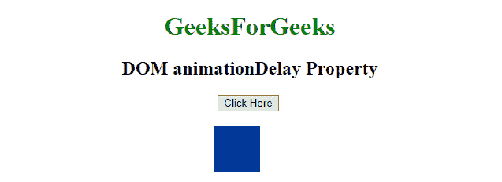

# HTML | DOM 样式动画延迟属性

> 原文:[https://www . geesforgeks . org/html-DOM-style-animation delay-property/](https://www.geeksforgeeks.org/html-dom-style-animationdelay-property/)

HTML DOM 中的 **animationDelay 属性**用于**设置**或**返回**延迟，在此之后**动画应该开始**。

**语法:**

*   用于设置 animationDelay 属性:

    ```html
    object.style.animationDelay = "time|initial|inherit"
    ```

*   用于返回 animationDelay 属性:

    ```html
    object.style.animationDelay
    ```

**属性值:**

*   **时间:**用于定义动画延迟的秒数或毫秒数。默认值为 0。
*   **初始值:**用于将属性设置为默认值。
*   **继承:**用于从其父代继承财产。

**返回值:**返回一个字符串值，代表元素的动画延迟属性。

**示例-1:** 动画延迟 3 秒，使用时间属性值。

```html
<!DOCTYPE html>
<html>

<head>
    <title>
        HTML DOM animationDelay Property
    </title>
    <style>
        div {
            width: 100px;
            height: 100px;
            background: green;
            position: relative;
            -webkit-animation: move_1 2s infinite;
            /* For Chrome, Safari, Opera*/
            animation: move_1 2s infinite;
        }
        /* For Chrome, Safari, Opera */

        @-webkit-keyframes move_1 {
            from {
                left: 150px;
            }
            to {
                left: 350px;
            }
        }

        @keyframes move_1 {
            from {
                left: 150px;
            }
            to {
                left: 350px;
            }
        }
        /* For Chrome, Safari, Opera */

        @-webkit-keyframes move_2 {
            from {
                left: 270px;
                width: 0px;
                height: 0px;
            }
            to {
                left: 270px;
                width: 100px;
                height: 100px;
                background: blue;
            }
        }

        @keyframes move_2 {
            from {
                left: 270px;
                width: 0px;
                height: 0px;
            }
            to {
                left: 270px;
                width: 100px;
                height: 100px;
                background: blue;
            }
        }
    </style>
</head>

<body style="text-align:center;">

    <h1 style="color:green;">  
            GeeksForGeeks  
        </h1>

    <h2>DOM animationDelay Property</h2>
    <button onclick="Geeks()">
        Click Here
    </button>
    <br>
    <br>
    <div id="GFG_DIV"></div>

    <script>
        function Geeks() {

            // Changing the animation name.
            document.getElementById(
              "GFG_DIV").style.WebkitAnimationName = 
              "move_2";

            // for Chrome, Safari, and Opera
            document.getElementById(
              "GFG_DIV").style.animationName = 
              "move_2";

            // Changing the animation delay.
            document.getElementById(
              "GFG_DIV").style.WebkitAnimationDelay = 
              "3s";

            // for Chrome, Safari, and Opera
            document.getElementById(
              "GFG_DIV").style.animationDelay = 
              "3s";
        }
    </script>
</body>

</html>
```

**输出**

*   **之前点击按钮:**
    
*   **点击按钮后:**
    
*   **最后:**
    

**示例-2:** 动画延迟 3 秒。

```html
<!DOCTYPE html>
<html>

<head>
    <title>
        HTML DOM animationDelay Property
    </title>
    <style>
        div {
            width: 100px;
            height: 100px;
            background: green;
            position: relative;
            -webkit-animation: move_1 2s infinite;
            /* For Chrome, Safari, Opera*/
            animation: move_1 2s infinite;
        }
        /* For Chrome, Safari, Opera */

        @-webkit-keyframes move_1 {
            from {
                left: 150px;
            }
            to {
                left: 350px;
            }
        }

        @keyframes move_1 {
            from {
                left: 150px;
            }
            to {
                left: 350px;
            }
        }
        /* For Chrome, Safari, Opera */

        @-webkit-keyframes move_2 {
            from {
                left: 270px;
                width: 0px;
            }
            to {
                left: 270px;
                width: 100px;
                background: blue;
            }
        }

        @keyframes move_2 {
            from {
                left: 270px;
                width: 0px;
            }
            to {
                left: 270px;
                width: 100px;
                background: blue;
            }
        }
    </style>
</head>

<body style="text-align:center;">

    <h1 style="color:green;">  
            GeeksForGeeks  
        </h1>

    <h2>DOM animationDelay Property</h2>
    <button onclick="Geeks()">
        Click Here
    </button>
    <br>
    <br>
    <div id="GFG_DIV"></div>

    <script>
        function Geeks() {

            // Changing the animation name.
            document.getElementById(
              "GFG_DIV").style.WebkitAnimationName = 
              "move_2"; 

            // for Chrome, Safari, and Opera
            document.getElementById(
              "GFG_DIV").style.animationName = 
              "move_2";

            // Changing the animation Delay.
            document.getElementById(
              "GFG_DIV").style.WebkitAnimationDelay = 
              "3s"; 

             // for Chrome, Safari, and Opera
            document.getElementById(
              "GFG_DIV").style.animationDelay =
              "3s";
        }
    </script>
</body>

</html>
```

**输出**

*   **之前点击按钮:**
    
*   **点击按钮后::**
    
*   **最后:**
    

**支持的浏览器:**以下列出了*DOM Style animation delay Property*支持的浏览器:

*   谷歌浏览器:43.0
*   火狐浏览器： 16.0， 5.0 moz
*   歌剧:30.0
*   Safari: 9.0