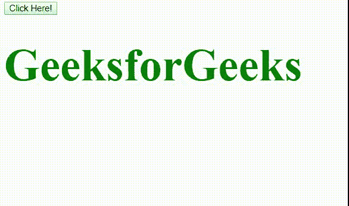

# HTML | DOM 样式动画方向属性

> 原文:[https://www . geesforgeks . org/html-DOM-style-animation direction-property/](https://www.geeksforgeeks.org/html-dom-style-animationdirection-property/)

**动画方向**属性用于设置或返回动画方向。如果动画设置为仅放置一次，此属性将不起作用。

**语法:**

*   它返回动画方向属性。

    ```html
    object.style.animationDirection;
    ```

*   它用于设置动画方向属性。

    ```html
    object.style.animationDirection = "normal|reverse|alternate|
    alternate-reverse|initial|inherit"
    ```

**属性值:**动画方向属性值如下:

*   **正常:**该属性向前播放动画。这是默认值。
*   **反转:**此动画属性以相反方向播放动画。
*   **交替:**此动画属性以交替顺序向前和向后播放动画。
*   **交替-反转:**这个动画属性先向后播放动画，再向前播放。
*   **初始值:**该属性用于将 animationDirection 属性设置为默认值。
*   **继承:**该属性用于从其父元素继承 animationDirection 属性。

**例 1:**

*   **程序:**

    ```html
    <!DOCTYPE html>
    <html>

    <head>
        <style> 
            div {
                color:green;
                font-size:70px;
                font-weight:bold;
                position: relative;

                 /* Chrome, Safari, Opera */
                -webkit-animation: animate 3s infinite;
                animation: animate 3s infinite;
            }

            /* Chrome, Safari, Opera */
            @-webkit-keyframes animate {
                from {top: 0px;}
                to {top: 200px;}
            }

            @keyframes animate {
                from {top: 0px;}
                to {top: 200px;}
            }
        </style>
    </head>

    <body>

        <button onclick = "myGeeks()">
            Click Here!
        </button>

        <div id = "GFG">
            GeeksforGeeks
        </div>

        <script>
        function myGeeks() {

            // Code for Chrome, Safari, and Opera
            document.getElementById("GFG").style.WebkitAnimationDirection
                    = "normal"; 

            document.getElementById("GFG").style.animationDirection
                    = "normal";
        }
        </script>
    </body>

    </html>                               
    ```

*   **输出:**
    

**例 2::**

*   **程序:**

    ```html
    <!DOCTYPE html>
    <html>

    <head>
        <style> 
            div {
                color:green;
                font-size:70px;
                font-weight:bold;
                position: relative;

                 /* Chrome, Safari, Opera */
                -webkit-animation: animate 3s infinite;
                animation: animate 3s infinite;
            }

            /* Chrome, Safari, Opera */
            @-webkit-keyframes animate {
                from {top: 0px;}
                to {top: 200px;}
            }

            @keyframes animate {
                from {top: 0px;}
                to {top: 200px;}
            }
        </style>
    </head>

    <body>

        <button onclick = "myGeeks()">
            Click Here!
        </button>

        <div id = "GFG">
            GeeksforGeeks
        </div>

        <script>
        function myGeeks() {

            // Code for Chrome, Safari, and Opera
            document.getElementById("GFG").style.WebkitAnimationDirection
                    = "reverse"; 

            document.getElementById("GFG").style.animationDirection
                    = "reverse";
        }
        </script>
    </body>

    </html>                           
    ```

*   **输出:**
    

**例 3:**

*   **程序:**

    ```html
    <!DOCTYPE html>
    <html>

    <head>
        <style> 
            div {
                color:green;
                font-size:70px;
                font-weight:bold;
                position: relative;

                 /* Chrome, Safari, Opera */
                -webkit-animation: animate 3s infinite;
                animation: animate 3s infinite;
            }

            /* Chrome, Safari, Opera */
            @-webkit-keyframes animate {
                from {top: 0px;}
                to {top: 200px;}
            }

            @keyframes animate {
                from {top: 0px;}
                to {top: 200px;}
            }
        </style>
    </head>

    <body>

        <button onclick = "myGeeks()">
            Click Here!
        </button>

        <div id = "GFG">
            GeeksforGeeks
        </div>

        <script>
        function myGeeks() {

            // Code for Chrome, Safari, and Opera
            document.getElementById("GFG").style.WebkitAnimationDirection
                    = "alternate"; 

            document.getElementById("GFG").style.animationDirection
                    = "alternate";
        }
        </script>
    </body>

    </html>                                
    ```

*   **输出:**
    

**例 4:**

*   **程序:**

    ```html
    <!DOCTYPE html>
    <html>

    <head>
        <style> 
            div {
                color:green;
                font-size:70px;
                font-weight:bold;
                position: relative;

                 /* Chrome, Safari, Opera */
                -webkit-animation: animate 3s infinite;
                animation: animate 3s infinite;
            }

            /* Chrome, Safari, Opera */
            @-webkit-keyframes animate {
                from {top: 0px;}
                to {top: 200px;}
            }

            @keyframes animate {
                from {top: 0px;}
                to {top: 200px;}
            }
        </style>
    </head>

    <body>

        <button onclick = "myGeeks()">
            Click Here!
        </button>

        <div id = "GFG">
            GeeksforGeeks
        </div>

        <script>
        function myGeeks() {

            // Code for Chrome, Safari, and Opera
            document.getElementById("GFG").style.WebkitAnimationDirection
                    = "alternate-reverse"; 

            document.getElementById("GFG").style.animationDirection
                    = "alternate-reverse";
        }
        </script>
    </body>

    </html>                              
    ```

*   **输出:**
    

**支持的浏览器:**由 *DOM animationDirection 属性*支持的浏览器如下:

*   谷歌 Chrome 43.0
*   火狐 16.0， 5.0 Moz
*   Safari 9.0
*   Opera 30.0