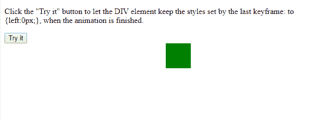
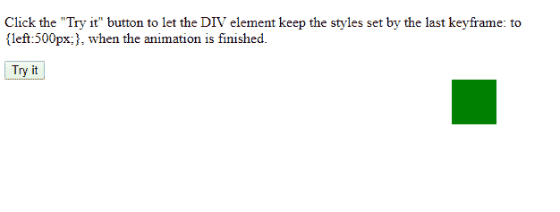

# HTML | DOM 样式动画填充模式属性

> 原文:[https://www . geesforgeks . org/html-DOM-style-animationfillmode-property/](https://www.geeksforgeeks.org/html-dom-style-animationfillmode-property/)

**DOM 样式 animationFillMode** 属性用于指定动画未播放时、动画完成时或动画延迟时元素的样式。
**动画填充模式**属性可以覆盖 *CSS 动画*的默认行为，当第一个关键帧被“播放”时，CSS 动画会影响该元素，然后在最后一个关键帧完成后停止影响该元素。

**语法:**

*   要返回 animationFillMode 属性，请使用以下命令:

    ```html
    object.style.animationFillMode;

    ```

*   要设置动画填充模式属性，请使用下面的命令:

    ```html
    object.style.animationFillMode = "none|forwards|backwards|both|
    initial|inherit";

    ```

**返回值:**返回一个字符串，代表元素的动画填充模式属性

**属性值:**

*   **无:**在执行之前或之后，它不会对目标应用任何样式。
*   **转发:**将应用动画结束时的属性值。
*   **向后:**它将应用关键帧中定义的属性值，该关键帧将在动画延迟定义的时间段内开始动画的第一次迭代。
*   **两者:**它将向前和向后的属性值应用于动画。
*   **初始值:**将属性设置为默认值。
*   **inherit:** 此属性从其父级继承。

**方法:**
<div>元素获取动画延迟期间动画开始前第一个关键帧设置的样式值。

**示例-1:**

```html
<!DOCTYPE html>
<html>

<head>
    <style>
        div {
            width: 50px;
            height: 50px;
            background: green;
            position: relative;
            -webkit-animation: animate 2s 1;
            /* Chrome, Safari, Opera */
            animation: animate 2s 2;
        }
        /* Chrome, Safari, Opera */

        @-webkit-keyframes animate {
            from {
                left: 500px;
            }
            to {
                left: 0px;
            }
        }

        @keyframes animate {
            from {
                left: 500px;
            }
            to {
                left: 0px;
            }
        }
    </style>
</head>

<body>

    <p>Click the "Try it" button to let the 
      DIV element keep the styles set by the 
      last keyframe: to {left:0px;}, when
      the animation is finished.</p>

    <button onclick="myFunction()">Try it</button>

    <script>
        function myFunction() {

            // Code for Chrome, Safari, and Opera
            document.getElementById(
              "div1").style.WebkitAnimationFillMode = 
              "backwards"; 

            document.getElementById(
              "div1").style.animationFillMode = 
              "backwards";
        }
    </script>

    <div id="div1"></div>

</body>

</html>
```

**输出:**


**示例-2:**

```html
<!DOCTYPE html>
<html>

<head>
    <style>
        div {
            width: 50px;
            height: 50px;
            background: green;
            position: relative;
            -webkit-animation: animate 2s 1;
            /* Chrome, Safari, Opera */
            animation: animate 2s 2;
        }
        /* Chrome, Safari, Opera */

        @-webkit-keyframes animate {
            from {
                left: 0px;
            }
            to {
                left: 500px;
            }
        }

        @keyframes animate {
            from {
                left: 0px;
            }
            to {
                left: 500px;
            }
        }
    </style>
</head>

<body>

    <p>Click the "Try it" button to let the 
      DIV element keep the styles set by the 
      last keyframe: to {left:500px;}, when 
      the animation is finished.
  </p>

    <button onclick="myFunction()">
      Try it
    </button>

    <script>
        function myFunction() {

            // Code for Chrome, Safari, and Opera
            document.getElementById(
              "div1").style.WebkitAnimationFillMode =
              "forwards"; 

            document.getElementById(
              "div1").style.animationFillMode = 
              "forwards";
        }
    </script>

    <div id="div1"></div>

</body>

</html>
```

**输出:**


**支持的浏览器:**animationFillMode 属性支持的浏览器如下:

*   谷歌 Chrome 43.0
*   Firefox 16.0
*   Opera 30.0