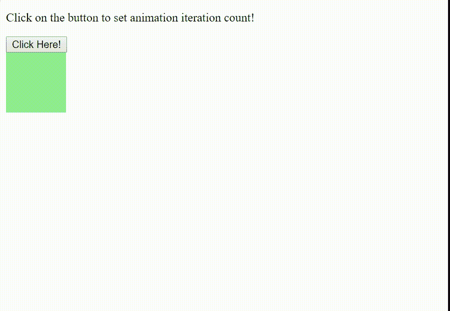
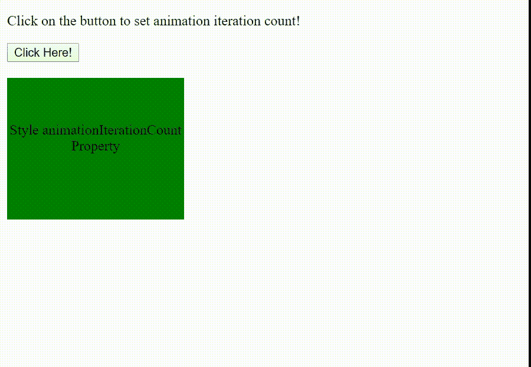

# HTML | DOM 样式动画迭代计数属性

> 原文:[https://www . geesforgeks . org/html-DOM-style-animation iterationcount-property/](https://www.geeksforgeeks.org/html-dom-style-animationiterationcount-property/)

HTML DOM 中的 Style**animationIterationCount**属性用于设置或返回一个动画应该播放多少次。

**语法:**

*   它用于返回 animationIterationCount 属性。

    ```html
    object.style.animationIterationCount
    ```

*   它用于设置动画迭代计数属性。

    ```html
    object.style.animationIterationCount = "number|infinite|initial|
    inherit"
    ```

**属性值:**

*   **编号:**用于设置动画播放的次数。它的默认值是 1。
*   **无限:**它设置动画将播放无限次。
*   **初始值:**它将动画迭代计数属性设置为默认值。
*   **inherit:** 该属性值从其父元素继承而来。

**例 1:**

```html
<!DOCTYPE html>
<html>
<head>
    <title>
        HTML DOM Style animationIterationCount Property
    </title>

    <style> 
        div {
            width: 80px;
            height: 80px;
            background: lightgreen;
            position: relative;

            /* For Chrome, Safari, Opera browsers */
            -webkit-animation: mymove 2s 1;
            animation: mymove 2s 1;
        }

        /* Chrome, Safari, Opera */
        @-webkit-keyframes mymove {
            from { 
                left: 0px;
                top: 0px;
            }
            to {
                left: 250px;
                top: 250px;
            }
        }

        @keyframes mymove {
            from {
                left: 0px;
                top: 0px;
            }
            to {
                left: 250px;
                top: 250px;
                background-color:green;
            }
        }
    </style>
</head>
<body>
    <p>
        Click on the button to set 
        animation iteration count!
    </p>

    <button onclick="myGeeks()">
        Click Here!
    </button>
    <br>

    <script>

        /* For Chrome, Safari, and Opera browsers */
        function myGeeks() {
            document.getElementById("GFG").style.WebkitAnimationIterationCount 
                    = "10"; 
            document.getElementById("GFG").style.animationIterationCount = "10";
        }
    </script>

    <div id="GFG"></div>

</body>
</html>                    
```

**输出:**


**例 2:**

```html
<!DOCTYPE html>
<html>
<head>  
    <title>
        HTML DOM Style animationIterationCount Property
    </title>

    <style> 
        div {
            width: 200px;
            height: 110px;
            background: green;
            text-align: center;
            padding-top:50px;
            position: relative;

            /* Chrome, Safari, Opera */
            -webkit-animation: mymove 2s 2; 
            animation: mymove 2s 2;
        }

        /* Chrome, Safari, Opera */
        @-webkit-keyframes mymove {
            from {left: 400px;}
            to {left: 0px;}
        }

        @keyframes mymove {
            from {left: 400px;}
            to {left: 0px;}
        }
    </style>
</head>
<body>
    <p>
        Click on the button to set
        animation iteration count!
    </p>

    <button onclick="myGeeks()">
        Click Here!
    </button>
    <br>

    <script>
        function myGeeks() {

            /* For Chrome, Safari, and Opera browsers */
            document.getElementById("GFG").style.WebkitAnimationIterationCount
                = "infinite"; 
            document.getElementById("GFG").style.animationIterationCount
                = "infinite";
        }
    </script>
    <br>

    <div id="GFG">
        Style animationIterationCount Property
    </div>

</body>
</html>                    
```

**输出:**


**支持的浏览器:**由*DOM Style animationIterationCount 属性*支持的浏览器如下:

*   Chrome 43.0
*   火狐 16.0， 5.0 -moz-
*   Opera 30.0
*   Safari 9.0