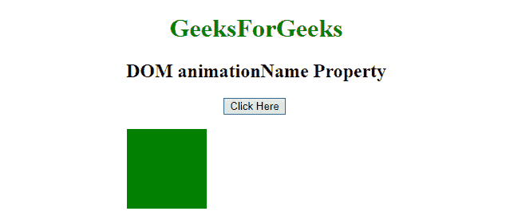
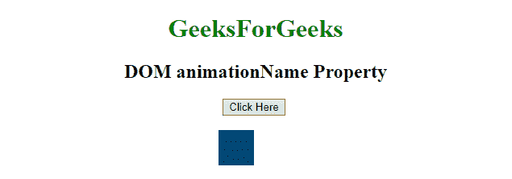
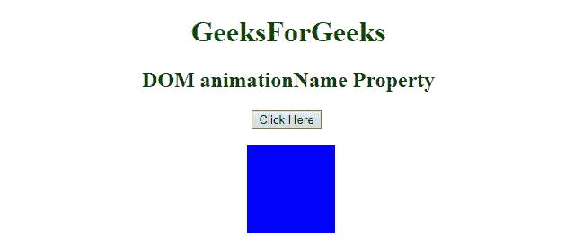
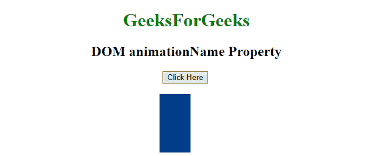
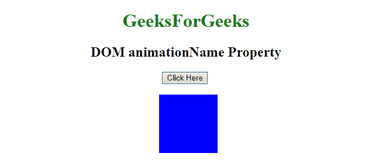

# HTML | DOM 样式动画名称属性

> 原文:[https://www . geesforgeks . org/html-DOM-style-animation name-property/](https://www.geeksforgeeks.org/html-dom-style-animationname-property/)

HTML DOM 中的**动画名称属性**用于设置或返回[@关键帧](https://www.geeksforgeeks.org/css-keyframes-rule/)动画的名称。

**语法:**

*   用于设置 animationName 属性:

    ```html
    object.style.animationName = "none|keyframename|initial|inherit"
    ```

*   用于返回 animationName 属性:

    ```html
    object.style.animationName
    ```

**属性值:**包含动画的名称。

*   **无:**动画为无时。这是默认值。
*   **关键帧名称:**绑定到选择器的关键帧名称。
*   **初始值:**用于设置默认值。
*   **继承:**用于从父代继承属性。

**示例-1:**

```html
<!DOCTYPE html>
<html>

<head>
    <title>
        HTML DOM animationName Property
    </title>
    <style>
        div {
            width: 100px;
            height: 100px;
            background: green;
            position: relative;
            -webkit-animation: move_1 2s infinite;
            /* For Chrome, Safari, Opera*/
            animation: move_1 2s infinite;
        }
        /* For Chrome, Safari, Opera */

        @-webkit-keyframes move_1 {
            from {
                left: 150px;
            }
            to {
                left: 350px;
            }
        }

        @keyframes move_1 {
            from {
                left: 150px;
            }
            to {
                left: 350px;
            }
        }
        /* For Chrome, Safari, Opera */

        @-webkit-keyframes move_2 {
            from {
                left: 270px;
                width: 0px;
                height: 0px;
            }
            to {
                left: 270px;
                width: 100px;
                height: 100px;
                background: blue;
            }
        }

        @keyframes move_2 {
            from {
                left: 270px;
                width: 0px;
                height: 0px;
            }
            to {
                left: 270px;
                width: 100px;
                height: 100px;
                background: blue;
            }
        }
    </style>
</head>

<body style="text-align:center;">

    <h1 style="color:green;">  
            GeeksForGeeks  
        </h1>

    <h2>DOM animationName Property</h2>
    <button onclick="Geeks()">
        Click Here
    </button>
    <br>
    <br>
    <div id="GFG_DIV"></div>

    <script>
        function Geeks() {

            // Changing the animation name.
            document.getElementById(
              "GFG_DIV").style.WebkitAnimationName =
              "move_2"; 

            // for Chrome, Safari, and Opera
            document.getElementById(
              "GFG_DIV").style.animationName = 
              "move_2";
        }
    </script>
</body>

</html>
```

**输出**

*   **之前点击按钮:**
    
*   **点击按钮后:**
    
*   **最后:**
    

**示例-2:**

```html
<!DOCTYPE html>
<html>

<head>
    <title>
        HTML DOM animationName Property
    </title>
    <style>
        div {
            width: 100px;
            height: 100px;
            background: green;
            position: relative;
            -webkit-animation: move_1 2s infinite;
            /* For Chrome, Safari, Opera*/
            animation: move_1 2s infinite;
        }
        /* For Chrome, Safari, Opera */

        @-webkit-keyframes move_1 {
            from {
                left: 150px;
            }
            to {
                left: 350px;
            }
        }

        @keyframes move_1 {
            from {
                left: 150px;
            }
            to {
                left: 350px;
            }
        }
        /* For Chrome, Safari, Opera */

        @-webkit-keyframes move_2 {
            from {
                left: 270px;
                width: 0px;
            }
            to {
                left: 270px;
                width: 100px;
                background: blue;
            }
        }

        @keyframes move_2 {
            from {
                left: 270px;
                width: 0px;
            }
            to {
                left: 270px;
                width: 100px;
                background: blue;
            }
        }
    </style>
</head>

<body style="text-align:center;">

    <h1 style="color:green;">  
            GeeksForGeeks  
        </h1>

    <h2>DOM animationName Property</h2>
    <button onclick="Geeks()">
        Click Here
    </button>
    <br>
    <br>
    <div id="GFG_DIV"></div>

    <script>
        function Geeks() {

            // Changing the animation name.
            document.getElementById(
              "GFG_DIV").style.WebkitAnimationName =
              "move_2"; 

            // for Chrome, Safari, and Opera
            document.getElementById(
              "GFG_DIV").style.animationName = "move_2";
        }
    </script>
</body>

</html>
```

**输出**

*   **之前点击按钮:**
    
*   **点击按钮后:**
    
*   **最后:**
    

**支持的浏览器:**

*   谷歌 Chrome: 43.0，4.0 Webkit
*   火狐浏览器： 16.0， 5.0 moz
*   边缘:10.0
*   Opera: 30.0，15.0 网络工具包
*   Safari: 4.0 网络工具包