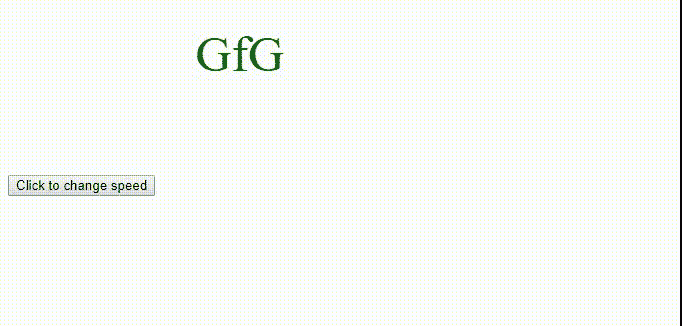
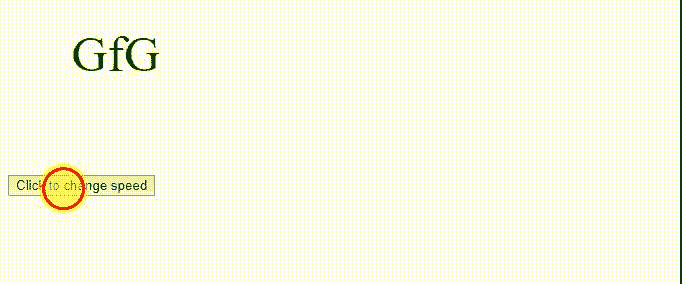
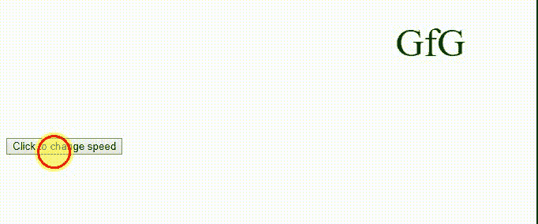
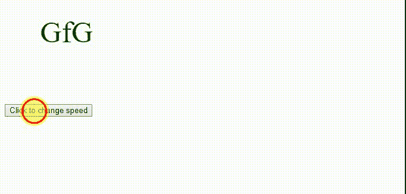
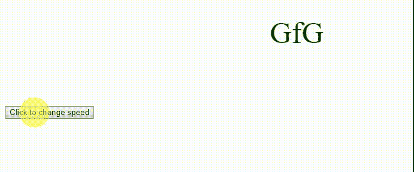
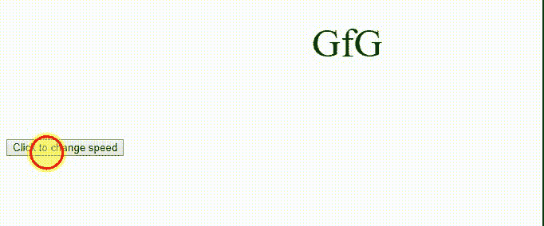

# HTML | DOM 样式动画定时功能属性

> 原文:[https://www . geesforgeks . org/html-DOM-style-animationtimegffunction-property/](https://www.geeksforgeeks.org/html-dom-style-animationtimingfunction-property/)

HTML DOM 中的 Style**animationtimefunction**属性定义了样式之间的过渡时间，以使过渡平滑。它指定动画的速度曲线。

**语法:**

```html
animation-timing-function: cubic-bezier(n1, n2, n3, n4)|linear
|ease|ease-in|ease-out|initial|inherit;
```

**返回值:**返回一个字符串，代表元素的动画定时功能属性

**属性值:**

*   **三次贝塞尔曲线(n1，n2，n3，n4):** 使用三次贝塞尔曲线函数指定动画计时。n1、n2、n3 和 n4 的值在 0 到 1 之间。
*   **线性:**动画从头到尾以相同的速度播放。
*   **缓和:**动画开始慢，然后快，最后慢慢结束。这是默认值。
*   **放松:**如果指定了该值，则动画从慢速开始。
*   **缓和:**动画正常播放，但结束缓慢。这类似于安逸。
*   **放松:**动画开始和结束都很慢。
*   **初始值:**它将动画定时功能属性设置为默认值。
*   **继承:**从其父元素继承的 animationTimingFunction 属性。

**示例:**三次贝塞尔曲线(n1，n2，n3，n4)

```html
<!DOCTYPE html>
<html>

<head>
    <style> 
        div {
            font-size: 50px;
            color: darkgreen;
            position: relative;
            height: 150px;
            width: 150px;
            animation: movement 5s infinite;
            -webkit-animation: movement 5s infinite; 
        }

        @-webkit-keyframes movement {
            from {left: 50px;}
            to {left: 500px;}
        }

        @keyframes movement {
            from {left: 50px;}
            to {left: 500px;}
        }
    </style>
</head>

<body>
    <div id = "geeks">
        GfG
    </div>

    <button onclick = "myText()">
        Click to change speed
    </button>

    <script>
    function myText() {
    document.getElementById("geeks").style.WebkitAnimationTimingFunction
            = "cubic-bezier(0.7,0.1,0.3,0.2)"; 

    document.getElementById("geeks").style.animationTimingFunction
            = "cubic-bezier(0.7,0.1,0.3,0.2)";
    }
    </script>
</body>

</html>                    
```

**输出:**

*   **之前点击按钮:**
    
*   **点击按钮后:**
    

**示例:**线性

```html
<!DOCTYPE html>
<html>

<head>
    <style> 
        div {
            font-size: 50px;
            color: darkgreen;
            position: relative;
            height: 150px;
            width: 150px;
            animation: movement 5s infinite;
            -webkit-animation: movement 5s infinite; 
        }

        @-webkit-keyframes movement {
            from {left: 50px;}
            to {left: 500px;}
        }

        @keyframes movement {
            from {left: 50px;}
            to {left: 500px;}
        }
    </style>
</head>

<body>
    <div id = "geeks">
        GfG
    </div>

    <button onclick="myText()">
        Click to change speed
    </button>

    <script>
    function myText() {
    document.getElementById("geeks").style.WebkitAnimationTimingFunction
            = "linear"; 

    document.getElementById("geeks").style.animationTimingFunction
            = "linear";
    }
    </script>
</body>

</html>                    
```

**输出:**

*   **之前点击按钮:**
    
*   **点击按钮后:**
    

**例:**缓和

```html
<!DOCTYPE html>
<html>

<head>
    <style> 
        div {
            font-size: 50px;
            color: darkgreen;
            position: relative;
            height: 150px;
            width: 150px;
            animation: movement 5s infinite;
            -webkit-animation: movement 5s infinite; 
        }

        @-webkit-keyframes movement {
            from {left: 50px;}
            to {left: 500px;}
        }

        @keyframes movement {
            from {left: 50px;}
            to {left: 500px;}
        }
    </style>
</head>

<body>
    <div id = "geeks">
        GfG
    </div>

    <button onclick = "myText()">
        Click to change speed
    </button>

    <script>
    function myText() {
    document.getElementById("geeks").style.WebkitAnimationTimingFunction
            = "ease"; 

    document.getElementById("geeks").style.
            = "ease";
    }
    </script>
</body>

</html>                    
```

**输出:**

*   **之前点击按钮:**
    
*   **点击按钮后:**
    

**示例:**轻松进入

```html
<!DOCTYPE html>
<html>

<head>
    <style> 
        div {
            font-size: 50px;
            color: darkgreen;
            position: relative;
            height: 150px;
            width: 150px;
            animation: movement 5s infinite;
            -webkit-animation: movement 5s infinite; 
        }

        @-webkit-keyframes movement {
            from {left: 50px;}
            to {left: 500px;}
        }

        @keyframes movement {
            from {left: 50px;}
            to {left: 500px;}
        }
    </style>
</head>

<body>
    <div id = "geeks">
        GfG
    </div>

    <button onclick = "myText()">
        Click to change speed
    </button>

    <script>
    function myText() {
    document.getElementById("geeks").style.WebkitAnimationTimingFunction
            = "ease-in"; 

    document.getElementById("geeks").style.animationTimingFunction
            = "ease-in";
    }
    </script>
</body>

</html>                    
```

**输出:**

*   **之前点击按钮:**
    
*   **点击按钮后:**
    

**示例:**放松

```html
<!DOCTYPE html>
<html>

<head>
    <style> 
        div {
            font-size: 50px;
            color: darkgreen;
            position: relative;
            height: 150px;
            width: 150px;
            animation: movement 5s infinite;
            -webkit-animation: movement 5s infinite; 
        }

        @-webkit-keyframes movement {
            from {left: 50px;}
            to {left: 500px;}
        }

        @keyframes movement {
            from {left: 50px;}
            to {left: 500px;}
        }
    </style>
</head>

<body>
    <div id = "geeks">
        GfG
    </div>

    <button onclick = "myText()">
        Click to change speed
    </button>

    <script>
    function myText() {
    document.getElementById("geeks").style.WebkitAnimationTimingFunction
            = "ease-out"; 

    document.getElementById("geeks").style.animationTimingFunction
            = "ease-out";
    }
    </script>
</body>

</html>                    
```

**输出:**

*   **之前点击按钮:**
    
*   **点击按钮后:**
    

**示例:**放松

```html
<!DOCTYPE html>
<html>

<head>
    <style> 
        div {
            font-size: 50px;
            color: darkgreen;
            position: relative;
            height: 150px;
            width: 150px;
            animation: movement 5s infinite;
            -webkit-animation: movement 5s infinite; 
        }

        @-webkit-keyframes movement {
            from {left: 50px;}
            to {left: 500px;}
        }

        @keyframes movement {
            from {left: 50px;}
            to {left: 500px;}
        }
    </style>
</head>

<body>
    <div id = "geeks">
        GfG
    </div>

    <button onclick = "myText()">
        Click to change speed
    </button>

    <script>
    function myText() {
    document.getElementById("geeks").style.WebkitAnimationTimingFunction
            = "ease-in-out"; 

    document.getElementById("geeks").style.animationTimingFunction
            = "ease-in-out";
    }
    </script>
</body>

</html>                    
```

**输出:**

*   **之前点击按钮:**
    
*   **点击按钮后:**
    

**支持的浏览器:**由 *DOM 样式的 animationTimingFunction 属性*支持的浏览器如下:

*   Chrome 43.0
*   火狐 16.0， 5.0 -moz-
*   Safari 9.0
*   歌剧 30