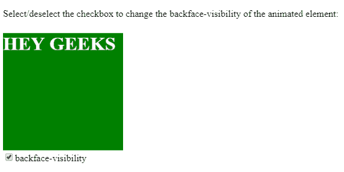
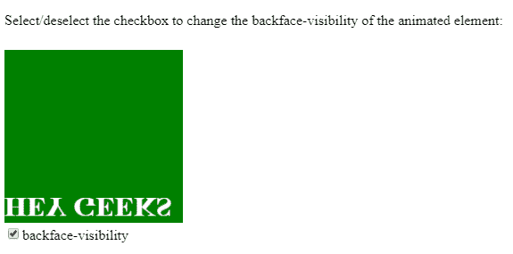
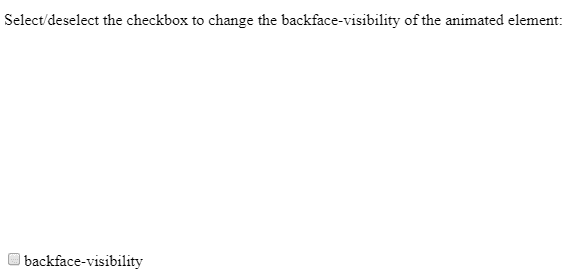
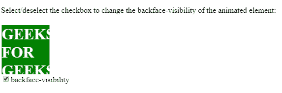
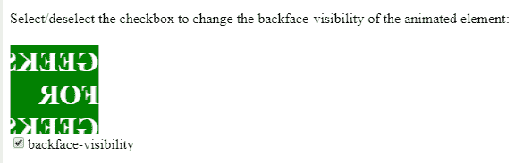
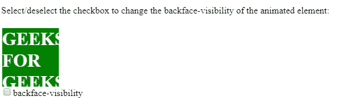
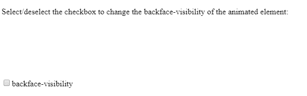

# HTML | DOM 样式背面可见性属性

> 原文:[https://www . geesforgeks . org/html-DOM-style-backface visibility-property/](https://www.geeksforgeeks.org/html-dom-style-backfacevisibility-property/)

**背面可见性属性**是当元素不面向屏幕时使元素可见或不可见的决定因素。当一个元素被*旋转*，并且其*背面*需要隐藏时，该属性很有用。

**语法:**

*   **返回背面可见性属性:**

    ```html
    object.style.backfaceVisibility
    ```

*   **设置背面可见性属性:**

    ```html
    object.style.backfaceVisibility = "visible|hidden|initial|
    inherit"
    ```

**属性值:**

*   **可见:**可见值为默认值。它有助于使背面可见。
*   **隐藏:**隐藏值会使背面不可见。
*   **初始值:**初始值将该属性设置为默认值。
*   **inherit:** 用于从其父元素继承属性。

**返回值:**返回一个字符串，代表元素的 **backfaceVisibility** 属性的行为。

**示例-1:** 将背面可见性从可见设置为隐藏。

```html
<!DOCTYPE html>
<html>

<head>
    <title>
        HTML DOM Style backfaceVisibility Property
    </title>
    <style>
        div {
            width: 200px;
            height: 200px;
            background: green;
            color: white;
            /* Chrome, Safari, Opera */
            -webkit-animation: mymove 3s infinite linear alternate;
            animation: mymove 3s infinite linear alternate;
        }
        /* Chrome, Safari, Opera */

        @-webkit-keyframes mymove {
            to {
                -webkit-transform: rotateX(180deg);
            }
        }

        @keyframes mymove {
            to {
                transform: rotateX(180deg);
            }
        }
    </style>
</head>

<body>

    <p>
      Select/deselect the checkbox to change the 
      backface-visibility of the animated element:
    </p>

    <div id="myGFG">
        <h1>HEY GEEKS</h1>
    </div>

    <input type="checkbox" onclick="flip(this)" checked> 
     backface-visibility

    <script>
        function flip(x) {
            if (x.checked === true) {

                // Code for Chrome, Safari, Opera
                document.getElementById(
                        "myGFG").style.WebkitBackfaceVisibility =
                    "visible";
                document.getElementById(
                        "myGFG").style.backfaceVisibility =
                    "visible";
            } else {
                // Code for Chrome, Safari, Opera
                document.getElementById(
                        "myGFG").style.WebkitBackfaceVisibility =
                    "hidden";

                document.getElementById(
                        "myGFG").style.backfaceVisibility =
                    "hidden";
            }
        }
    </script>
</body>

</html>
```

**输出:**

*   **Before hidden:**
    

    

*   **After hidden:**
    

    

    **示例-2:** 将背面可见性从可见设置为隐藏。

    ```html
    <!DOCTYPE html>
    <html>

    <head>
        <title>
            HTML DOM Style backfaceVisibility Property
        </title>

        <style>
            div {
                width: 100px;
                height: 100px;
                background: green;
                color: white;
                -webkit-animation: mymove 2s infinite linear alternate;
                /* Chrome, Safari, Opera */
                animation: mymove 2s infinite linear alternate;
            }
            /* Chrome, Safari, Opera */

            @-webkit-keyframes mymove {
                to {
                    -webkit-transform: rotateY(180deg);
                }
            }

            @keyframes mymove {
                to {
                    transform: rotateY(180deg);
                }
            }
        </style>
    </head>

    <body>

        <p>
          Select/deselect the checkbox to change the 
          backface-visibility of the animated element:
        </p>
        <div id="myGFG">
            <h1>GEEKS FOR GEEKS</h1>
        </div>

        <input type="checkbox" onclick="flip(this)" checked> 
          backface-visibility

        <script>
            function flip(x) {
                if (x.checked === true) {

                    // Code for Chrome, Safari, Opera
                    document.getElementById(
                            "myGFG").style.WebkitBackfaceVisibility =
                        "visible";
                    document.getElementById(
                            "myGFG").style.backfaceVisibility =
                        "visible";
                } else {
                    // Code for Chrome, Safari, Opera
                    document.getElementById(
                            "myGFG").style.WebkitBackfaceVisibility =
                        "hidden";
                    document.getElementById(
                            "myGFG").style.backfaceVisibility =
                        "hidden";
                }
            }
        </script>

    </body>

    </html>
    ```

    **输出:**

    *   **前隐:**
        
        
    *   **隐藏后:**
        
        

        **注意:** Chrome 版本(12-35)，Safari 新更新版本和 Opera 15+版本支持一个被称为“WebkitBackfaceVisibility 属性”的替代属性。

        **支持的浏览器:***DOM Style backface visibility 属性* 支持的浏览器如下:

        *   谷歌 Chrome 36.0 12.0 网络工具包
        *   互联网浏览器 10.0/边缘
        *   火狐 16.0 10.0 莫兹
        *   Opera 23.0 15.0 网络工具包
        *   苹果 Safari 4.0 网络工具包