# HTML | DOM 样式背景属性

> 原文:[https://www . geesforgeks . org/html-DOM-style-background-property/](https://www.geeksforgeeks.org/html-dom-style-background-property/)

HTML DOM 中的**样式背景属性**是一个用来设置或返回元素背景的简写属性。它可以帮助操作八个背景属性中的一个或多个。

**语法:**

*   它返回背景属性。

    ```html
    object.style.background
    ```

*   它用于设置背景属性。

    ```html
    object.style.background = "color image repeat attachment 
    position size origin clip|initial|inherit"
    ```

**返回值:**返回一个字符串值，代表一个元素的背景。

**属性值:**后台有 8 个属性，描述如下:

*   **颜色:**用于设置元素的背景颜色。它对应于背景色属性。
*   **图像:**用于设置一个元素的背景图像。它对应于背景图像属性。
*   **重复:**用于设置背景图像应该如何沿着 x 轴和 y 轴重复。它对应于 background-repeat 属性。
*   **附件:**用于设置图像是滚动还是保持固定。它对应于背景附件属性。
*   **位置:**用于设置背景图像的起始位置。它对应于背景位置属性。
*   **大小:**用于以固定单位或百分比设置背景图像的大小。它对应于背景大小属性。
*   **原点:**背景-原点属性指定背景图像的原点位置。它对应于背景来源属性。
*   **剪辑:**用于设置背景图像的绘画区域。它对应于背景剪辑属性。
*   **初始值:**用于将属性设置为默认值。
*   **继承:**用于从其父代继承财产。

**示例:**背景色属性

```html
<!DOCTYPE html>
<html>

<head>
    <title>
        DOM Style Background Property
    </title>

    <style>
        .GFG {
            height: 250px;
            width: 250px;
            border-style: solid;
        }
    </style>
</head>

<body>
    <h1 style="color: green">
        GeeksforGeeks
    </h1>

    <b>DOM Style Background Property</b>

    <p>
        Click on the button to set
        the background color
    </p>

    <div class="GFG"></div>

    <button onclick="setBg()">
        Set background color
    </button>

    <!-- Script to set the background color -->
    <script>
        function setBg() {
            elem = document.querySelector('.GFG');
            elem.style.background = "green";
        }
    </script>
</body>

</html>                    
```

**输出:**

*   **点击按钮前:**
    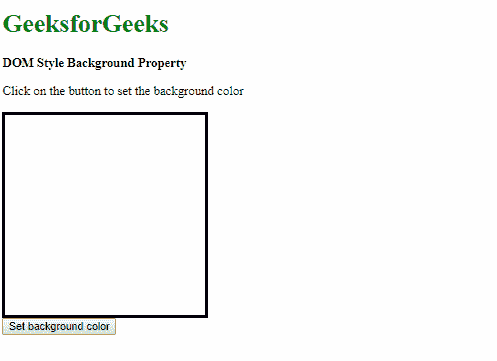
*   **点击按钮后:**
    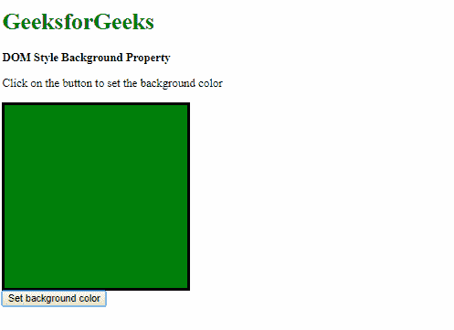

**示例:**背景图像属性

```html
<!DOCTYPE html>
<html>

<head>
    <title>
        DOM Style Background Property
    </title>

    <style>
        .GFG {
            height: 250px;
            width: 250px;
            border-style: solid;
        }
    </style>
</head>

<body>
    <h1 style="color: green">
        GeeksforGeeks
    </h1>

    <b>DOM Style Background Property</b>

    <p>
        Click on the button to set
        the background image
    </p>

    <div class="GFG"></div>

    <button onclick="setBg()">
        Set background color
    </button>

    <!-- Script to set the background image -->
    <script>
        function setBg() {
            elem = document.querySelector('.GFG');
            elem.style.background = 
"url('https://media.geeksforgeeks.org/wp-content/uploads/20190314004249/sample-image2.png')";
        }
    </script>
</body>

</html>                    
```

**输出:**

*   **点击按钮前:**
    
*   **点击按钮后:**
    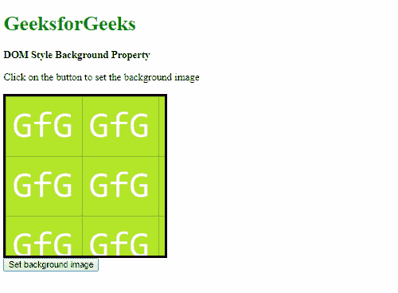

**示例:**本示例使用 repeat-x 属性沿 x 轴重复背景图像。

```html
<!DOCTYPE html>
<html>

<head>
    <title>
        DOM Style Background Property
    </title>

    <style>
        .GFG {
            height: 250px;
            width: 250px;
            border-style: solid;
        }
    </style>
</head>

<body>
    <h1 style="color: green">
        GeeksforGeeks
    </h1>

    <b>DOM Style Background Property</b>

    <p>
        Click on the button to set
        the background image
    </p>

    <div class="GFG"></div>

    <button onclick="setBg()">
        Set background color
    </button>

    <!-- Script to set the background color -->
    <script>
        function setBg() {
            elem = document.querySelector('.GFG');
            elem.style.background = 
"url('https://media.geeksforgeeks.org/wp-content/uploads/20190314004249/sample-image2.png') repeat-x";
        }
    </script>
</body>

</html>                    
```

**输出:**

*   **点击按钮前:**
    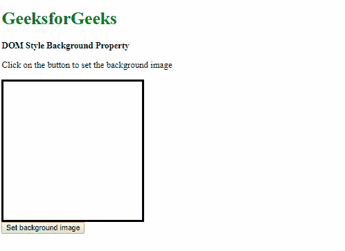
*   **点击按钮后:**
    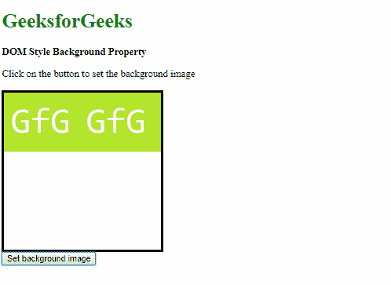

**示例:**本示例将附件属性设置为“滚动”。

```html
<!DOCTYPE html>
<html>

<head>
    <title>
        DOM Style Background Property
    </title>

    <style> 
        body { 
            background: url( 
'https://media.geeksforgeeks.org/wp-content/uploads/20190311222622/sample-image.png') 
            no-repeat right top / 200px; 
            background-attachment: fixed; 
        } 
        #scrolling-area { 
            height: 1000px; 
        } 
    </style> 
</head> 

<body> 
    <h1 style="color: green">
        GeeksforGeeks
    </h1>

    <b>DOM Style Background Property</b>

    <p>
        Click on the button to set 
        the background color
    </p>

    <div class="GFG"></div>

    <button onclick="setBg()">
        Set background color
    </button>

    <div id="scrolling-area"><br> 
        This is a large area for scrolling. 
    </div> 

    <!-- Script to change backgroundAttachment -->
    <script> 
        function setBg() { 
            document.body.style.backgroundAttachment 
                    = 'scroll'; 
        } 
    </script> 
</body> 

</html>                     
```

**输出:**

*   **点击按钮前:**
    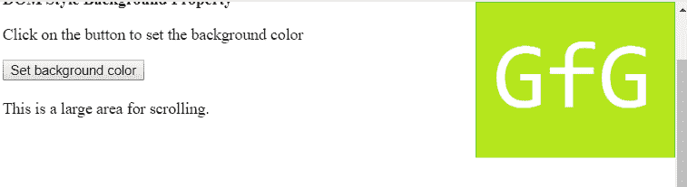
*   **点击按钮后:**
    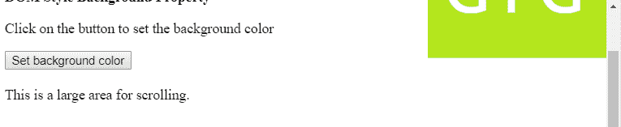

**示例:**本示例将背景图像的位置设置为“中心”。

```html
<!DOCTYPE html>
<html>

<head>
    <title>
        DOM Style Background Property
    </title>

    <style>
        .GFG {
            height: 250px;
            width: 250px;
            border-style: solid;
        }
    </style>
</head>

<body>
    <h1 style="color: green">
        GeeksforGeeks
    </h1>

    <b>DOM Style Background Property</b>

    <p>
        Click on the button to set
        the background image
    </p>

    <div class="GFG"></div>

    <button onclick="setBg()">
        Set background color
    </button>

    <!-- Script to set the background color -->
    <script>
        function setBg() {
            elem = document.querySelector('.GFG');
            elem.style.background = 
"url('https://media.geeksforgeeks.org/wp-content/uploads/20190314004249/sample-image2.png') no-repeat center";
        }
    </script>
</body>

</html>                    
```

**输出:**

*   **点击按钮前:**
    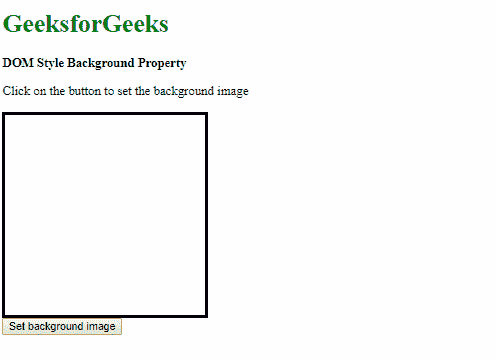
*   **点击按钮后:**
    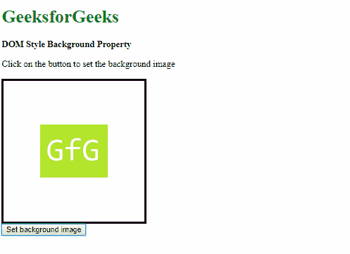

**示例:**本示例将背景图像的大小设置为宽度为“200px”，高度为“150px”。

```html
<!DOCTYPE html>
<html>

<head>
    <title>
        DOM Style Background Property
    </title>

    <style>
        .GFG {
            height: 250px;
            width: 250px;
            border-style: solid;
        }
    </style>
</head>

<body>
    <h1 style="color: green">
        GeeksforGeeks
    </h1>

    <b>DOM Style Background Property</b>

    <p>
        Click on the button to set
        the background image
    </p>

    <div class="GFG"></div>

    <button onclick="setBg()">
        Set background color
    </button>

    <!-- Script to set the background color -->
    <script>
        function setBg() {
            elem = document.querySelector('.GFG');
            elem.style.background = 
"url('https://media.geeksforgeeks.org/wp-content/uploads/20190314004249/sample-image2.png') no-repeat center / 200px 150px ";
        }
    </script>
</body>

</html>                    
```

**输出:**

*   **点击按钮前:**
    
*   **点击按钮后:**
    

**示例:**本示例将背景原点设置为“边框”。

```html
<!DOCTYPE html>
<html>

<head>
    <title>
        DOM Style Background Property
    </title>

    <style>
        .GFG {
            height: 250px;
            width: 250px;
            padding: 20px;
            border: 10px dotted;
        }
    </style>
</head>

<body>
    <h1 style="color: green">
        GeeksforGeeks
    </h1>

    <b>DOM Style Background Property</b>

    <p>
        Click on the button to set
        the background image
    </p>

    <div class="GFG"></div>

    <button onclick="setBg()">
        Set background image
    </button>

    <!-- Script to set background origin property -->
    <script>
        function setBg() {
            elem = document.querySelector('.GFG');
            elem.style.background = 
"url('https://media.geeksforgeeks.org/wp-content/uploads/20190314004249/sample-image2.png') no-repeat border-box";
        }
    </script>
</body>
</html>                    
```

**输出:**

*   **点击按钮前:**
    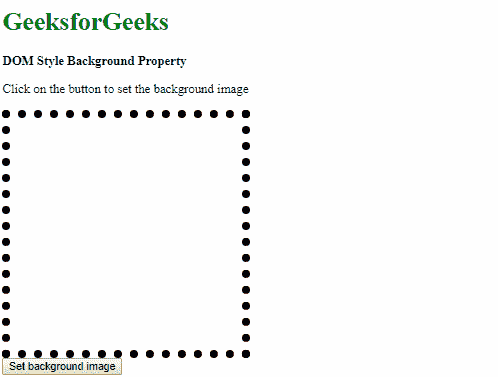
*   **点击按钮后:**
    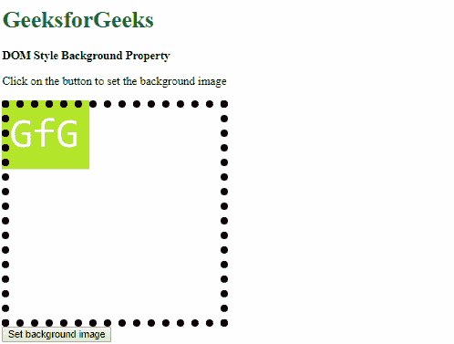

**示例:**本示例将背景剪辑设置为“内容框”。

```html
<!DOCTYPE html>
<html>

<head>
    <title>
        DOM Style Background Property
    </title>

    <style>
        .GFG {
            height: 250px;
            width: 250px;
            border: 10px dotted;
        }
    </style>
</head>

<body>
    <h1 style="color: green">
        GeeksforGeeks
    </h1>

    <b>DOM Style Background Property</b>

    <p>
        Click on the button to set 
        the background color
    </p>

    <div class="GFG"></div>

    <button onclick="setBg()">
        Set background color
    </button>

    <!-- Script to set background clip property -->
    <script>
        function setBg() {
            elem = document.querySelector('.GFG');
            elem.style.background = "green content-box";
        }
    </script>
</body>
</html>                    
```

**输出:**

*   **点击按钮前:**
    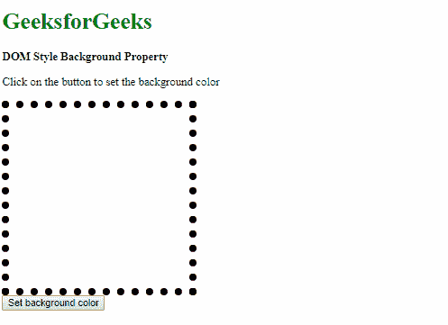
*   **点击按钮后:**
    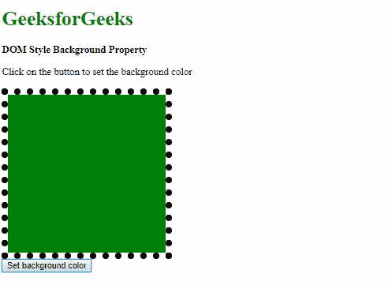

**示例:**它将属性设置为默认值

```html
<!DOCTYPE html>
<html>

<head>
    <title>
        DOM Style Background Property
    </title>

    <style>
        .GFG {
            height: 250px;
            width: 250px;
            border-style: solid;
            background: green
        }
    </style>
</head>

<body>
    <h1 style="color: green">
        GeeksforGeeks
    </h1>

    <b>DOM Style Background Property</b>

    <p>
        Click on the button to set the
        background to initial
    </p>

    <div class="GFG"></div>

    <button onclick="setBg()">
        Set background
    </button>

    <!-- Script to set background property -->
    <script>
        function setBg() {
            elem = document.querySelector('.GFG');
            elem.style.background = "initial";
        }
    </script>
</body>

</html>                    
```

**输出:**

*   **Before Clicking the button:**

    
    *   **点击按钮后:**
        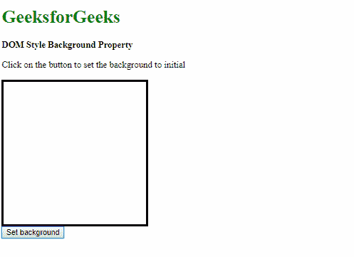

    **示例:**用于从其父级继承属性

    ```html
    <!DOCTYPE html>
    <html>

    <head>
        <title>
            DOM Style Background Property
        </title>

        <style>
            .GFG {
                margin: 20px;
                height: 100px;
                width: 100px;
                border: 5px solid;
            }

            #parent {
                height: 250px;
                width: 250px;
                border: 1px solid;
                background: 
    url('https://media.geeksforgeeks.org/wp-content/uploads/20190314004249/sample-image2.png') center / cover;
            }
        </style>
    </head>

    <body>
        <h1 style="color: green">
            GeeksforGeeks
        </h1>

        <b>DOM Style Background Property</b>

        <p>
            Click on the button to set
            the background to inherit
        </p>

        <div id="parent"> 
            <div class="GFG"></div>
        </div>

        <button onclick="setBg()">
            Set background
        </button>

        <!-- Script to set background property -->
        <script>
            function setBg() {
                elem = document.querySelector('.GFG');
                elem.style.background = "inherit";
            }
        </script>
    </body>

    </html>                    
    ```

    **输出:**

    *   **点击按钮前:**
        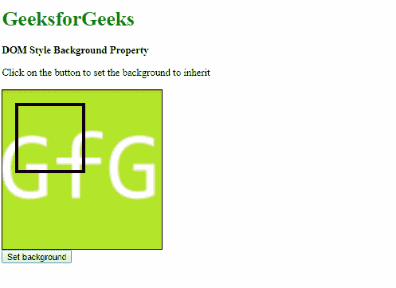
    *   **点击按钮后:**
        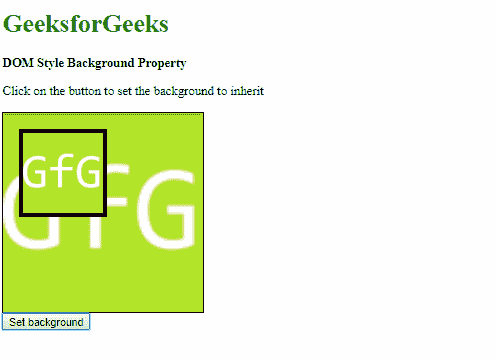

    **支持的浏览器:**后台属性支持的浏览器如下:

    *   Chrome 1.0
    *   Internet Explorer 4.0
    *   Firefox 1.0
    *   歌剧 3.5
    *   Safari 1.0