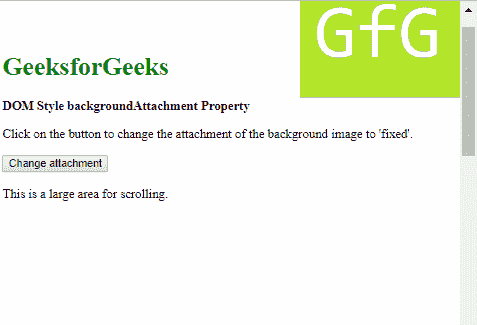
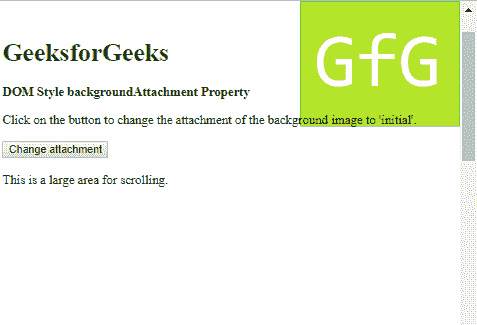

# HTML | DOM 样式背景附件属性

> 原文:[https://www . geesforgeks . org/html-DOM-style-background attachment-property/](https://www.geeksforgeeks.org/html-dom-style-backgroundattachment-property/)

HTML DOM 中的 **Style backgroundAttachment 属性**用于设置或返回背景图像是应该固定还是随内容滚动。

**语法:**

*   它返回 backgroundAttachment 属性。

    ```html
    object.style.backgroundAttachment
    ```

*   它用于设置 backgroundAttachment 属性。

    ```html
    object.style.backgroundAttachment = "scroll|fixed|local|initial|
    inherit"
    ```

**返回值:**它返回一个字符串值，该值表示背景图像如何附加到文档中的对象上。

**属性值:**用例子描述每个属性值。

**scroll:**

*   **例:**

    ```html
    <!DOCTYPE html>
    <html>

    <head>
        <title>
            DOM Style backgroundAttachment Property
        </title>

        <style>
            body {
                background: url(
    'https://media.geeksforgeeks.org/wp-content/uploads/20190311222622/sample-image.png')
                no-repeat right top / 200px;
                background-attachment: fixed;
            }
            #scrolling-area {
                height: 1000px;
            }
        </style>
    </head>

    <body>
        <h1 style="color: green; margin-top: 100px;">
            GeeksforGeeks
        </h1>

        <b>DOM Style backgroundAttachment Property</b>

        <p>
            Click on the button to change the attachment
            of the background image to 'scroll'.
        </p>

        <button onclick="changeAttachment()">
            Change attachment
        </button>

        <div id="scrolling-area"><br>
            This is a large area for scrolling.
        </div>

        <!-- Script to change backgroundAttachment -->
        <script>
            function changeAttachment() {
                document.body.style.backgroundAttachment
                        = 'scroll';
            }
        </script>
    </body>

    </html>                    
    ```

*   **Output:**
    **Before clicking the button:**
    
    **After clicking the button:**
    

    **固定:**该值使背景图像相对于视口固定。

*   **例:**

    ```html
    <!DOCTYPE html>
    <html>

    <head>
        <title>
            DOM Style backgroundAttachment Property
        </title>

        <style>
            body {
                background: url(
    'https://media.geeksforgeeks.org/wp-content/uploads/20190311222622/sample-image.png')
                no-repeat right top / 200px;
            }
            #scrolling-area {
                height: 1000px;
            }
        </style>
    </head>

    <body>
        <h1 style="color: green; margin-top: 100px;">
            GeeksforGeeks
        </h1>

        <b>DOM Style backgroundAttachment Property</b>

        <p>
            Click on the button to change the attachment
            of the background image to 'scroll'.
        </p>

        <button onclick="changeAttachment()">
            Change attachment
        </button>

        <div id="scrolling-area"><br>
            This is a large area for scrolling.
        </div>

        <!-- Script to change backgroundAttachment -->
        <script>
            function changeAttachment() {
                document.body.style.backgroundAttachment
                        = 'fixed';
            }
        </script>
    </body>

    </html>                    
    ```

*   **Output:**
    **Before clicking the button:**
    
    **After clicking the button:**
    

    **local:** 该值使背景图像随着元素内容一起滚动。

*   **例:**

    ```html
    <!DOCTYPE html>
    <html>

    <head>
        <title>
            DOM Style backgroundAttachment Property
        </title>

        <style>
            body {
                background: url(
    'https://media.geeksforgeeks.org/wp-content/uploads/20190311222622/sample-image.png')
                no-repeat right top / 200px;
                background-attachment: fixed;
            }
            #scrolling-area {
                height: 1000px;
            }
        </style>
    </head>

    <body>
        <h1 style="color: green; margin-top: 100px;">
            GeeksforGeeks
        </h1>

        <b>DOM Style backgroundAttachment Property</b>

        <p>
            Click on the button to change the attachment
            of the background image to 'scroll'.
        </p>

        <button onclick="changeAttachment()">
            Change attachment
        </button>

        <div id="scrolling-area"><br>
            This is a large area for scrolling.
        </div>

        <!-- Script to change backgroundAttachment -->
        <script>
            function changeAttachment() {
                document.body.style.backgroundAttachment
                        = 'local';
            }
        </script>
    </body>

    </html>                    
    ```

*   **Output:**
    **Before clicking the button:**
    
    **After clicking the button:**
    

    **初始值:**用于将该属性设置为默认值。

*   **例:**

    ```html
    <!DOCTYPE html>
    <html>

    <head>
        <title>
            DOM Style backgroundAttachment Property
        </title>

        <style>
            body {
                background: url(
    'https://media.geeksforgeeks.org/wp-content/uploads/20190311222622/sample-image.png')
                no-repeat right top / 200px;
                background-attachment: fixed;
            }
            #scrolling-area {
                height: 1000px;
            }
        </style>
    </head>

    <body>
        <h1 style="color: green; margin-top: 100px;">
            GeeksforGeeks
        </h1>

        <b>DOM Style backgroundAttachment Property</b>

        <p>
            Click on the button to change the attachment
            of the background image to 'scroll'.
        </p>

        <button onclick="changeAttachment()">
            Change attachment
        </button>

        <div id="scrolling-area"><br>
            This is a large area for scrolling.
        </div>

        <!-- Script to change backgroundAttachment -->
        <script>
            function changeAttachment() {
                document.body.style.backgroundAttachment
                        = 'initial';
            }
        </script>
    </body>

    </html>                    
    ```

*   **Output:**
    **Before clicking the button:**
    
    **After clicking the button:**
    

    **inherit:** 它从其父元素继承属性。

*   **例:**

    ```html
    <!DOCTYPE html>
    <html>

    <head>
        <title>
            DOM Style backgroundAttachment Property
        </title>

        <style>
            .bg-img {
                height: 150px;
                background: url(
    'https://media.geeksforgeeks.org/wp-content/uploads/20190311222622/sample-image.png') 
                no-repeat right top / 200px;
            }

            #parent {
                background-attachment: fixed;
                height: 1000px;
            }
        </style>
    </head>

    <body>
        <div id="parent">
            <div class="bg-img"></div>

            <h1 style="color: green;">
                GeeksforGeeks
            </h1>

            <b>
                DOM Style backgroundAttachment Property
            </b>

            <p>
                Click on the button to change the attachment
                of the background image to 'inherit'.
            </p>

            <button onclick="changeAttachment()">
                Change attachment
            </button>
        </div>

        <!-- Script to change backgroundAttachment property -->
        <script>
            function changeAttachment() {
                elem = document.querySelector('.bg-img');
                elem.style.backgroundAttachment = 'inherit';
            }
        </script>
    </body>

    </html>                    
    ```

*   **输出:**
    **点击按钮前:**
    
    **点击按钮后:**
    

**支持的浏览器:**由*DOM Style background attachment*属性支持的浏览器如下:

*   谷歌 Chrome 1.0
*   Internet Explorer 4.0
*   Firefox 1.0
*   歌剧 3.5
*   Safari 1.0