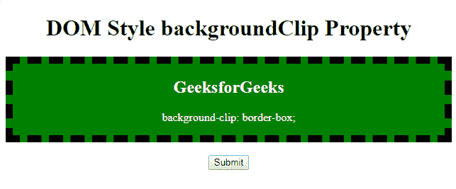
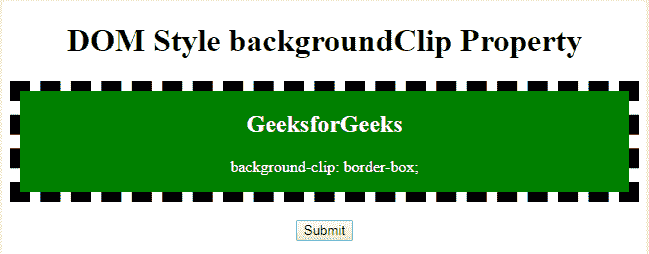

# HTML | DOM 样式背景剪辑属性

> 原文:[https://www . geesforgeks . org/html-DOM-style-background clip-property/](https://www.geeksforgeeks.org/html-dom-style-backgroundclip-property/)

**DOM 样式背景剪辑**属性用于设置或返回背景的绘制区域。
**语法:**

*   用于返回 **backgroundClip** 属性。

```html
object.style.backgroundClip 
```

*   用于设置 **backgroundClip** 属性。

```html
object.style.backgroundClip = "border-box|padding-box|content-box|
initial|inherit" 
```

**房产价值:**

*   **边框属性:**边框属性用于设置覆盖整个分区的背景颜色。
*   **填充框属性:**填充框属性用于设置边框内的背景。
*   **内容框属性:**内容框属性仅用于设置内容的背景颜色。

**例:**

## 超文本标记语言

```html
<!DOCTYPE html>
<html>

<head>
    <title>Border Box</title>
    <style>
        #gfg {
            background-color: green;
            background-clip: border-box;
            text-align: center;
            border: 10px dashed black;
            color: white;
        }
    </style>
</head>

<body>
    <center>
        <h1>
          DOM Style backgroundClip Property
        </h1>
        <div id="gfg">
            <h2>
                GeeksforGeeks
            </h2>

<p>
                background-clip: border-box;
            </p>

        </div>
        <br>
        <button onclick="myGeeks()">Submit</button>
        <script>
            function myGeeks() {
                document.getElementById("gfg"
                ).style.backgroundClip = "padding-box";
            }
        </script>
  </center>
</body>

</html>
```

**输出:**
**点击按钮前:**



**点击按钮后:**



**支持的浏览器:**支持的浏览器 *DOM Style backgroundClip* 属性如下:

*   谷歌 Chrome
*   微软公司出品的 web 浏览器
*   火狐浏览器
*   歌剧
*   旅行队