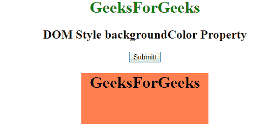
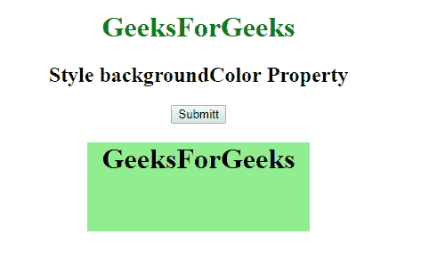

# HTML | DOM 样式背景颜色属性

> 原文:[https://www . geesforgeks . org/html-DOM-style-background color-property/](https://www.geeksforgeeks.org/html-dom-style-backgroundcolor-property/)

HTML DOM 中的 **backgroundColor** 属性用于设置或返回元素的背景色。

**语法:**

*   ```html
    object.style.backgroundColor
    ```

    它返回元素的背景色。

*   ```html
    object.style.backgroundColor = "color|transparent|initial|
    inherit"
    ```

    它用于设置元素的背景颜色。

**参数:**background colot 属性接受四个参数

*   **颜色:**该属性保存背景颜色。
*   **透明:**默认背景色为透明。
*   **初始值:**将该属性设置为默认值
*   **继承:**从其父元素继承属性

**返回值:**返回一个字符串值，代表背景颜色。

**例 1:**

```html
<!DOCTYPE html>
<html>

<head>
    <title>
      Style backgroundColor Property
    </title>
    <script>
        /* script to set background color */
        function geeks() {
            document.body.style.backgroundColor = 
                                "lightgreen";
        }
    </script>
</head>

<body style="text-align:center">

    <h1 style="color:green;">
            GeeksForGeeks
        </h1>

    <h2>
            Style backgroundColor Property
        </h2>

    <button type="button" onclick="geeks()">
      Submit
    </button>
</body>
</html      
```

**输出:**

*   **之前:**
    
*   **之后:**
    

**例 2:**

```html
<!DOCTYPE html>
<html>

<head>
    <title>
        Style backgroundColor Property
    </title>
    <style>
        #geeks {
            width: 250px;
            height: 100px;
            background-color: coral;
        }
    </style>
</head>

<body>
    <center>
        <h1 style="color:green;">
            GeeksForGeeks
        </h1>

        <h2>
            DOM Style backgroundColor Property
        </h2>

        <button onclick="geeks()">Submitt</button>

        <div id="geeks">
            <h1>GeeksForGeeks</h1>
        </div>

        <script>
            function geeks() {
                document.getElementById("geeks").style.backgroundColor =
                                                          "lightgreen";
            }
        </script>
    </center>
</body>

</html>     
```

**输出:**

*   **之前:**
    
*   **之后:**
    

**支持的浏览器:**DOM 样式 backgroundColor Property 支持的浏览器如下:

*   Chrome 1.0
*   互联网探索 4.0
*   Firefox 1.0
*   Safari 1.0
*   歌剧 3.5