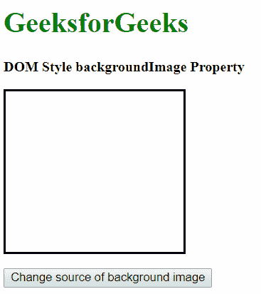
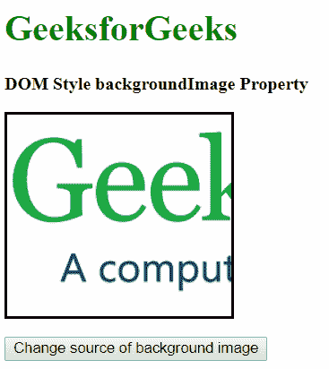
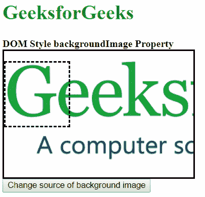
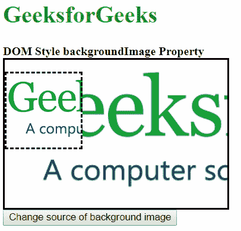

# HTML | DOM 样式背景图像属性

> 原文:[https://www . geesforgeks . org/html-DOM-style-background image-property/](https://www.geeksforgeeks.org/html-dom-style-backgroundimage-property/)

DOM Style **backgroundImage** 属性用于**设置**或**返回**元素的背景图像。

**语法:**

*   获取 backgroundImage 属性

    ```html
    object.style.backgroundImage
    ```

*   设置背景图像属性

    ```html
    object.style.backgroundImage = "image | none | initial |
    inherit"
    ```

**返回值:**返回一个字符串，代表背景图像。

**属性值:**

*   **图像:**这将属性设置为使用指定的图像。可以在 url()函数中指定图像路径。
*   **无:**这将属性设置为不使用背景图像。
*   **初始值:**用于将该属性设置为默认值。
*   **继承:**用于从其父级继承属性。

1.  **image:** This sets the property to use the image specified. The image path may be specified in the url() function.

    **示例-1:**

    ```html
    <!DOCTYPE html>
    <html lang="en">

    <head>
        <title>DOM Style backgroundImage Property</title>
        <style>
            .bg-img {
                border: solid;
                height: 180px;
                width: 200px;
            }
        </style>
    </head>

    <body>
        <h1 style="color: green">GeeksforGeeks</h1>
        <b>DOM Style backgroundImage Property</b>
        <p class="bg-img"></p>

        <button onclick="changeImage()">
          Change source of background image</button>

        <script>
            function changeImage() {
                elem = document.querySelector('.bg-img');

                // Setting the backgroundImage to an url
                elem.style.backgroundImage =
    "url('https://media.geeksforgeeks.org/wp-content/uploads/geeksforgeeks-logo.png')";
            }
        </script>
    </body>

    </html>
    ```

    **输出:**

    *   **点击按钮前:**
        
    *   **点击按钮后:**
        
2.  **none:** This sets the property to use no background image.

    **示例-2:**

    ```html
    <!DOCTYPE html>
    <html lang="en">

    <head>
        <title>DOM Style backgroundImage Property</title>
        <style>
            .bg-img {
                border: solid;
                height: 180px;
                width: 200px;
                background-image: 
    url('https://media.geeksforgeeks.org/wp-content/uploads/geeksforgeeks-logo.png');
            }
        </style>
    </head>

    <body>
        <h1 style="color: green">GeeksforGeeks</h1>
        <b>DOM Style backgroundImage Property</b>
        <p class="bg-img"></p>
        <button onclick="changeImage()">
          Change source of background image
        </button>

        <script>
            function changeImage() {
                elem = document.querySelector('.bg-img');

                // Setting the backgroundImage to none
                elem.style.backgroundImage = "none";
            }
        </script>
    </body>

    </html>
    ```

    **输出:**

    *   **点击按钮前:**
        
    *   **点击按钮后:**
        
3.  **initial**: This is used to set this property to its default value.

    **示例-3:**

    ```html
    <!DOCTYPE html>
    <html lang="en">

    <head>
        <title>DOM Style backgroundImage Property</title>
        <style>
            .bg-img {
                border: solid;
                height: 180px;
                width: 200px;
                background-image: 
    url('https://media.geeksforgeeks.org/wp-content/uploads/geeksforgeeks-logo.png');
            }
        </style>
    </head>

    <body>
        <h1 style="color: green">GeeksforGeeks</h1>
        <b>DOM Style backgroundImage Property</b>
        <p class="bg-img"></p>
        <button onclick="changeImage()">
          Change source of background image
         </button>

        <script>
            function changeImage() {
                elem = document.querySelector('.bg-img');

                // Setting the backgroundImage to initial
                elem.style.backgroundImage = "initial";
            }
        </script>
    </body>

    </html>
    ```

    **输出:**

    *   **点击按钮前:**
        
    *   **点击按钮后:**
        
4.  **inherit**: This is used to inherit the property from its parent.

    **示例-4:**

    ```html
    <!DOCTYPE html>
    <html lang="en">

    <head>
        <title>DOM Style backgroundImage Property</title>
        <style>
            #parent {
                border: solid;
                height: 200px;
                width: 300px;
                background: 
    url('https://media.geeksforgeeks.org/wp-content/uploads/geeksforgeeks-logo.png')
                  no-repeat;
                background-size: cover;
            }

            .bg-img {
                border: dashed;
                height: 100px;
                width: 100px;
                background-size: cover;
            }
        </style>
    </head>

    <body>
        <h1 style="color: green">GeeksforGeeks</h1>
        <b>DOM Style backgroundImage Property</b>

        <div id="parent">
            <p class="bg-img"></p>
        </div>
        <button onclick="changeImage()">
          Change source of background image
        </button>

        <script>
            function changeImage() {
                elem = document.querySelector('.bg-img');

                // Setting the backgroundImage to inherit
                elem.style.backgroundImage = "inherit";
            }
        </script>
    </body>

    </html>
    ```

    **输出:**

    *   **点击按钮前:**
        
    *   **点击按钮后:**
        

**支持的浏览器:**支持的浏览器*背景图片*属性如下:

*   Chrome 1.0
*   Internet Explorer 4.0
*   Firefox 1.0
*   歌剧 3.5
*   Safari 1.0