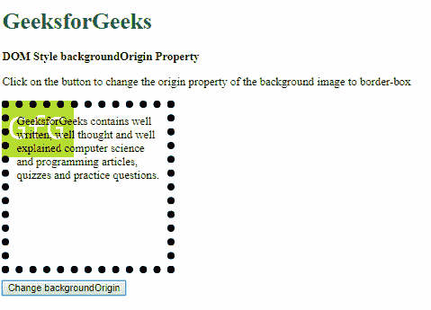

# HTML | DOM Style background origin 属性

> 原文:[https://www . geesforgeks . org/html-DOM-style-background origin-property/](https://www.geeksforgeeks.org/html-dom-style-backgroundorigin-property/)

HTML DOM 中的 **Style backgroundOrigin 属性**用于确定背景图像在位置上的相对位置。它可以相对于填充、边框或实际内容进行制作。

**语法:**

*   它返回 backgroundOrigin 属性。

    ```html
    object.style.backgroundOrigin
    ```

*   它用于设置 backgroundOrigin 属性。

    ```html
    object.style.backgroundOrigin = "padding-box|border-box|initial|
    content-box|inherit"
    ```

**返回值:**返回一个字符串值，代表元素的背景原点属性。

**属性值:**

*   **填充框:**该值相对于左上角的填充边缘定位图像。这是默认值。
*   **边框:**该值相对于边框边缘定位图像，边框边缘是绝对的左上角。
*   **内容框:**该值相对于元素实际内容的开头定位图像。
*   **初始值:**用于将该属性设置为默认值。
*   **inherit:** 它从其父元素继承属性。

**填充框:**该值相对于左上角的填充边缘定位图像。这是默认值。

**示例:**

```html
<!DOCTYPE html>
<html>

<head>
    <title>
        DOM Style backgroundOrigin Property
    </title>

    <style>
        .bg-img {
            height: 200px;
            width: 200px;
            padding: 10px;
            border: 10px dotted;
            margin-bottom: 10px;
            background: url(
'https://media.geeksforgeeks.org/wp-content/uploads/20190311222622/sample-image.png')
            no-repeat;
            background-size: 100px;
            background-origin: content-box;
        }
    </style>
</head>

<body>
    <h1 style="color: green">
        GeeksforGeeks
    </h1>

    <b>DOM Style backgroundOrigin Property</b>

    <p>
        Click on the button to change the origin 
        property of the background image to padding-box
    </p>

    <div class="bg-img">
        GeeksforGeeks contains well written, well
        thought and well explained computer science
        and programming articles, quizzes and
        practice questions.
    </div>

    <button onclick="changeOrigin()">
        Change backgroundOrigin
    </button>

    <!-- Script to change backgroundOrigin property -->
    <script>
        function changeOrigin() {
            elem = document.querySelector('.bg-img');
            elem.style.backgroundOrigin = 'padding-box';
        }
    </script>
</body>

</html>                    
```

**输出:**

*   **点击按钮前:**
    
*   **点击按钮后:**
    

**边框:**该值相对于边框边缘定位图像，边框边缘是绝对的左上角。

**示例:**

```html
<!DOCTYPE html>
<html>

<head>
    <title>
        DOM Style backgroundOrigin Property
    </title>

    <style>
        .bg-img {
            height: 200px;
            width: 200px;
            padding: 10px;
            border: 10px dotted;
            margin-bottom: 10px;
            background: url(
'https://media.geeksforgeeks.org/wp-content/uploads/20190311222622/sample-image.png')
            no-repeat;
            background-size: 100px;
        }
    </style>
</head>

<body>
    <h1 style="color: green">
        GeeksforGeeks
    </h1>

    <b>DOM Style backgroundOrigin Property</b>

    <p>
        Click on the button to change the origin 
        property of the background image to padding-box
    </p>

    <div class="bg-img">
        GeeksforGeeks contains well written, well
        thought and well explained computer science
        and programming articles, quizzes and
        practice questions.
    </div>

    <button onclick="changeOrigin()">
        Change backgroundOrigin
    </button>

    <!-- Script to change backgroundOrigin property -->
    <script>
        function changeOrigin() {
            elem = document.querySelector('.bg-img');
            elem.style.backgroundOrigin = 'border-box';
        }
    </script>
</body>

</html>                    
```

**输出:**

*   **点击按钮前:**
    
*   **点击按钮后:**
    

**内容框:**该值相对于元素实际内容的开头定位图像。

**示例:**

```html
<!DOCTYPE html>
<html>

<head>
    <title>
        DOM Style backgroundOrigin Property
    </title>

    <style>
        .bg-img {
            height: 200px;
            width: 200px;
            padding: 10px;
            border: 10px dotted;
            margin-bottom: 10px;
            background: url(
'https://media.geeksforgeeks.org/wp-content/uploads/20190311222622/sample-image.png')
            no-repeat;
            background-size: 100px;
        }
    </style>
</head>

<body>
    <h1 style="color: green">
        GeeksforGeeks
    </h1>

    <b>DOM Style backgroundOrigin Property</b>

    <p>
        Click on the button to change the origin 
        property of the background image to padding-box
    </p>

    <div class="bg-img">
        GeeksforGeeks contains well written, well
        thought and well explained computer science
        and programming articles, quizzes and
        practice questions.
    </div>

    <button onclick="changeOrigin()">
        Change backgroundOrigin
    </button>

    <!-- Script to change backgroundOrigin property -->
    <script>
        function changeOrigin() {
            elem = document.querySelector('.bg-img');
            elem.style.backgroundOrigin = 'content-box';
        }
    </script>
</body>

</html>                    
```

**输出:**

*   **点击按钮前:**
    
*   **点击按钮后:**
    

**初始值:**用于将该属性设置为默认值。

**示例:**

```html
<!DOCTYPE html>
<html>

<head>
    <title>
        DOM Style backgroundOrigin Property
    </title>

    <style>
        .bg-img {
            height: 200px;
            width: 200px;
            padding: 10px;
            border: 10px dotted;
            margin-bottom: 10px;
            background: url(
'https://media.geeksforgeeks.org/wp-content/uploads/20190311222622/sample-image.png')
            no-repeat;
            background-size: 100px;
            background-origin: content-box;
        }
    </style>
</head>

<body>
    <h1 style="color: green">
        GeeksforGeeks
    </h1>

    <b>DOM Style backgroundOrigin Property</b>

    <p>
        Click on the button to change the origin 
        property of the background image to padding-box
    </p>

    <div class="bg-img">
        GeeksforGeeks contains well written, well
        thought and well explained computer science
        and programming articles, quizzes and
        practice questions.
    </div>

    <button onclick="changeOrigin()">
        Change backgroundOrigin
    </button>

    <!-- Script to change backgroundOrigin property -->
    <script>
        function changeOrigin() {
            elem = document.querySelector('.bg-img');
            elem.style.backgroundOrigin = 'initial';
        }
    </script>
</body>

</html>                    
```

**输出:**

*   **点击按钮前:**
    
*   **点击按钮后:**
    

**inherit:** 它从其父元素继承属性。

**示例:**

```html
<!DOCTYPE html>
<html>

<head>
    <title>
        DOM Style backgroundOrigin Property
    </title>

    <style>

        /* Parent element */
        #parent {
            height: 250px;
            width: 250px;
            background-origin: border-box;
        }

        .bg-img {
            height: 200px;
            width: 200px;
            padding: 10px;
            margin-bottom: 50px;
            border: 10px dotted;
            background: url(
'https://media.geeksforgeeks.org/wp-content/uploads/20190311222622/sample-image.png') 
            no-repeat;
            background-size: 100px;
        }
    </style>
</head>

<body>
    <h1 style="color: green">
        GeeksforGeeks
    </h1>

    <b>
        DOM Style backgroundOrigin Property
    </b>

    <p>
        Click on the button to change the origin
        property of the background image to inherit
    </p>

    <div id="parent">
        <div class="bg-img">
            GeeksforGeeks contains well written, well
            thought and well explained computer
            science and programming articles, quizzes
            and practice questions.
        </div>
    </div>

    <button onclick="changeOrigin()">
        Change origin of background image
    </button>

    <!-- Script to change backgroundOrigin -->
    <script>
        function changeOrigin() {
            elem = document.querySelector('.bg-img');
            elem.style.backgroundOrigin = 'inherit';
        }
    </script>
</body>

</html>                    
```

**输出:**

*   **点击按钮前:**
    alt = " inherit-Before " width = " 479 " height = " 345 " class = " alignone size-full WP-image-947844 "/>
*   **点击按钮后:**
    

**支持的浏览器:**由 *DOM Style backgroundOrigin* 属性支持的浏览器如下:

*   谷歌 Chrome 4.0
*   Internet Explorer 9.0
*   Firefox 4.0
*   歌剧 10.5
*   Safari 3.0