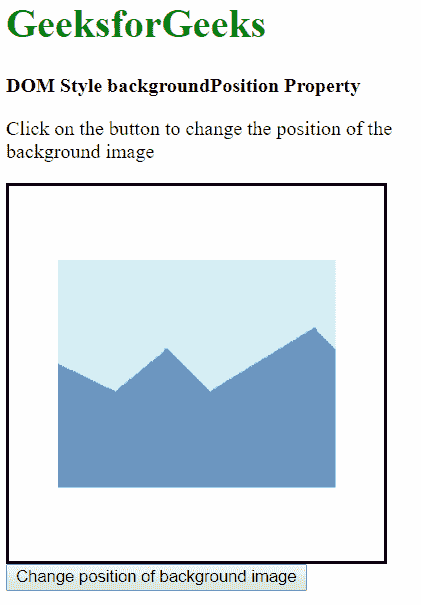
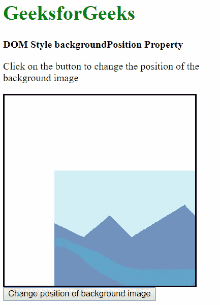
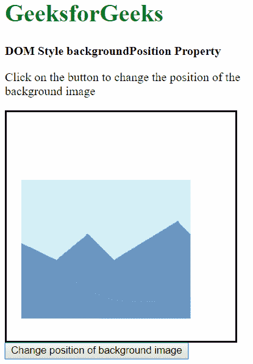
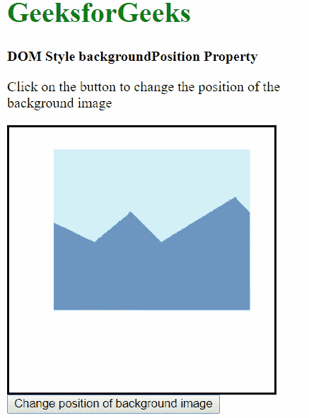
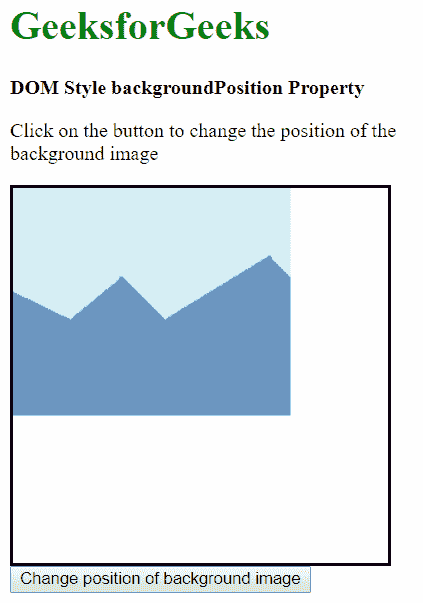
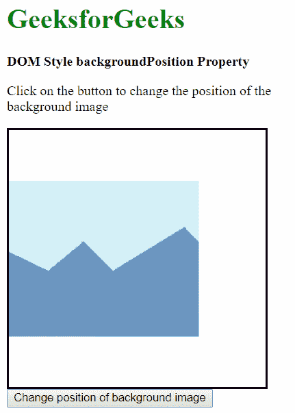

# HTML | DOM 样式背景位置属性

> 原文:[https://www . geesforgeks . org/html-DOM-style-background position-property/](https://www.geeksforgeeks.org/html-dom-style-backgroundposition-property/)

HTML DOM 样式**背景位置**:设置或返回背景图像在元素中的位置。

**语法:**

*   获取背景位置属性

    ```html
    object.style.backgroundPosition
    ```

*   设置背景位置属性

    ```html
    object.style.backgroundPosition = value
    ```

**返回值:**返回一个字符串值，代表背景图像的位置。

**属性值:**

*   **关键词值:**这是用关键词指定位置。如果只指定了一个值，默认情况下，另一个值将是“中心”。可能的关键字组合有:
    *   左上角
    *   上死点
    *   右上角
    *   中间偏左
    *   中心中心
    *   中间偏右
    *   左下角
    *   下死点
    *   右下方
*   **x % y %**这是用百分比来指定位置的。 **x%** 确定相对于初始左上角位置的水平位置， **y%** 确定相对于初始左上角位置的垂直位置。
*   **xpos ypos** :用于使用像素或任何其他 CSS 测量来指定位置。 **xpos** 确定水平位置， **ypos** 确定相对于初始左上角位置的垂直位置。
*   **初始**:用于将该属性设置为默认值。
*   **继承**:这是从其父级继承属性。

使用以下示例解释这些值:

**示例-1:** 使用关键字值。在本例中，我们使用值“右下角”。

```html
<!DOCTYPE html>
<html lang="en">

<head>
    <title>
      DOM Style backgroundPosition Property
    </title>
    <style>
        .bg-img {
            height: 300px;
            width: 300px;
            border-style: solid;
            background: 
url('https://media.geeksforgeeks.org/wp-content/uploads/sample_image.png')
                        no-repeat center;
        }
    </style>
</head>

<body>
    <h1 style="color: green">
      GeeksforGeeks
    </h1>
    <b>
      DOM Style backgroundPosition Property
    </b>
    <p>
      Click on the button to change the 
      position of the background image
    </p>
    <div class="bg-img">
    </div>

    <button onclick="changePos()">
        Change position of background image
    </button>

    <script>
        function changePos() {
            elem = document.querySelector('.bg-img');

            // Setting the position to bottom vertically
            // and right horizontally
            elem.style.backgroundPosition = 'bottom right';
        }
    </script>
</body>

</html>
```

**输出:**

*   **按下按钮前:**
    
*   **按下按钮后:**
    

**示例-2:** 使用百分比指定位置。我们使用“25% 75%”来定位图像。

```html
<!DOCTYPE html>
<html lang="en">

<head>
    <meta charset="UTF-8">
    <title>
      DOM Style backgroundPosition Property
    </title>
    <style>
        .bg-img {
            height: 300px;
            width: 300px;
            border-style: solid;
            background: 
url('https://media.geeksforgeeks.org/wp-content/uploads/sample_image.png') 
                        no-repeat center;
        }
    </style>
</head>

<body>
    <h1 style="color: green">
      GeeksforGeeks
    </h1>
    <b>
      DOM Style backgroundPosition Property
    </b>
    <p>
      Click on the button to change the
      position of the background image
    </p>

    <div class="bg-img">
    </div>
    <button onclick="changePos()">
        Change position of background image
    </button>

    <script>
        function changePos() {
            elem = document.querySelector('.bg-img');

            // Setting the position to 25% horizontally
            //and 75% vertically
            elem.style.backgroundPosition = '25% 75%';
        }
    </script>
</body>

</html>
```

**输出:**

*   **按下按钮前:**
    
*   **按下按钮后:**
    

**示例-3:** 使用固定单位指定位置。我们使用“50px 25px”来定位图像。

```html
<!DOCTYPE html>
<html lang="en">

<head>
    <title>
      DOM Style backgroundPosition Property
    </title>
    <style>
        .bg-img {
            height: 300px;
            width: 300px;
            border-style: solid;
            background: 
url('https://media.geeksforgeeks.org/wp-content/uploads/sample_image.png')
                        no-repeat center;
        }
    </style>
</head>

<body>
    <h1 style="color: green">
      GeeksforGeeks
    </h1>
    <b>
      DOM Style backgroundPosition Property
    </b>
    <p>
      Click on the button to change the 
      position of the background image</p>
    <div class="bg-img">
    </div>

    <button onclick="changePos()">
        Change position of background image
    </button>

    <script>
        function changePos() {
            elem = document.querySelector('.bg-img');

            // Setting the position to 50px horizontally
           //and 25px horizontally
            elem.style.backgroundPosition = '50px 25px';
        }
    </script>
</body>

</html>
```

**输出:**

*   **按下按钮前:**
    
*   **按下按钮后:**
    

**示例-4:** 使用初始值。这会将位置设置为默认值。

```html
<!DOCTYPE html>
<html lang="en">

<head>
    <title>DOM Style backgroundPosition Property</title>
    <style>
        .bg-img {
            height: 300px;
            width: 300px;
            border-style: solid;
            background: 
url('https://media.geeksforgeeks.org/wp-content/uploads/sample_image.png') 
                        no-repeat center;
        }
    </style>
</head>

<body>
    <h1 style="color: green">
      GeeksforGeeks
    </h1>
    <b>
      DOM Style backgroundPosition Property
    </b>
    <p>
      Click on the button to change the 
      position of the background image
    </p>
    <div class="bg-img">
    </div>

    <button onclick="changePos()">
        Change position of background image
    </button>

    <script>
        function changePos() {
            elem = document.querySelector('.bg-img');

            // Setting the position to the default 
            // value with initial
            elem.style.backgroundPosition = 'initial';
        }
    </script>
</body>

</html>
```

**输出:**

*   **按下按钮前:**
    
*   **按下按钮后:**
    

**示例-5:** 使用继承值。这将从其父元素继承位置。

```html
<!DOCTYPE html>
<html lang="en">

<head>
    <title>
      DOM Style backgroundPosition Property
    </title>
    <style>
        /* Parent element */

        #parent {
            height: 300px;
            width: 300px;
            border-style: solid;
            /* Setting the parent's background-position
          //to center left*/
            background-position: center left;
        }

        .bg-img {
            height: 300px;
            width: 300px;
            background: 
url('https://media.geeksforgeeks.org/wp-content/uploads/sample_image.png')
                        no-repeat center;
        }
    </style>
</head>

<body>
    <h1 style="color: green">
      GeeksforGeeks
    </h1>
    <b>
      DOM Style backgroundPosition Property
    </b>
    <p>
      Click on the button to change the 
      position of the background image
    </p>
    <div id="parent">
        <div class="bg-img"></div>
    </div>

    <button onclick="changePos()">
        Change position of background image
    </button>

    <script>
        function changePos() {
            elem = document.querySelector('.bg-img');

            // Setting the position to inherit from its parent
            elem.style.backgroundPosition = 'inherit';
        }
    </script>
</body>

</html>
```

**输出:**

*   **按下按钮前:**
    
*   **按下按钮后:**
    

**支持的浏览器:**以下是*后台位置属性*支持的浏览器:

*   Chrome 1.0
*   Internet Explorer 4.0
*   Firefox 1.0
*   歌剧 3.5
*   Safari 1.0