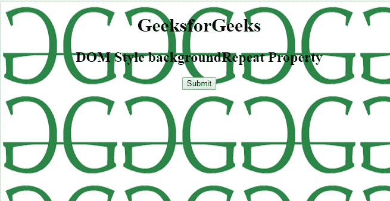
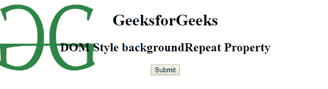
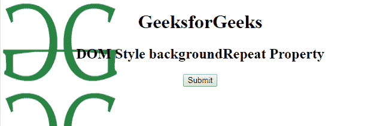

# HTML | DOM 样式背景重复属性

> 原文:[https://www . geesforgeks . org/html-DOM-style-background repeat-property/](https://www.geeksforgeeks.org/html-dom-style-backgroundrepeat-property/)

HTML DOM 中的 **backgroundRepeat** 属性用于设置或返回 CSS backgroundRepeat 属性。它还检查背景图像是否重复。

**语法:**

*   它用于返回 backgroundRepeat 属性。

    ```html
    object.style.backgroundRepeat 
    ```

*   它用于设置 backgroundRepeat 属性。

    ```html
    object.style.backgroundRepeat = "repeat|repeat-x|repeat-y|
    no-repeat|initial|inherit" 
    ```

**属性值:**

*   **重复:**用于水平和垂直重复背景图像。这是默认值。
*   **repeat-x:** 用于水平重复背景图像。
*   **repeat-y:** 用于设置只垂直重复的背景图像。
*   **不重复:**不重复背景图像。它只显示一次背景图像。

**返回值:**返回一个字符串值，表示背景图像如何重复。

**例 1:**

```html
<!DOCTYPE html> 
<html> 
    <head> 
        <title>
            DOM Style background-repeat property
        </title> 

        <style> 
            body { 
                background-image: url( 
"https://media.geeksforgeeks.org/wp-content/uploads/geeks-25.png"); 
                background-size: 200px 150px; 
                text-align:center; 
            } 
        </style> 
    </head> 

    <body> 
        <h1>GeeksforGeeks</h1> 

        <h2>
            DOM Style backgroundRepeat Property
        </h2> 

        <button onclick = "myGeeks()">
            Submit
        </button>

        <script>
            function myGeeks() {
                document.body.style.backgroundRepeat = "no-repeat";
            } 
        </script>
    </body> 
</html>                                     
```

**输出:**
**点击按钮前:**

**点击按钮后:**


**例 2:**

```html
<!DOCTYPE html> 
<html> 
    <head> 
        <title>
            DOM Style background-repeat property
        </title> 

        <style> 
            body { 
                background-image: url( 
"https://media.geeksforgeeks.org/wp-content/uploads/geeks-25.png"); 
                background-repeat: repeat-y; 
                background-size: 200px 150px; 
                text-align:center; 
            } 
        </style> 
    </head> 

    <body> 
        <h1>GeeksforGeeks</h1>

        <h2>
            DOM Style backgroundRepeat Property
        </h2> 

        <button onclick = "myGeeks()">
            Submit
        </button>

        <script>
            function myGeeks() {
                document.body.style.backgroundRepeat = "repeat-x";
            } 
        </script>
    </body> 
</html>                    
```

**输出:**
前点击按钮:

**后点击按钮:**


**支持的浏览器:**由 *DOM Style backgroundRepeat* 属性支持的浏览器如下:

*   谷歌 Chrome 1.0
*   Internet Explorer 4.0
*   Firefox 1.0
*   Opera 1.0
*   Safari 3.5