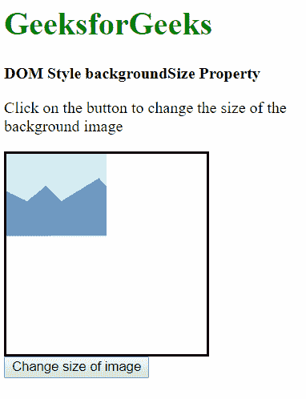
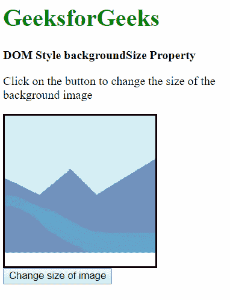
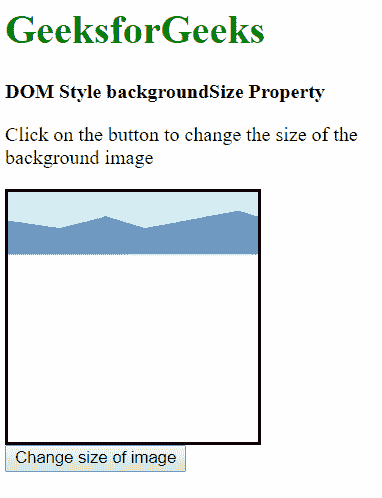
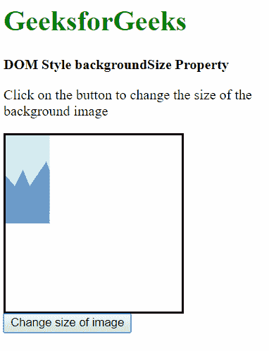
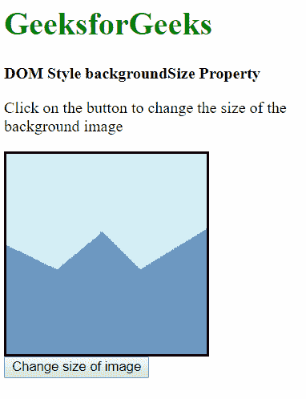
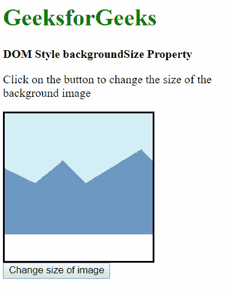
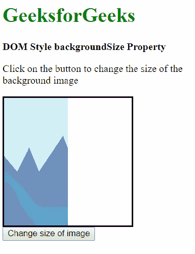

# HTML | DOM Style backgroundSize 属性

> 原文:[https://www . geesforgeks . org/html-DOM-style-background size-property/](https://www.geeksforgeeks.org/html-dom-style-backgroundsize-property/)

HTML DOM Style**background size**属性用于设置或返回背景图像的大小。

**语法:**

*   获取 backgroundSize 属性

    ```html
    object.style.backgroundSize
    ```

*   设置背景尺寸属性

    ```html
    object.style.backgroundSize = "auto | length | percentage | 
    cover| contain |initial | inherit"
    ```

**返回值:**返回一个字符串值，代表元素的背景大小属性

**属性值:**

*   **自动:**用于显示原始尺寸的背景图像。这是默认值。
*   **长度:**用于设置图像的高度和宽度。这两个值分别设置宽度和高度。如果只给出一个值，则另一个值设置为“自动”。
*   **百分比:**以父元素的百分比设置宽度和高度。这两个值分别设置宽度和高度。如果只给出一个值，则另一个值设置为“自动”。
*   **覆盖:**用于缩放背景图像，覆盖整个容器元素。
*   **contain:** 这用于尽可能放大背景图像，使高度和宽度都适合容器区域。
*   **初始**:用于将该属性设置为默认值。
*   **继承**:这将从其父级继承背景大小属性。

1.  **auto**: This is used to display the background image in its original size it’s default value.

    **示例:**

    ```html
    <!DOCTYPE html>
    <html lang="en">

    <head>
        <title>DOM Style backgroundSize Property</title>
        <style>
            .bg-img {
                height: 200px;
                width: 200px;
                border-style: solid;
                background-image: url(
    'https://media.geeksforgeeks.org/wp-content/uploads/sample_image.png');
                background-repeat: no-repeat;
                /* we set the size ourselves to demonstrate auto */
                background-size: 100px;
            }
        </style>
    </head>

    <body>
        <h1 style="color: green">GeeksforGeeks</h1>
        <b>DOM Style backgroundSize Property</b>
        <p>Click on the button to 
          change the size of the background image</p>
        <div class="bg-img"></div>

        <button onclick="changePos()">Change size of image</button>

        <script>
            function changePos() {
                elem = document.querySelector('.bg-img');

                // Setting size to auto
                elem.style.backgroundSize = 'auto';
            }
        </script>
    </body>

    </html>
    ```

    **输出:**

    *   **Before pressing the button:**

        

    *   **After pressing the button:**

        

2.  **length:** This is used to set the height and width of the image. Both the values set the width and height respectively. If only one value is given, the other one is set to ‘auto’.

    **示例:**

    ```html
    <!DOCTYPE html>
    <html lang="en">

    <head>
        <title>DOM Style backgroundSize Property</title>
        <style>
            .bg-img {
                height: 200px;
                width: 200px;
                border-style: solid;
                background-image: url(
    'https://media.geeksforgeeks.org/wp-content/uploads/sample_image.png');
                background-repeat: no-repeat;
            }
        </style>
    </head>

    <body>
        <h1 style="color: green">GeeksforGeeks</h1>
        <b>DOM Style backgroundSize Property</b>
        <p>Click on the button to 
          change the size of the background image</p>

        <div class="bg-img"></div>
        <button onclick="changePos()">Change size of image</button>

        <script>
            function changePos() {
                elem = document.querySelector('.bg-img');

                // Setting size to 200px in width
                // and 50px in height
                elem.style.backgroundSize = 
                  '200px 50px';
            }
        </script>
    </body>

    </html>
    ```

    **输出:**

    *   **Before pressing the button:**

        

    *   **After pressing the button:**

        

3.  **percentage:** This sets the width and height in terms of percentage of the parent element. Both the values set the width and height respectively. If only one value is given, the other one is set to ‘auto’.

    **示例:**

    ```html
    <!DOCTYPE html>
    <html lang="en">

    <head>
        <title>DOM Style backgroundSize Property</title>
        <style>
            .bg-img {
                height: 200px;
                width: 200px;
                border-style: solid;
                background-image: url(
    'https://media.geeksforgeeks.org/wp-content/uploads/sample_image.png');
                background-repeat: no-repeat;
            }
        </style>
    </head>

    <body>
        <h1 style="color: green">
          GeeksforGeeks
       </h1>
        <b>DOM Style backgroundSize Property</b>
        <p>Click on the button to 
          change the size of the background image</p>

        <div class="bg-img"></div>
        <button onclick="changePos()">
          Change size of image
        </button>

        <script>
            function changePos() {
                elem = document.querySelector('.bg-img');

                // Setting size to 25% in width and 50% in height
                elem.style.backgroundSize = '25% 50%';
            }
        </script>
    </body>

    </html>
    ```

    **输出:**

    *   **Before pressing the button:**

        

    *   **After pressing the button:**

        

4.  **cover:** This is used to scale the background image to cover the whole container element.

    **示例-4:**

    ```html
    <!DOCTYPE html>
    <html lang="en">

    <head>
        <title>DOM Style backgroundSize Property</title>
        <style>
            .bg-img {
                height: 200px;
                width: 200px;
                border-style: solid;
                background-image: url(
    'https://media.geeksforgeeks.org/wp-content/uploads/sample_image.png');
                background-repeat: no-repeat;
            }
        </style>
    </head>

    <body>
        <h1 style="color: green">GeeksforGeeks</h1>
        <b>DOM Style backgroundSize Property</b>
        <p>Click on the button to 
          change the size of the background image</p>

        <div class="bg-img"></div>
        <button onclick="changePos()">Change size of image</button>

        <script>
            function changePos() {
                elem = document.querySelector('.bg-img');

                // Setting size to cover
                elem.style.backgroundSize = 'cover';
            }
        </script>
    </body>

    </html>
    ```

    **输出:**

    *   **Before pressing the button:**

        

    *   **After pressing the button:**

        

5.  **contain:** This is used to scale the background image as large as possible such that both the height and width fit inside the container area.

    **示例-5:**

    ```html
    <!DOCTYPE html>
    <html lang="en">

    <head>
        <title>DOM Style backgroundSize Property</title>
        <style>
            .bg-img {
                height: 200px;
                width: 200px;
                border-style: solid;
                background-image: url(
    'https://media.geeksforgeeks.org/wp-content/uploads/sample_image.png');
                background-repeat: no-repeat;
            }
        </style>
    </head>

    <body>
        <h1 style="color: green">GeeksforGeeks</h1>
        <b>DOM Style backgroundSize Property</b>

        <p>Click on the button to 
          change the size of the background image</p>
        <div class="bg-img"></div>

        <button onclick="changePos()">
          Change size of image
      </button>

        <script>
            function changePos() {
                elem = document.querySelector('.bg-img');

                // Setting size to contain
                elem.style.backgroundSize = 'contain';
            }
        </script>
    </body>

    </html>
    ```

    **输出:**

    *   **Before pressing the button:**

        

    *   **After pressing the button:**

        

6.  **initial**: This is used to set this property to its default value.

    **示例-6:**

    ```html
    <!DOCTYPE html>
    <html lang="en">

    <head>
        <title>DOM Style backgroundSize Property</title>
        <style>
            .bg-img {
                height: 200px;
                width: 200px;
                border-style: solid;
                background-image: url(
    'https://media.geeksforgeeks.org/wp-content/uploads/sample_image.png');
                background-repeat: no-repeat;

                /* we set the size ourselves to demonstrate initial */
                background-size: 100px;
            }
        </style>
    </head>

    <body>
        <h1 style="color: green">GeeksforGeeks</h1>
        <b>DOM Style backgroundSize Property</b>
        <p>Click on the button to 
          change the size of the background image</p>

        <div class="bg-img"></div>
        <button onclick="changePos()">
          Change size of image
        </button>

        <script>
            function changePos() {
                elem = document.querySelector('.bg-img');

                // Setting size to initial
                elem.style.backgroundSize = 'initial';
            }
        </script>
    </body>

    </html>
    ```

    **输出:**

    *   **Before pressing the button:**

        

    *   **After pressing the button:**

        

7.  **inherit**: This inherits the background size property from its parent.

    **示例-7:**

    ```html
    <!DOCTYPE html>
    <html lang="en">

    <head>
        <title>DOM Style backgroundSize Property</title>
        <style>
            .bg-img {
                height: 200px;
                width: 200px;
                border-style: solid;
                background-image: url(
    'https://media.geeksforgeeks.org/wp-content/uploads/sample_image.png');
                background-repeat: no-repeat;
            }

            #parent {
                background-size: 100px 200px;
            }
        </style>
    </head>

    <body>
        <h1 style="color: green">GeeksforGeeks</h1>
        <b>DOM Style backgroundSize Property</b>
        <p>Click on the button to 
          change the size of the background image</p>

        <div id="parent">
            <div class="bg-img"></div>
        </div>

        <button onclick="changePos()">
          Change size of image
       </button>

        <script>
            function changePos() {
                elem = document.querySelector('.bg-img');

                // Setting size to inherit
                elem.style.backgroundSize = 'inherit';
            }
        </script>
    </body>

    </html>
    ```

    **输出:**

    *   **Before pressing the button:**

        

    *   **After pressing the button:**

        

**支持的浏览器:***后台大小属性*支持的浏览器如下:

*   Chrome 4.0
*   Internet Explorer 9.0
*   Firefox 4.0
*   Safari 4.1
*   歌剧 10.5