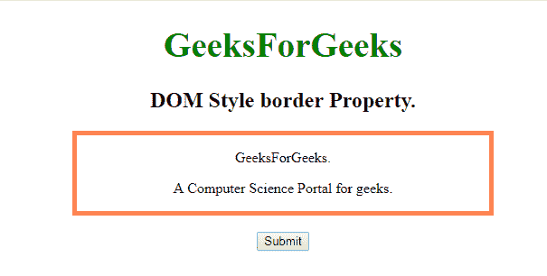
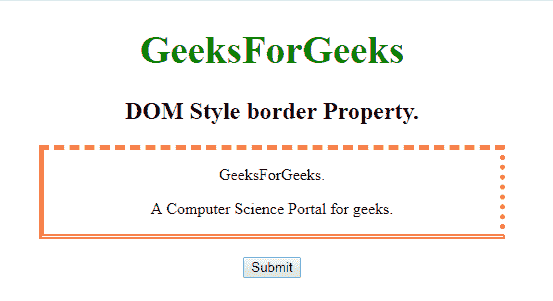
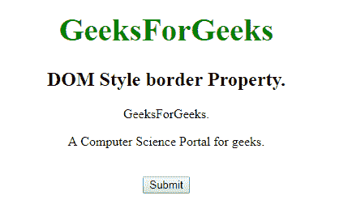
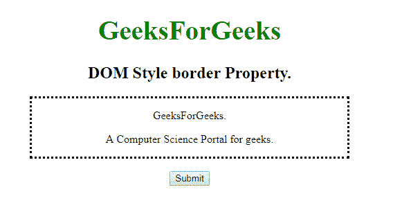

# HTML | DOM 样式边框属性

> 原文:[https://www . geesforgeks . org/html-DOM-style-border-property/](https://www.geeksforgeeks.org/html-dom-style-border-property/)

**DOM 样式边框**属性用于设置或返回元素边框的样式。我们可以为各个边(上、右、下、左)设置不同的边框样式。边框样式属性可以为每一侧取多个值。

**语法:**

*   它用于返回样式属性。

    ```html
    object.style.borderStyle 
    ```

    *   It is used to set the Style Property.

    ```html
    object.style.borderStyle = value 
    ```

    **DOM 边框样式属性值**

    *   **无:**不创建边框，保持空白
    *   **隐藏:**就像“无”一样，除非添加背景图像，否则它不会显示任何边框，然后边框顶部宽度将设置为 0，而与用户定义的值无关。
    *   **虚线:**一系列的点显示成一条线作为边框。
    *   **实线:**使用单个实线和粗线作为边框。
    *   **虚线:**一系列方形虚线作为边框。
    *   **双:**相互平行放置的两条线作为边框。
    *   **凹槽:**显示一个三维凹槽边框，其效果取决于边框颜色值。
    *   **脊:**显示一个三维脊状边框，其效果取决于边框颜色值。
    *   **inset:** Displays a 3D inset border, it’s effect depends on border-color value.

        **开始:**显示一个 3D 开始边框，其效果取决于边框颜色值。

    **返回值:**返回一个代表元素边框样式的字符串值。

    **示例-1:**

    ```html
    <!DOCTYPE html>
    <html>

    <head>
        <style>
            h1 {
                color: green;
                font-size: 39px;
            }

            #GFG {
                border: thick solid coral;
                width: 70%;
            }
        </style>
    </head>

    <body>
        <center>
            <h1>GeeksForGeeks</h1>
            <h2>DOM Style border Property.</h2>
            <div id="GFG">
                <p>GeeksForGeeks.</p>
                <p>A Computer Science Portal for geeks.</p>
            </div>
            <br>
            <button type="button" onclick="myGeeks()">Submit</button>

            <script>
                function myGeeks() {

                    // Return the style property.
                    document.getElementById("GFG").style.borderStyle = 
                      "dashed dotted double solid";
                }
            </script>

    </body>

    </html>
    ```

    **输出:**

    **点击按钮前::**
    

    **点击按钮后:**
    

    **示例-2:**

    ```html
    <!DOCTYPE html>
    <html>

    <head>
        <style>
            h1 {
                color: green;
                font-size: 39px;
            }

            #GFG {
                width: 70%;
            }
        </style>
    </head>

    <body>
        <center>
            <h1>GeeksForGeeks</h1>
            <h2>DOM Style border Property.</h2>
            <div id="GFG">
                <p>GeeksForGeeks.</p>
                <p>A Computer Science Portal for geeks.</p>
            </div>
            <br>

            <button type="button" onclick="myGeeks()">
              Submit
            </button>

            <script>
                function myGeeks() {

                    // Return the dotted style border.
                    document.getElementById("GFG").style.borderStyle = 
                      "  dotted ";
                }
            </script>

    </body>

    </html>
    ```

    **输出:**

    **点击按钮前:**
    

    **点击按钮后:**
    

    **支持的浏览器:**T2 DOM 样式边框属性支持的浏览器如下:

    *   谷歌 Chrome
    *   微软公司出品的 web 浏览器
    *   火狐浏览器
    *   歌剧
    *   旅行队