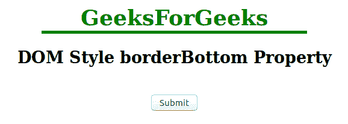

# HTML | DOM 样式 borderBottom 属性

> 原文:[https://www . geesforgeks . org/html-DOM-style-borderbottom-property/](https://www.geeksforgeeks.org/html-dom-style-borderbottom-property/)

DOM 样式 **borderBottom** 属性用于设置或返回元素的三种不同的边框-底部属性，如边框-底部宽度、边框-底部样式和边框-底部颜色。

**语法:**

*   它返回 borderBottom 属性。

    ```html
    object.style.borderBottom
    ```

*   它用于设置 borderBottom 属性。

    ```html
    object.style.borderBottom = "width style color|initial|inherit"
    ```

**参数:**

*   **宽度:**保持下边框的宽度。
*   **样式:**设置下边框样式。
*   **颜色:**设置下边框的颜色。
*   **初始:**设置属性的默认值。
*   **继承:**从其父级继承属性。

**返回值:**返回一个字符串值，代表元素下边框的宽度、样式和/或颜色。

**示例:**

```html
<!DOCTYPE html>
<html>
    <head>
        <title>DOM Style borderBottom Property </title>
    </head>

    <body>
        <center>
            <h1 style = "color:green;width:50%;" id = "sudo">
                GeeksForGeeks
            </h1>

            <h2>DOM Style borderBottom Property </h2>         
            <br>
            <button type = "button" onclick = "geeks()">
                Submit
            </button>

            <script>
            function geeks() {
            document.getElementById("sudo").style.borderBottom
                                        = "thick solid green";
            }
            </script>
        </center>
    </body>
</html>                    
```

**输出:**
**前点击按钮:**

**后点击按钮:**

**例 2:**

```html
<!DOCTYPE html>
<html>
    <head>
        <title>DOM Style borderBottom Property</title>
    </head>
    <body>
        <center>
            <h1 style = "color:green;">
                GeeksForGeeks
            </h1>

            <h2>DOM Style borderBottom Property </h2> 

            <h3 style = "border:2px solid red;width:50%;" 
                id = "sudo">geksforgeeks</h3>
            <br>
            <button type = "button" onclick = "geeks()">
                Submit
            </button>

            <script>
                function geeks() {
                    document.getElementById("sudo").style.borderBottom
                                            = "thick dotted green";
                }
            </script>
        </center>
    </body>
</html>                    
```

**输出:**
**点击按钮前:**

**点击按钮后:**


**支持的浏览器:**T2 DOM Style borderBottom 属性支持的浏览器如下:

*   谷歌 Chrome 1.0
*   Internet Explorer 4.0
*   Firefox 1.0
*   歌剧 3.5
*   Safari 1.0