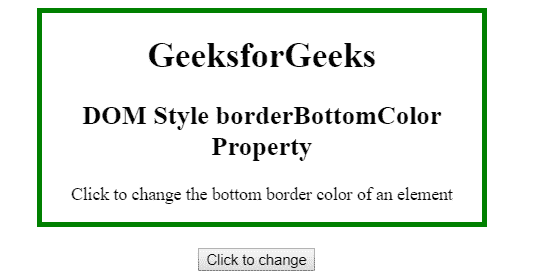
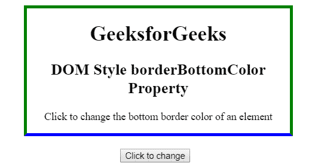
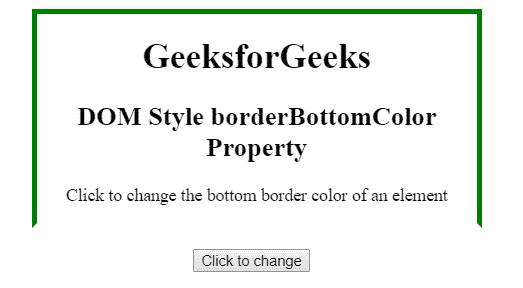

# HTML | DOM 样式 borderBottomColor 属性

> 原文:[https://www . geesforgeks . org/html-DOM-style-borderbottomcolor-property/](https://www.geeksforgeeks.org/html-dom-style-borderbottomcolor-property/)

HTML DOM 中的 **Style borderBottomColor 属性**用于设置或返回元素下边框的颜色。

**语法:**

*   它返回 borderBottomColor 属性。

```html
object.style.borderBottomColor
```

*   它用于设置 borderBottomColor 属性。

```html
object.style.borderBottomColor = "color|transparent|initial|
inherit"
```

**属性值:**

*   **颜色:**指定对应元素的下边框颜色。默认颜色是黑色。
*   **透明:**将对应元素的下边框颜色设置为透明。
*   **初始值:**将 borderBottomColor 属性设置为默认值。
*   **Inherit:** 该属性从其父元素继承而来。

**返回值:**返回一个代表元素下边框颜色的字符串。
**例 1:** 本例将下边框颜色改为黑色。

## 超文本标记语言

```html
<!DOCTYPE html>
<html>

<head>
    <title>
        Style borderBottomColor Property
    </title>

    <style>
        #GFG_Div {
            width: 400px;
            margin-left: 210px;
            border: thick solid green;
        }
    </style>
</head>

<body align="center">

    <div id="GFG_Div">
        <h1>GeeksforGeeks</h1>

        <h2>
            DOM Style borderBottomColor Property
        </h2>

<p>
            Click to change the bottom border
            color of an element
        </p>

    </div>

    <br>

    <button type="button" onclick="myGeeks()">
        Click to change
    </button>

    <!-- Script to use Style borderBottomColor
        Property -->
    <script>
        function myGeeks() {
            document.getElementById("GFG_Div")
                .style.borderBottomColor = "blue";
        }
    </script>

</body>

</html>
```

**输出:**

*   **点击按钮前:**



*   **点击按钮后:**



**示例 2:** 本示例将下边框的颜色更改为透明值。

## 超文本标记语言

```html
<!DOCTYPE html>
<html>

<head>
    <title>
        Style borderBottomColor Property
    </title>

    <style>
        #GFG_Div {
            width: 400px;
            margin-left: 210px;
            border: thick solid green;
        }
    </style>
</head>

<body align="center">

    <div id="GFG_Div">
        <h1>GeeksforGeeks</h1>

        <h2>
            DOM Style borderBottomColor Property
        </h2>

<p>
            Click to change the bottom border
            color of an element
        </p>

    </div>

    <br>

    <button type="button" onclick="myGeeks()">
        Click to change
    </button>

    <!-- Script to use Style borderBottomColor
        Property -->
    <script>
        function myGeeks() {
            document.getElementById("GFG_Div")
            .style.borderBottomColor = "transparent";
        }
    </script>

</body>

</html>
```

**输出:**

*   **点击按钮前:**


*   **点击按钮后:**



**支持的浏览器:**下面列出了*风格 borderBottomColor 属性*支持的浏览器:

*   谷歌 Chrome 1.0
*   Internet Explorer 4.0
*   Firefox 1.0
*   歌剧 3.5
*   Safari 1.0